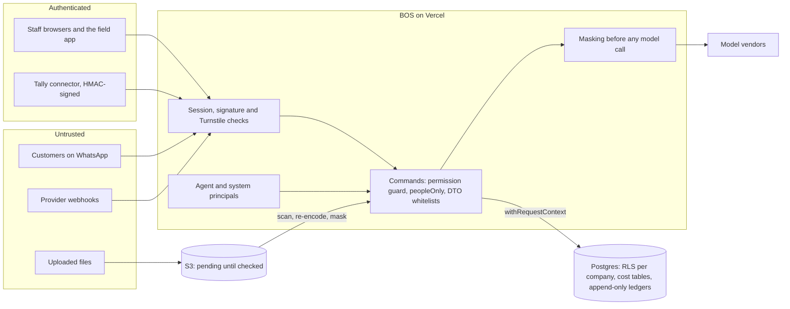

# Security — Shakti Prime BOS

Blueprint reference: §7, §9.3, §12. This document is the working security specification: threat model, identity, the permission catalogue, data isolation, data protection, AI and telecom compliance, application and infrastructure security, and operations. `docs/01-blueprint.md` governs on any conflict.

## Contents
1. [Threat model](#1-threat-model)
2. [Identity and authentication](#2-identity-and-authentication)
3. [Authorization](#3-authorization): [3.1 Model](#31-model), [3.2 Permission catalogue](#32-permission-catalogue) (with [shared rows](#shared-rows-adr-0016), [quotes](#quote-permissions), [the timeline, tasks, tags and customers](#timeline-task-tag-and-customer-permissions) and [duplicates and merges](#duplicate-and-merge-permissions)), [3.3 Agent principals](#33-agent-principals) (with [the worker principal](#the-worker-principals-grants) and [the agent runtime](#the-agent-runtime)), [3.4 Voice principals](#34-voice-principals)
4. [Data isolation](#4-data-isolation)
5. [Data protection](#5-data-protection-dpdp-act-2023-rules-2025)
6. [AI security](#6-ai-security)
7. [Telecom compliance](#7-telecom-compliance)
8. [Application security](#8-application-security)
9. [Infrastructure security](#9-infrastructure-security)
10. [Operations](#10-operations)
11. [Security test suite](#11-security-test-suite)

## 1. Threat model
**Assets:** customer PII and KYC documents; supplier rates, costs and margins; price lists; Tally financial mirrors; call recordings and WhatsApp conversations; the Executive Knowledge Vault; credentials and API keys; the integrity of stock, money and state.

**Actors and trust boundaries:**
| Actor | Trust | Main risks |
|---|---|---|
| Staff users (11 roles) | Authenticated, least privilege | Over-privileged reads, cross-entity access, export leakage |
| Customers on WhatsApp | Untrusted | Prompt injection, spam, document spoofing, social engineering of the Concierge |
| Providers (Meta, Exotel, Google, LiveKit) | Verified by signature, otherwise untrusted | Forged webhooks, replay |
| Tally connector | Signed, outbound only | Key theft on the client PC, tampered batches |
| AI agents | Internal service principals | Acting beyond autonomy, leaking cost data, runaway spend |
| Overseas AI vendors | Contracted processors | Retention of PII, model misuse |
| Developers and operators | Trusted with audit | Key-person risk, secret sprawl |

Each arrow into the BOS crosses a check: a session with its second factor, a provider or QStash signature, the connector's HMAC, or Turnstile on public forms. Inside, every change is a command run under the caller's own permissions and RLS; untrusted content reaches a model only as masked data, never as instructions.

**Boundaries enforced in code and in the database:** RLS per entity; two cost permissions; command-only mutations; webhook inbox; masked LLM inputs; DTO whitelists.

## 2. Identity and authentication
- **Passwords:** Argon2id (m = 64 MiB, t = 3, p = 1); minimum 12 characters; breached-password check.
- **Bot and brute-force controls:**
  - Cloudflare Turnstile on login and public forms.
  - The exponential lockout in Redis applies to one account from one address, so a stranger who knows an email cannot keep its owner out and one office address is not locked for everyone behind it. The account-wide count only escalates, emailing the owner at every tenth failure.
  - Per-address request caps bound what one address tries across accounts, the password-hashing and mail-sending endpoints included, on top of the sign-in lockout. Requests whose address cannot be read share one count per path, so a missing address never lifts a cap, and the server's own calls (an invitation) are not counted.
  - An Executive can lift an account's locks through the audited command `admin.user.lock.clear`.
  - The trade-off: a spread-out guessing attempt meets Turnstile, the caps and the owner's alert rather than a hard lock. A suspended account locks like an active one, so the lock does not reveal it, and no session is created for an inactive user.
- **Sessions:**
  - Database sessions with rotation on privilege change; idle timeout 12 h; absolute 7 d; admins can force logout; a role change revokes sessions.
  - A revoked or expired session is refused on every auth route and in-process call, not only in `currentPrincipal()`; no device is ever remembered past the second factor.
  - The session token column is readable by the auth module's database role only; application code sees session metadata, never the token.
- **Cookies:** HttpOnly, Secure, SameSite=Lax, with the `__Host-` prefix in production.
- **2FA:**
  - TOTP required for Executive, GM and Accounts; each code verifies once; five wrong codes lock the second factor for an hour; the sign-in lock clears and the last sign-in is recorded only after the second factor; recovery codes; recovery email via SES only.
  - A user who has lost both the app and the backup codes is reset by an Executive (`admin.user.two_factor.reset`, never their own account) only after the Executive has confirmed who is asking by phone or in person. The reset signs the user out everywhere, emails them (only when the reset removed an app, and once per form submission) and makes them set up a new app at the next sign-in.
- **Set-password links:**
  - Stored hashed; an invitation lasts 24 h and a forgotten-password link 1 h; a new link withdraws the person's earlier ones; attempts are capped per link and per address.
  - Staff ask for a new link on the "Forgot your password?" screen. An address that is not one is marked on its field before anything else runs; then Turnstile, and the same answer and the same wait whether or not the email has an account.
  - The answer waits only for the per-address cap and the Turnstile check, which refuse before anything reads the account. Finding the account, storing the link, the mail and the audit row run after it (`requestResetInBackground`); a failure there is logged as `auth.reset_failed` or `auth.mail_failed`, never shown.
  - An Executive re-sends an invitation by inviting the person again, and is told when the email did not go out.
- **Endpoints:** the auth module serves over HTTP only the link a set-password email opens; every other auth endpoint answers not found over HTTP and is reached by the screens' server actions in-process.
- **Deployment guard:**
  - Every production runtime is hosted except a build started with `BOS_ENVIRONMENT=local` whose `BETTER_AUTH_URL` is on localhost, 127.0.0.1 or [::1] and which is not on Vercel (the end-to-end journeys and Lighthouse on a developer's machine or a CI runner).
  - A hosted runtime refuses to start with a missing variable, a published or short `BETTER_AUTH_SECRET`, a non-https base URL, Cloudflare's Turnstile test keys, or a mail setting other than `ses` or `log` (production accepts only `ses`, Amazon SES with its verified sender).
  - Readiness checks both database connections, the key-value store (a write and read back), the configuration and the outbox (down when a due event has waited more than five minutes since it became due). The public route answers only ready or not ready, capped at 20 calls a minute per address, and names the failing check in the log alone.
- **Mobile:** 15-minute access tokens, rotating refresh tokens in the Android Keystore, per-device revocation, minimum-version gate.
- **Voice:** a 5-minute user-scoped token per session so the worker acts as the speaking user.
- **Realtime:** BOS-signed ES256 JWT (≤ 15 min) with Realtime-only claims, verified by Supabase with the BOS public key imported as a standby signing key, since Supabase's third-party auth accepts named vendors only (ADR 0003, ARCHITECTURE §8).
- **Connector:** HMAC-SHA256 request signing with per-connector keys and a 5-minute skew window.

## 3. Authorization

### 3.1 Model
Roles are permission templates that Executives can edit; the set of roles is fixed (no custom roles), and an edited role is marked customised so a deploy never undoes the edit, while it still receives permissions the catalogue gains later. A permission is `module.resource.action` with a scope: `own`, `team`, `entity` or `all`. Users hold a role per entity; agents are service principals with fixed permission sets.

**The role editor** (Admin › Roles, `admin.role.permissions.set`, `admin.roles.write:all` with `admin.users.write:all`):
- It replaces a staff role's grants as a set, in a request acting for every active company, since a role's grants reach every company (ADR 0016); a request narrowed to some companies sees a notice and cannot save. It never edits an agent role or a system role (`role_not_editable`).
- **Who may hold a permission** is fixed, whoever writes (BLUEPRINT §7.1 to §7.3; `roleMayHold()` in `@shakti/contracts` and `app.role_may_hold()`, which a security test compares for every role and permission):
  - every `admin.*` permission and `integrations.dlq.replay`: the Executive role only (`EXECUTIVE_ONLY_PERMISSIONS`);
  - `finance.cost.read`: Executive and Accounts only; `procurement.rate.read`: Executive, Inventory Manager and Accounts only (`COST_PERMISSION_HOLDERS`);
  - platform-only permissions (`PLATFORM_ONLY_PERMISSIONS`: `files.process`, `imports.process`, `crm.score.refresh`, `crm.duplicates.scan`, `sales.quote.expire`, `notifications.send`, `knowledge.index`, `crm.handover.run`): a system role only.
- The command refuses any other holder (`permission_not_for_role`, `permission_platform_only`), the trigger `role_permissions_holder_guard` refuses it in the database, the seed included, and the editor shows such a permission locked with its reason.
- Each permission is offered only at the scopes it honours (`PERMISSION_SCOPES`, the scopes the matrix in §3.2 uses for it: `admin.*` all companies, the cost permissions a company or all; `scope_not_offered`).
- The Executive role always keeps `admin.roles.write:all` and `admin.users.write:all` (`EXECUTIVE_KEPT_GRANTS`, `executive_keeps_admin`), which a deferred constraint trigger also checks at the end of every transaction, so the group cannot lock itself out.
- A save carries the fingerprint of the grant set the editor read and is refused when the role changed since (`role_changed_meanwhile`).
- A save marks the role customised and signs out everyone holding it in any company (`role_changed`), a role left in an archived company not counted against the caller, apart from the caller's own current sign-in, which the server action names from the session. Nothing is saved if a holder's session cannot be revoked (`role_holders_kept`).
- Every holder's cached access is then dropped; a cache that cannot be reached is logged and the save stands, since the holders are already signed out. The editor warns in plain words on the two cost permissions.

### 3.2 Permission catalogue
Columns are the staff roles of `STAFF_ROLE_KEYS` (`packages/contracts/src/roles.ts`); CC is the Tele-Caller for cold calling (`tele_caller_cc`) and LC the Tele-Caller for lead calling (`tele_caller_lc`), which receives the leads CC qualifies.

| Permission | Executive | GM | Sales Lead | CC | LC | Store | Inventory | Project Mgr | Field | Accounts | HR |
|---|---|---|---|---|---|---|---|---|---|---|---|
| `crm.lead.read` | all | entity | team | own | own | own | – | entity | – | entity | – |
| `crm.lead.write` | all | entity | team | own | own | own | – | – | – | – | – |
| `crm.lead.assign` | all | entity | team | – | – | – | – | – | – | – | – |
| `crm.lead.merge` | all | entity | team | – | – | – | – | – | – | – | – |
| `crm.account.read` / `.write` | all | entity | team | own | own | own | entity (read) | entity | own (read) | entity (read) | – |
| `crm.config.write` | all | – | – | – | – | – | – | – | – | – | – |
| `calls.dial` | all | entity | team | own | own | own | – | – | – | – | – |
| `calls.log` | all | entity | team | own | own | own | – | – | – | – | – |
| `calls.recording.listen` | all | entity | team | – | – | – | – | – | – | – | – |
| `sales.quote.create` / `.send` | all | entity | team | – | own | own | – | – | – | – | – |
| `sales.order.create` / `.confirm` | all | entity | team | – | own | own | – | – | – | – | – |
| `sales.order.cancel` | all | entity | – | – | – | – | – | – | – | – | – |
| `sales.credit.release` | all | – | – | – | – | – | – | – | – | – | – |
| `sales.credit.write` | all | – | – | – | – | – | – | – | – | entity | – |
| `pricing.read` | all | entity | entity | entity | entity | entity | entity | entity | – | entity | – |
| `pricing.write` | all | – | – | – | – | – | – | – | – | – | – |
| `catalogue.write` | all | entity | – | – | – | – | entity | – | – | – | – |
| `tax.rates.write` | all | – | – | – | – | – | – | – | – | entity | – |
| `inventory.stock.read` | all | entity | – | – | entity | entity | entity | entity | own | entity | – |
| `inventory.stock.move` / `.adjust` | all | – | – | – | – | – | entity | – | own (move) | – | – |
| `inventory.dispatch.write` | all | entity | – | – | – | – | entity | entity | – | – | – |
| `inventory.eway.write` | all | – | – | – | – | – | entity | – | – | entity | – |
| `inventory.warranty.write` | all | – | – | – | – | – | entity | – | – | – | – |
| `procurement.po.write` / `.grn.write` | all | – | – | – | – | – | entity | – | – | – | – |
| `procurement.rate.read` | all | – | – | – | – | – | entity | – | – | entity | – |
| `projects.read` / `.write` | all | entity | – | – | own (read) | – | – | entity | own | entity (read) | – |
| `projects.gate.approve` / `.qc.signoff` | all | entity | – | – | – | – | – | entity | – | – | – |
| `projects.schedule.write` | all | entity | – | – | – | – | – | entity | – | – | – |
| `documents.read` / `.write` | all | entity | – | – | own | own | – | entity | own | entity | – |
| `documents.sensitive.read` | all | – | – | – | – | – | – | entity | – | entity | – |
| `finance.proforma.write` / `.payment.write` / `.recon.write` | all | – | – | – | – | – | – | – | – | entity | – |
| `finance.cost.read` | all | – | – | – | – | – | – | – | – | entity | – |
| `finance.expense.submit` | own | own | own | own | own | own | own | own | own | own | own |
| `finance.expense.approve` | all | entity (manager step) | team | – | – | – | – | entity | – | entity | – |
| `finance.expense.verify` | all | – | – | – | – | – | – | – | – | entity | – |
| `hr.employee.write` / `.attendance.manage` / `.leave.approve` / `.incentive.manage` | all | entity (leave) | team (leave) | – | – | – | – | – | – | – | all |
| `hr.export` | all | – | – | – | – | – | – | – | – | all | all |
| `knowledge.vault.read.staff` | all | all | all | all | all | all | all | all | all | all | all |
| `knowledge.vault.read.management` | all | all | – | – | – | – | – | – | – | all | – |
| `knowledge.vault.read.exec` | all | – | – | – | – | – | – | – | – | – | – |
| `knowledge.vault.write` | all | all | – | – | – | – | – | – | – | – | – |
| `knowledge.playbook.approve` | all | – | – | – | – | – | – | – | – | – | – |
| `agents.inbox.act` | all | entity | team | own | own | own | entity | entity | – | entity | – |
| `agents.autonomy.write` | all | – | – | – | – | – | – | – | – | – | – |
| `agents.killswitch` | all | all | – | – | – | – | – | – | – | – | – |
| `voice.use` | all | all | – | – | – | – | – | – | – | – | – |
| `reports.export` | all | entity | team | – | – | – | entity | entity | – | entity | all |
| `audit.read` | all | entity | – | – | – | – | – | – | – | entity | – |
| `imports.write` | all | entity | – | – | – | – | – | – | – | – | – |
| `profile.write` | own | own | own | own | own | own | own | own | own | own | own |
| `admin.users.write` / `.roles.write` / `.entities.write` / `.integrations.write` / `.flags.write` | all | – | – | – | – | – | – | – | – | – | – |
| `integrations.dlq.replay` | all | – | – | – | – | – | – | – | – | – | – |
| `files.process` | – | – | – | – | – | – | – | – | – | – | – |
| `imports.process` | – | – | – | – | – | – | – | – | – | – | – |
| `crm.score.refresh` | – | – | – | – | – | – | – | – | – | – | – |
| `crm.duplicates.scan` | – | – | – | – | – | – | – | – | – | – | – |
| `sales.quote.expire` | – | – | – | – | – | – | – | – | – | – | – |
| `notifications.send` | – | – | – | – | – | – | – | – | – | – | – |
| `knowledge.index` | – | – | – | – | – | – | – | – | – | – | – |
| `crm.handover.run` | – | – | – | – | – | – | – | – | – | – | – |

"–" means not granted. The matrix is data in `role_permissions`; this table is its seed and its test oracle (`packages/db/src/permission-matrix.test.ts`). The seed keeps to the holder rules and scopes of §3.1 (a security test): only the Executive role holds `admin.*` and `integrations.dlq.replay`, and the cost permissions only the roles named for them.

#### Shared rows (ADR 0016)
GST rates and composite-supply splits (`tax_rates`, `composite_supply_rules`) and the catalogue (`items`, `kits`, `kit_components`, `pump_curves`) carry no company, so `tax.rates.write` and `catalogue.write` change them only in a request that acts for every active company, as shared price lists are written.

The catalogue commands say so (`catalogue_needs_all_companies`) and the tables' write policies enforce it; a General Manager or Inventory Manager who holds the grant in one company reads the catalogue there and changes it from All companies only, holding the grant in every company.

#### Quote permissions
The quotes ([phase 1 design §7.3](03-roadmap-appendix/phase1.md#73-s1-quotes); the tables are [DATABASE §6.4](05-database.md#64-sales)) add the platform-only `sales.quote.expire` and no permission a person holds:
- A quote, its lines, its versions and its PDF (`files_quote_pdf_read`, 0111) are read with their lead (`crm.lead.read` over the lead), so `/quotes`, the quote page, Account 360's quotes and ⌘K's quote numbers open for whoever reads leads, at their scope; a quote is made with `sales.quote.create` over the lead's owner and team, as the caller, which the builder's screen asks for too; sending and withdrawing take `sales.quote.send`, a re-quote `sales.quote.create`. A quote's prices, taxes and totals are frozen when it is made: the lines are written only in that transaction, and afterwards a person changes only its state and the reason it was withdrawn (column grants). A price, a rate or an amount in the input is refused (SAL-03).
- A customer's price tier, which decides every price they are quoted, is set with `crm.account.tier.set`, which takes `pricing.write` for all companies (the Executive role alone) besides the customer write scope, and is people-only; the trigger `accounts_tier_guard` refuses any other request that sets or changes `accounts.tier_id`, so a caller who may write their customer cannot move them to a cheaper tier.
- The daily expiry runs as `system:workers` with `sales.quote.expire`, which no person's role and no agent holds; the render worker reads a quote and attaches its PDF with `files.process` through definers only (§3.3). The agent refusal sweep covers the restricted and platform-only quote commands.

**Orders, acceptance and dealer credit** ([phase 1 design §8.3](03-roadmap-appendix/phase1.md#83-s2-orders-acceptance-and-credit)) add `sales.credit.write` (Executive all companies, Accounts their company; no agent):
- An order of a quote is read with its lead, a dealer's own order with the dealer in its company, so `/orders`, the order page and Account 360's orders open for whoever reads leads or customers, at their scope. A quote is accepted (`sales.quote.accept`, people only) with `sales.quote.send`, and its order made in the same transaction with `sales.order.create` over the lead; a dealer's order (`sales.order.create`, people only) over the dealer's relationship, priced only from the Price Master of the dealer's tier (a price in the input is refused, SAL-03). An order's lines and totals are frozen when it is made; afterwards a person changes only its state, confirmation, credit hold, release and cancel columns (column grants).
- `sales.order.confirm` runs the dealer credit check; a block holds the order (kept, not refused) with the facts its sentence names. Only the Executive releases a hold (`sales.credit.release`, people only, with a reason, audited), and the trigger `app.guard_sales_order_release()` refuses any other request that sets the release, or one in another person's name. `sales.order.cancel` is the General Manager's and the Executive's.
- A dealer's credit limit, days and outstanding are entered with `sales.credit.write` (`sales.dealer_terms.set`, `sales.dealer_outstanding.record`, people only), kept as append-only entries and read by Accounts and by whoever reads the dealer. The exposure is worked out in one definer, `app.dealer_credit_position()`, answered to `sales.credit.write` or to a caller who may confirm the order, since the confirmation counts the dealer's orders the caller may not read.
- A referral commission is read only as the commission rules are (`crm.config.write:all`, `finance.payment.write`); the person confirming an order reaches the rule and records the accrual only through `app.order_commission_rule()` and `app.record_commission_accrual()`, which check `sales.order.confirm` over the order and the amount against the rule, and a cancel cancels it through `app.cancel_commission_accrual()` ([DATABASE §4.1](05-database.md#41-settings-per-transaction)). The agent refusal sweep covers the seven new commands.

**The Knowledge Vault** (docs/03-roadmap-appendix/phase1.md §8.4, PRD AI-01) adds `knowledge.vault.write` and the platform-only `knowledge.index`:
- A vault file and its passages are read in the request's companies, or for the whole group, only with the read permission of their sensitivity (`staff_ai_ok` `knowledge.vault.read.staff`, `management` `.management`, `exec_only` `.exec`), in row-level security on both tables ([DATABASE §4.4](05-database.md#44-rules-of-particular-tables)); a vault upload is read with a vault file the reader may read, or by its uploader while they hold `knowledge.vault.write`. The staff search runs as the reader, so the policies filter the passages before any is ranked; the security suite proves it role by role (§11 item 6).
- `knowledge.file.add`, `knowledge.file.reindex` and `knowledge.file.archive` take `knowledge.vault.write` (Executive and GM, all companies) and are for people only; a vault file is tagged only with a sensitivity its adder reads (`knowledge_sensitivity_not_held`), and a file of the whole group is added, indexed again or archived only from a request for every company (`knowledge_needs_all_companies`).
- The index job runs as `system:workers` with `knowledge.index` and no vault read permission (§3.3); what it stores is masked first (`maskForModel()`, §5), and a PDF or a photo reaches the model only after its upload passed the file checks, a photo masked by the OCR step and a PDF masked page by page (§5), so only masked pictures are sent and the PDF's own bytes never are.
- A vault file's sensitivity tag, chosen by the person who adds it, decides who and which agents may read it, and nothing else does: a document that carries costs or supplier rates must be tagged `management` or `exec_only`, so that only people holding `finance.cost.read` or `procurement.rate.read` read it; one tagged `staff_ai_ok` reaches every staff role and `agent:copilot`.

#### Timeline, task, tag and customer permissions
The customer timeline, tasks, tags and Account 360 ([phase 1 design §6.5](03-roadmap-appendix/phase1.md#65-c2-customer-timeline); the rules of the tables are [DATABASE §4.4](05-database.md#44-rules-of-particular-tables)) add no permission:
- A timeline row (`activities`) is read with its lead, or, for a row of no lead, with its customer in that company; a note is never read by an agent.
- A task is a scope root on `crm.lead.read` / `.write` with the person it is for as its owner, on a lead the caller reads; a task for someone else also needs `crm.lead.assign` at the scope that covers them (team scope for the caller's own team, company scope for anyone else).
- Tags are made and archived with `crm.lead.assign` by people only (a tag for the whole group only in a request for every company, and a group tag and a company tag never share a name), and put on or taken off a lead with `crm.lead.write`; a company's tag never goes on another company's lead.
- Customer, contact and site edits and consents need `crm.account.write` over the customer (`app.account_in_scope()`, `app.contact_in_scope()`); reading a customer through a lead gives no right to change it, and no agent holds `crm.account.write`. A number put on a contact is refused and routed when it belongs to another customer the caller may not change (§4).
- A note on a lead needs `crm.lead.write` over a lead that is not archived, and a note on the customer needs `crm.account.write` over the customer; notes are for people only.
- The customers screens open with `crm.account.read` at own scope in the menu, which every staff role that reads leads holds; their queries take `crm.account.read` or `crm.lead.read` and refuse an agent principal.

#### Duplicate and merge permissions
The duplicates and merges ([phase 1 design §7.4](03-roadmap-appendix/phase1.md#74-d1-duplicates), CRM-03) add `crm.duplicates.scan` (platform-only, §3.3) and use `crm.lead.merge`:
- A duplicate card is read by whoever reads both of its customers (`account_entities_read`) or both of its leads; `/duplicates` needs `crm.lead.merge` (a team lead and above).
- `crm.customer.merge`, `crm.customer.unmerge`, `crm.lead.merge` and `crm.duplicate.dismiss` are for people only (`peopleOnly`, and the merge definers refuse an agent, a voice session and the system principal as well); `crm.duplicate.suggest`, which puts two open leads of one customer forward as a card, is the one step an agent may take.
- A merge never reaches past the caller: every relationship of both customers, and every lead it moves, must be in the request's companies (the duplicate actions request every company the caller works for, since a customer is shared, ADR 0008; otherwise `merge_other_company`) and in the caller's customer or lead write scope (otherwise `customer_held_by_colleague`, §4), or nothing moves. A referral partner is never merged away; a lead merge gives the kept lead the merged lead's partner when it has none and refuses two leads of two partners.
- A customer merge records every id it moved (`customer_merges`) and is undone by `crm.customer.unmerge`, which is refused while the kept customer has since been merged away; each merge, undo and decision is audited. A write about a known customer holds its row (`app.hold_customer()`), so it never lands on a customer a merge is archiving (the definers are in [DATABASE §4.1](05-database.md#41-settings-per-transaction)).

**The handover** (docs/03-roadmap-appendix/phase1.md §8.2, PRD TEL-02) adds the platform-only `crm.handover.run` (§3.3) and uses `crm.lead.assign` and `profile.write`; no other permission is new:
- `caller_profiles` (one row per person and company: converter switch, presence, cap, languages and business lines) is read by the person and by whoever manages them, and written by a manager: `crm.lead.assign` at company scope for any profile of the company, at team scope for a person who works in the caller's own team there (`app.caller_profile_manages()`). A person changes only their own `presence` (`crm.caller_profile.set_presence`, `profile.write`); a trigger refuses any other column, and neither an agent nor the system principal writes a profile.
- A qualified lead is given over by `system:workers` with `crm.handover.run`, which no person's role and no agent holds. It reaches the lead, the people who could take it, the Sales Team Lead and the lead's callbacks only through definers that check that permission and the company (`app.handover_lead_facts()`, `app.handover_candidates()`, `app.handover_team_lead()`, `app.handover_assign()`, `app.handover_route_to_team_lead()`; DATABASE §4.1). The ownership lock never stops it, and a Sales Team Lead may still reassign a locked lead (TEL-02 criterion 2).
- The owner decided on 09-10-2026 that a round-robin handover moves the customer relationship to the lead's new owner as a person's handover does: `app.hand_over_customer()` answers for the system principal with `crm.handover.run`, while an agent's handover still never moves it. The customer read rules (`account_entities_read`, `app.lead_search_ids()`) are unchanged: the worker reads customers only through `crm.account.read`, which it does not hold.
- `crm.lead.reassign_all` (people only; `crm.lead.assign` at team scope or wider, with `crm.lead.write`) moves the leads its caller's scope covers through `crm.opportunity.assign`, so the lock, callbacks, relationship and notice follow as for any assignment.

**Notifications** (docs/03-roadmap-appendix/phase1.md §8.1, PRD RPT-04) add the platform-only `notifications.send` (§3.3) and no permission a person holds:
- A notice is a person's own: they read their own notices in the request's companies with no permission at all, and nobody else, an Executive included, reads them (`notifications_read`). Marking read, the notification settings and a browser for alerts are the person's own profile (`profile.write`, which every staff role holds at own scope), for people only.
- No request writes a notice. The notify worker and its five-minute scan run as `system:workers` with `notifications.send` and reach leads, tasks, quotes, duplicate cards, settings and browsers only through definers that check that permission and answer ids and codes (DATABASE §4.1); a notice goes only to an active person with a role in its company, its payload holds ids only, and its words come from the message catalogue. A push carries the kind's sentence and the screen to open, never a customer's name or number, and goes only to a push service the app knows (`isPushServiceEndpoint()`), so a stored address can never make the server call anywhere else.
- An enquiry refused because a colleague looks after the customer (`customer_held_by_colleague`) is passed to that colleague as routed work (`crm.enquiry.route`, `crm.lead.write` and `crm.account.write` in the company, people only); the caller learns only the colleague's name, and the routed item is read only through the colleague's own inbox scope.

### 3.3 Agent principals
| Principal | Permissions |
|---|---|
| `agent:triage` | `crm.lead.read:entity`, `crm.lead.write:entity` (score, pipeline, entity fields only), `crm.lead.assign:entity`, `crm.lead.merge:entity` (suggest only) |
| `agent:concierge` | `crm.lead.read:own`, `crm.lead.write:own`, `crm.account.read:own`, `documents.write:own`. Read the current thread's account and opportunity; write qualification fields; book callback and site-visit slots; send approved templates and in-window messages; file documents; hand off. No cross-customer queries, no price edits, no internal notes |
| `agent:copilot` | `crm.lead.read:entity`, write summaries, dispositions and follow-up tasks; read approved knowledge |
| `agent:sizing` | `pricing.read:entity`, `inventory.stock.read:entity`, `sales.quote.create:entity` (draft); no cost permissions; suggests a sizing, never records one (ADR 0021) |
| `agent:orchestrator` | `projects.read/write:entity`, `projects.schedule.write:entity` (suggest), `documents.write:entity`, message requests |
| `agent:chief` | `crm.lead.read:entity`, `crm.account.read:entity`, `projects.read:entity`, `inventory.stock.read:entity`. Read across modules at entity scope for briefings and anomalies; no cost permissions, no writes except Agent Inbox items |
| `system:workers` | The system principal the event workers act as (`apps/web/src/workers/events`): one seeded principal of kind `system`, scoped to the company of the event it handles; its grants are listed under [the worker principal](#the-worker-principals-grants). It holds no `crm.*` permission a person may hold, so no lead, customer or note reaches it through the policies, and it reads customers as an agent does (ADR 0020, decided by the owner on 09-10-2026): a request is a service's for the read rules when its role key is `agent:%` or `system:%` or its principal row is of kind `agent` or `system` (0064), but only an agent's lead handover leaves the customer relationship where it is (0125) |

#### The worker principal's grants
`SYSTEM_MATRIX` (`packages/contracts/src/system-principal.ts`) holds eight grants, all at scope `all`, which the seed writes and the workers build their principal from. Each worker reads and writes through definers that check the permission ([DATABASE §4.1](05-database.md#41-settings-per-transaction)). Each later worker adds only the grant its command needs, and never a cost, admin, audit, integrations or sensitive-document permission.

| Grant | What it is for |
|---|---|
| `files.process` | The file checks of `files.file.uploaded` (`files.file.mark_scanned`, `.mark_ready`, `.reject`) and the hourly sweep of abandoned uploads (`files.upload.sweep`, through `app.stale_upload_entities()`); the render worker, which reads a company's details and its sealed bank account to print them, prints a quote through `app.quote_for_print()` (never a phone number), attaches the quote's PDF through `app.attach_quote_pdf()` (`sales.quote.pdf.attach`) and records the PDF it stores (`files.document.record`) |
| `imports.process` | `imports.job.fail`, by which the import worker stops a job it can take no further (its last try failed, or the person who asked for the commit may no longer go on with it) |
| `crm.score.refresh` | The nightly rescoring (`crm.lead.score_refresh`): it reads the scoring facts of one company's open leads through `app.lead_score_facts()` and writes only their score columns through `app.write_lead_scores()` |
| `crm.duplicates.scan` | The nightly duplicate search (`crm.duplicate.scan`): it reads only ids and yes-or-no matching facts of one company's customers through `app.duplicate_facts()` and records candidates through `app.record_duplicates()`, which checks each pair again |
| `sales.quote.expire` | The daily quote expiry (`sales.quote.expire`): it reads one company's lapsed draft and sent quotes through `app.lapsed_quotes()` and marks them expired through `app.expire_quotes()` |
| `notifications.send` | The notify worker and its scan (`notifications.event.notify`, `notifications.due.scan`, `notifications.push.record`): they find who a notice is for, write it and record its push only through the notification definers (`app.notice_*()`, `app.write_notices()`, `app.record_notice_push()`) |
| `crm.handover.run` | The handover worker (`crm.opportunity.hand_over`): it reads the facts of a lead that reached Qualified and the people who could take it, gives the lead over (owner, team, lock, callbacks and nurture calls, timeline) and files routed work for the Sales Team Lead only through the handover definers, and moves the customer relationship through `app.hand_over_customer()`; it holds no `crm.*` permission a person may hold |
| `knowledge.index` | The Knowledge Vault's index job (`knowledge.file.record_index`): it reads the facts of a vault file waiting to be read and records its passages only through the vault definers (`app.knowledge_files_waiting_on()`, `app.knowledge_file_for_index()`, `app.record_knowledge_index()`), and never reads a vault file by its sensitivity |

The delivery check's worker writes no row.

What no agent principal holds or does:
- No agent principal holds `procurement.rate.read`, `finance.cost.read`, `documents.sensitive.read`, `knowledge.vault.read.exec`, any admin permission, `crm.config.write`, or the human controls (`agents.inbox.act`, `agents.autonomy.write`, `agents.killswitch`, `knowledge.playbook.approve`, `sales.credit.release`), or `sales.credit.write`, the dealer credit Accounts enter.
- The Triage and Co-pilot agents work on opportunity data without customer names or phone numbers.
- No agent reads or adds a customer note, makes or archives a tag, or reads the customers screens' queries: the command guard refuses an agent, a voice session and the system principal for a command marked for people (`peopleOnly`), before it checks any permission and whatever it holds (`people_only`), while the Co-pilot still adds follow-up tasks and the Triage agent tags leads. No agent holds `crm.account.write`; of the agents, only the Concierge (`crm.account.read:own`) and the Chief of Staff (`crm.account.read:entity`) read customers, and the customer rule of §4 never lets an agent read a customer through a lead (0057).
- Only people record the sizing a quote relies on (ADR 0021): `crm.sizing.record` is for people only, so its guard refuses a principal of kind `agent`, `system` or `voice_session` and any role key `agent:%` or `system:%`; the `sizings` insert policy holds the recorder to a principal of kind `user`, the definer `app.open_sizing_review()` that opens the team lead's review task refuses the same principals, `latestSizing` answers only a sizing a person recorded, and the agent refusal sweep (`packages/domain/tests/security/agent-refusals.test.ts`) asserts the refusal for every agent and the system principal over every command for people only. `agent:sizing` drafts quotes from a person's sizing; it never records one.
- Only people log calls: `calls.call.log` is for people only (`peopleOnly`), no agent role holds `calls.log`, and the `calls` insert policy holds the caller to a principal of kind `user`; the calling queries refuse an agent.
- The Triage agent's reassignment moves the lead's open callbacks to the new owner through `crm.task.create` and `crm.task.cancel`, audited under the agent.
- An agent's lead handover never moves the customer relationship: `app.hand_over_customer()` answers `unchanged` for an agent request and touches nothing (0059).
- Ask the Business and voice Ask run as the user.

#### The agent runtime
The runtime and the Agent Inbox ([phase 1 design §7.1](03-roadmap-appendix/phase1.md#71-ai0-agent-runtime-and-inbox); the tables are in [DATABASE §4.4](05-database.md#agent_configs-agent_runs-agent_actions-and-inbox_items)). The principals' ids and grants are `AGENT_PRINCIPAL_IDS` and `AGENT_MATRIX` in `packages/contracts/src/agent-principals.ts`, which the seed writes and the runtime acts as (`agentPrincipal()`, scoped to the one company the run is for).
- An agent proposes or takes only an action type listed for it in `AGENT_ACTION_TYPES` (`packages/domain/src/ai/action-types.ts`): an action type is a command the agent may run itself, never one for people only, which a unit test checks against `AGENT_MATRIX`.
- `agents.run.record` records each run as the agent's own principal, with the permission of the command its action type runs; it refuses a person, another agent's run and an action type not open to the agent. A proposal must be about a lead or customer the agent itself reads in the run's company, and a task names the person it is for (filled from the inbox item's assignee when the agent leaves it out), never an agent or the workers (`agent_proposal_invalid`). It files the suggestion with an inbox item under Suggest and Needs approval; a switch that is off records the run as stopped and files nothing. Automatic, which would run the command at once as the agent under its own permissions, is not available in Phase 1: a stored Automatic files a Needs approval item.
- A step of an agent's work is keyed by the event that started it, its agent and its action type (`agentStepKey()`), and the key goes to `agents.run.record`: a redelivered event is answered from the run already recorded, before any model call.
- `agents.inbox.approve`, `.edit` and `.reject` (`agents.inbox.act`, for people only) decide once on a Needs approval suggestion the caller may act on; approving runs the suggested command through `ctx.run()` as the person who approves, under that person's permissions and in the same transaction, never the agent's, and is refused while a switch stops the agent (`agent_switched_off`). An edit changes only the fields its action type names, takes a time only with its offset, and counts as edited only when a field changed, times compared as instants. A Suggest suggestion is for the person to act on themselves: `agents.inbox.dismiss` closes it and runs nothing, and approving, editing or rejecting it is refused (`agent_suggestion_only`); a Needs approval one is not dismissed (`agent_needs_decision`).
- `agents.config.set` (`agents.autonomy.write`, for people only) sets autonomy and the daily spending limit, patch-style (a field left out keeps its value). Automatic is refused in Phase 1 (`autonomy_automatic_unavailable`); from Phase 6 it is set only on one action type in one company once the promotion rule of §6 is met, and the Executive's change is the sign-off. `agents.killswitch.set` (`agents.killswitch`, for people only) stops every agent or one, in every company or one. A setting for the group needs a request for every company (`agents_need_all_companies`). A change of a setting or a switch takes the agent's settings lock exclusively, and every decision and run that acts on the settings takes it shared, so a switch turned off is seen by every decision that commits after it.
- The agent refusal sweep covers the six human controls; no agent reads the Agent Inbox or the agents screen's query.

### 3.4 Voice principals
A `voice_session` principal (`principals.kind`) stands for one "Talk to Shakti" session (blueprint §9.2, ADR 0010). It is not an agent: it acts as the speaking user.

| Rule | Source |
|---|---|
| Only a user holding `voice.use` (Executive and GM, §3.2) can start a session through `POST /voice/session`; Executives and GMs first | Blueprint §9.2, ADR 0010 |
| The worker calls `/api/v1` with a 5-minute BOS token for the speaking user (`VoiceTokenClaims`, `aud: shakti-voice`, `sid` = the session), so every tool call is a command run with that user's own grants and entity scope, under RLS and cost masking; the worker holds no database credentials and no service role | Blueprint §9.2, ADR 0010 |
| Command mode proposes actions that the user confirms with a tap before they run | Blueprint §9.2 |
| A recording question before every session (`consentRecording`), a visible listening indicator, PII masking before any model call, and per-user daily minute and spend caps checked when the session starts (`voice_cap_reached`) and enforced by the worker during it | Blueprint §9.2, ADR 0010 |
| Proposed: the principal never carries `finance.cost.read` or `procurement.rate.read`, even for an Executive, so a spoken answer never reads out a cost or supplier rate; cost figures stay on the screen reports that run under the viewer's own permissions | Proposed, from the blueprint's cost masking for voice (§9.2) |
| Proposed: each command a session runs is audited with `actor_kind = voice_session` and the speaking user in `on_behalf_of_user_id` | Proposed (`audit_logs`, DATABASE §6.10) |

## 4. Data isolation
- RLS on every business table with fail-closed policies (`docs/05-database.md` §4); `FORCE ROW LEVEL SECURITY`; `app_user` is not the owner and has no `BYPASSRLS`; queries may run as `app_reader`, which can only read (ADR 0018).
- Two cost permissions enforced in RLS and in DTOs: `procurement.rate.read` (supplier rates, PO values, purchase vouchers) and `finance.cost.read` (item costs, job costs, margins).
- Cost columns live in side tables (`item_costs`, `stock_movement_costs`, `job_cost_entries`, `tally_purchase_vouchers`) so operational tables carry no cost data.
- **Customers (ADR 0008).** This is the one statement of who sees a customer; [DATABASE §4.4](05-database.md#account_entities) gives the policy that enforces it.
  - A person sees a customer in a company through the relationship at their `crm.account.read` scope, or through one of the customer's leads there that they can read and that is not archived (0057, 0059).
  - An agent, and the system principal of the workers, sees a customer only through `crm.account.read`, which only `agent:concierge` (own) and `agent:chief` (company) hold (§3.3; 0057, 0064, ADR 0020).
  - A new lead or import row whose number belongs to a customer a colleague looks after in the company is refused and routed (`customer_held_by_colleague`, `app.lead_phone_status()`), judged in that company only, so the All-companies view cannot get round it. A number put on a contact is refused the same way when it belongs to another customer the caller may not change anywhere in the group (`app.contact_phone_status()`).
  - The lead form holds a new customer's number while it is checked, so two leads typed at once with one new number cannot both find it free; imports take no number lock, so an import committing a brand-new number at the same moment as a form or another import can make a second customer, which the duplicate cards (CRM-03, slice D1) are to catch.
  - A lead handed over by its holder takes the customer relationship with it (`app.hand_over_customer()`, 0055); an agent's handover never does (0059).
  - Administrators update people and revoke sessions only for people who work solely in the request's companies, in RLS as well as in the commands (0055 to 0057).
- Exports are permission-gated commands and audited with the row count and filter.
- Materialised views with margins are readable only through commands that require `finance.cost.read`.
- **Search candidates:** ⌘K lead search finds its candidates through the definer `app.lead_search_ids()` (0052), which applies the same scope rules as the read policies of leads and customers, returns lead ids only and never more than 200; the search then reads those leads under RLS. The customers list's search does the same through `app.customer_search_ids()`, which applies the `account_entities_read` rule (never through a lead for an agent) and returns at most 200 customer ids to list (DATABASE §4.1).

## 5. Data protection (DPDP Act 2023, Rules 2025)
- **Consent:** per channel, purpose and source with evidence; opt-out honoured by humans and agents; consent text versions stored. Proof is uploaded as a `consent_evidence` file of the company and must have passed its checks before a consent names it; Account 360 offers to open it only to a caller the `files` policies let read it (`crm.account.write` at company scope, or the person who uploaded it).
- **Rights:** data-principal export and deletion commands, subject to retention obligations; requests logged with due dates.
- **Aadhaar:** never stored. OCR masking at capture keeps only the last four digits and a masked image; the original is deleted. This applies to WhatsApp uploads, field-app photos and web uploads. A vault PDF is masked page by page before it is stored or sent anywhere: each page is drawn as a picture (PDFium, WebAssembly, no longer than 7,000 pixels on a side), every picture goes through the same OCR masking step as a photo, and only a PDF of the masked pictures is kept (no text layer, nothing of the original); the original PDF is deleted with every stored version. Masking a dense page takes about half a minute and a delivery lives for a minute, so each delivery masks one page, keeps it in the file store beside the upload and sends the next delivery on; the last page ends in the masked PDF, and the upload and the pages kept on the way are then deleted. A PDF of more than 12 pages, one whose numbers the step cannot find, or one with a page that takes more than 45 seconds to check is refused and nothing is kept; so is a vault photo or PDF where the masking step is not set up. A twelve-digit number typed into any field, and a number of ten digits or more given as a number outside a time or amount field, is hidden in full in the logs and the audit trail, and the identity fields are removed from both (§8).
- **Bank details:** field-level encryption, opened only to print or pay with them and in the Executive's own bank account form (a clear-text read writes no audit row; each change does), through the `FieldCipher` port (ARCHITECTURE §9, ADR 0019). Each value is sealed under its own data key with the table, column, company and row bound into the seal and into the KMS encryption context, so a sealed value copied to another column, row or company opens neither there nor in KMS. A developer's machine and CI use `FIELD_ENCRYPTION_KEY`, which a hosted runtime refuses to start with. A company's bank account (bank, account number, IFSC, branch) is set by an Executive through `org.entity.update` on Settings › Companies and stored only sealed in `entities.bank_json`, a column no request role may select; it is read in clear only through `app.entity_bank_envelope()`, which admits `admin.entities.write` at all scope (the Executive's bank account form) or `files.process` (the print loader, run as `system:workers`) for a company in the request, and the query refuses anyone else before the database does (`readEntityBankDetails`, 0091). The company DTO says only whether an account is recorded; the audit row records the last four digits of the account number before and after (`bankAccount`), never the bank, IFSC, branch or the rest of the number, and the logs carry none of it.
- **Masking before LLM calls** (`maskForModel()`, `packages/domain/src/privacy/model-text.ts`): the text is read with every decimal digit of any script (the Indian scripts, Arabic-Indic, full-width) as an ASCII digit and every space, tab, line break, format character, dash and minus as one space, and each placeholder replaces the original characters whole, never in part. **Caught:** email and UPI addresses (`[email]`, `[upi]`); PAN and GSTIN, with or without spaces or hyphens between their groups (`[pan]`, `[gstin]`); any run of digit groups joined by at most three separators (space, `.` `,` `/` `_` `-` `:` or brackets), digits touching letters included (`UID234567890123`, `Mob9876543210`), with nine or more digits in all: `[phone]` for a mobile (ten digits from 6 to 9, after an optional +91, 91 or 0) or a landline with its code, `[number]` for anything else (Aadhaar, bank account). **Kept as written** when nothing joins them to another digit: UUIDs; dates (DD-MM-YYYY, DD.MM.YYYY, DD/MM/YYYY, YYYY-MM-DD), times and timestamps with their offset, and ranges of them; rupee amounts after ₹, Rs, INR or an amount word (`amount`, `budget`, `quoted` and the like; lakh or western commas up to eleven digits, nine digits plain); quantities with their unit (kW, kWp, HP, m, mm, %, panels and the like); product codes (capitals, then short groups holding six digits at most, and an optional year: `SP-7.5-100-2026`). **Not caught:** a number of eight digits or fewer (a landline without its code, part of a number); a number written in words; a number written as one of the kept shapes (after ₹ or an amount word, or shaped as a date, time or product code). A list of small numbers with nine or more digits in all is masked too. Texts are cut at 20,000 characters, never through a number. A vault file's text is masked whole (in blocks of whole lines under that limit, never cut inside a number) before it is cut into passages, and every passage is masked again. Street addresses are masked on a best-effort heuristic (§6); documents pass through the masking step before vision classification; transcripts are masked before summarisation.
- **Vendors:** data processing terms confirmed with Anthropic, Voyage, the speech vendor and LiveKit, including retention settings; listed in the privacy notice. Sentry, in the group's US-region organisation, receives error reports with personal data removed before sending (ADR 0015).
- **Retention:** schedule in blueprint §7.9, executed by logged jobs.
- **Breach handling:** `privacy_incidents` register; runbook to contain, assess, notify the Data Protection Board and affected principals in plain language within the Rules' timelines, and record every step.
- **Calendar:** consent notices, rights handling and breach protocol live before 14 May 2027.

## 6. AI security
- Untrusted inputs (customer messages, uploads, transcripts, webhook payloads) are labelled as data in prompts and never concatenated as instructions.
- Concierge tools are the six listed in §3.3; tool inputs are validated with `strict` schemas; every tool call is a domain command with its own permission guard.
- Deterministic output filters on every outbound message (from A1 / Phase 2): no internal data, no other customer's PII, claims limited to approved Playbook directives, length limit, link allowlist.
- Rate limits per conversation; abuse detection; automatic handoff after repeated failed turns, complaints or legal topics (from Phase 2, with the Concierge).
- Autonomy levels per agent × action type; promotion to Automatic only after ≥ 95% unedited over ≥ 200 cases with Executive sign-off. Automatic is not available in Phase 1; the rule is a named default for Phase 6 (`AGENT_DEFAULTS.promotion` in `packages/domain/src/ai/agent-defaults.ts`): counted per company over a rolling 90 days, on decisions of suggestions filed under Needs approval only, rejections among the decisions.
- Kill switches (global, per agent, per entity); per-agent daily spend caps in paise, the company's and the group's both applying; a limit on the output tokens of every call (1,024 unless the call names another; copying a vault file's text out names 8,000).
- Prompt-injection test set (data exfiltration, price manipulation, unauthorised promises, tool misuse) runs in CI, and every case must fail safely (from A1 / Phase 2).
- Evals gate every prompt or model change (from A1 / Phase 2).
- **The provider wrapper** (`packages/domain/src/ai/provider.ts`, ADR 0011) is the one way to a model: every call names its agent and purpose; every text is masked first (`maskForModel()`, the placeholders of §5), and data from outside the business is wrapped as `untrusted_data` with its ampersands and then its angle brackets escaped (`labelUntrusted()`); a call has a 20-second timeout per attempt (or the longer one it names: copying a vault file's text out, 90 seconds, within a total of 170 seconds for all attempts, after which the reservation is settled and the file is recorded as timed out), two retries for a timeout, a network failure, a 429 or a 5xx, and a circuit breaker in Redis (five failures in a minute pause the vendor for a minute); it names a model with a known price; it reserves the most it can cost (every UTF-8 byte of its text counted as a token at the dearest input price, or the model's whole context window for a call that sends a document or a photo, and every output token it may write) in the company's and the group's running totals (the group's only, for work of the whole group) before it is sent, and is refused if either would pass its cap (`agent_spend_cap_reached`); and it settles the reservation at its cost in whole paise, rounded up, once it answers, or releases it when it fails. A call may also name one person's daily share, counted beside the caps (the staff search gives each person a fifth of its cap). The prices (Haiku 4.5 and the Voyage embeddings only, dated) and the rupee rate (₹104 a dollar: ₹88 plus 18% GST on imported services) are named defaults flagged for the owner to confirm (`AGENT_DEFAULTS`). Logs carry agent, purpose, model, tokens and cost, never a text. Without `ANTHROPIC_API_KEY` (or `VOYAGE_API_KEY`) it answers unavailable and nothing calls out. Every test uses its fake transport.
- **Known limitation, address masking:** only a number after its label becomes `[address]` (House No, H.No, Door No, Shop No, Quarter No, and Plot, Flat, Khasra, Ward or Gali with or without No), and only a six-digit PIN code after its label (PIN, Pincode, PIN code, postal code) or right after a capitalised place name (`Jaipur 302001`, `Rajasthan - 302017`) becomes `[pin]`; a street, village or colony name, a number after `#`, `block` or `sector`, a PIN after any other word, and an address written without those markers reach the model as written. Callers send only the fields a run needs, and no AI0 action type needs an address.

## 7. Telecom compliance
- Each entity registered on DLT as a Principal Entity; headers and consent templates registered.
- 140-series numbers for promotional outbound; 160-series for service calls to leads with recorded consent; inbound IVR on standard virtual numbers.
- TRAI hours (9 AM–9 PM) and DND scrubbing enforced in the dial command; recording notice on every call.
- Phase 1 calls are dialled by hand on a phone outside the system (`calls.number_series` `manual`). The Cold Caller workspace shows a lead's full number (`dialNumber`) only inside TRAI hours and for a customer none of whose contacts has withdrawn consent to calls, and the queue marks such a customer; this only guides the caller, since Account 360 shows every phone in full. The control is `calls.call.log`, which refuses a call saved outside those hours (`outside_calling_hours`) or for such a customer (`call_consent_withdrawn`).
- WhatsApp: opt-in and opt-out, 24-hour window, approved templates per number, quality-rating monitoring, portfolio messaging-limit budget with service messages first.

## 8. Application security
- CSP with nonces; CSRF origin checks on server actions; Zod validation on every input; output encoding by React.
- **Uploads:** each purpose names the permission that creates and reads its files (`app.file_purpose_grant()`, 0066, mirrored by `packages/domain/src/files/purposes.ts`; the list is [DATABASE §4.4](05-database.md#files)). No AI agent holds any of those write permissions, and the checks run as the worker principal with `files.process`, which no person's role or AI agent holds; a person changes only their own pending upload's status.
  - Each purpose also names its types and largest size (`files/limits.ts`, checked by `files.upload.begin` and by the uploader before sending).
  - A pre-signed PUT lasts 15 minutes and binds the type, length, SHA-256 and SSE-KMS encryption into its signature, and `files.upload.complete` checks the stored size and SHA-256.
  - The bucket blocks public access, enforces its owner, keeps versions, refuses calls without TLS and accepts browser uploads from the environment's own address only (`infra/aws/files.yaml`, ADR 0019).
  - Nothing is `ready` before its checks: the malware verdict, image re-encoding, the PDF refusal list and masking of vault photos and of each page of a vault PDF, as ARCHITECTURE §9 lists them. A refused or replaced file's bytes are deleted with every stored version, retried on every delivery until none remains, and earlier versions expire after a day.
- Secrets only in Vercel, EAS and the connector's encrypted local store; none in the repo, `tooling.json` or `.mcp.json`.
- **Logging:** structured JSON; request IDs; no phone numbers, Aadhaar digits, bank details or message bodies; log redaction tested. Every logged value passes the redaction in `packages/domain/src/ports/redaction.ts`, which the logger (`ports/logger.ts`) applies:
  - secret-named fields and the Aadhaar, UID, PAN, account number and IFSC fields are removed; the identity fields are matched without case or separators under the spellings people give them (`aadhar`, `aadharno`, `panno`, `accountno`, `bankaccountno` among them);
  - in free text, email addresses, UPI addresses (`name@bank`, no dot after the @), set-password links and credentials are replaced, and a phone number keeps its last four digits, including a mobile number written spaced or after a 0, 91 or +91 (`98765 43210`, `+91-98765-43210`);
  - a twelve-digit number (as Aadhaar numbers are printed) is hidden in full, the number shapes standing alone, so a UUID's groups are never taken for one; a number of ten digits or more given as a number is hidden in full as well;
  - a value in an id or code field (ids, `code`, `sku`, `hsn`, `gstin`, `pin`, `barcode` and the named document numbers: `CODE_KEYS` and `isCodeKey()`, never a field named for a phone, email, Aadhaar or UPI id, nor `sourceCode`) is kept whole only when it has a code's shape and holds nothing the text scrub would change (`keepsAsCode()`), and a long number in a time or amount field (`isMeasureKey()`) is kept;
  - the audit trail treats every value the same way (`redactForAudit()`), so a number typed into a name or address field never reaches it, and Better Auth's own log lines drop every field that names a person before they are logged.
- Supply chain: Dependabot (weekly, grouped; minor and patch bumps merge automatically once CI passes, majors wait for the owner's review), `pnpm audit --audit-level=moderate` and a gitleaks secret scan over the history in CI; CodeQL once the repository has GitHub Advanced Security; pinned lockfile; provenance-checked releases for the connector.
- Staging holds synthetic data only.

## 9. Infrastructure security
- Supabase: SSL enforced; audit of dashboard access.
- Vercel: environment separation (a project per environment), deployment protection on previews.
- **Targets before production** (not in place on dev and staging; the plans and accounts are in [accounts](runbooks/accounts.md)):
  - Supabase network restrictions to Vercel and the workers, and point-in-time recovery on the production project;
  - a protected production branch: the free GitHub plan has no branch rules, so nothing blocks a direct push to `main` today (ADR 0017; the audit ([2026-09-audit](14-reviews/2026-09-audit.md)) M45).
- AWS: one least-privilege IAM user per environment for S3 and SES; KMS key per environment with rotation; S3 block public access; lifecycle rules; backup bucket in a separate account or with object lock.
- Upstash: separate databases per environment; signing keys rotated.
- LiveKit: room tokens with 5-minute TTL; worker credentials per environment.
- Client PC (connector): encrypted config, least-privilege Windows service account, signed self-updates.

## 10. Operations
- **Secret rotation:** every 6 months and on offboarding. `BETTER_AUTH_SECRET` also encrypts the stored authenticator secrets, so it is never replaced outright: the new key goes first in `BETTER_AUTH_SECRETS` (`<version>:<secret>` entries) and the previous `BETTER_AUTH_SECRET` stays set as the legacy key until every enrolled user has re-enrolled or the data is re-encrypted.
- **Offboarding:** revoke sessions, rotate shared keys, remove from GitHub, Vercel, Supabase, AWS, Meta, Exotel, Anthropic within one business day.
- **Incident response:** severity levels, on-call contact, containment steps, communication template, post-incident review within 5 working days.
- **Pentest:** external test before go-live (Phase 7) and annually; findings tracked to closure.
- **Restore drills:** quarterly.
- **Access review:** quarterly review of roles and agent autonomy settings by an Executive.

## 11. Security test suite
Runs on every PR against real Postgres. Items 1 to 3 and 6 run today, and item 5 for the token route; each other item joins with its feature in the phase named (09-testing.md §3):
1. For every business table and every role × entity pair: only that entity's rows are visible (`role-entity-matrix.test.ts`, every role in every company, acting as the fixture rows' owner in their team, so it proves isolation between companies); no context ⇒ zero rows (`fail-closed.test.ts`). Scope inside one company (own, team, company) is proved by `crm-scope.test.ts`, `list-leads-scope.test.ts` and `customer-read-through-leads.test.ts`, and requests for all companies by `admin-users.test.ts` and `user-company-scope.test.ts`; `packages/domain/src/auth/resolve-principal.test.ts`, a unit test, covers the rule that the narrowest role wins.
2. Cost fields absent from every DTO unless the command requires a cost permission; GM sees no rates and no margins; Inventory Manager sees rates and no margins; purchase vouchers gated.
3. Agent principals and the system principal `system:workers` cannot call cost, admin, audit, integrations, tax, price, catalogue, CRM set-up or sensitive-document commands, and no seeded agent or system role holds those permissions. The sensitive-document commands join the sweep when they are registered, with the document vault in Phase 4.
4. Voice tokens act only as the issuing user and expire. Phase 2, with live voice.
5. Realtime JWTs for user A cannot subscribe to user B's or another entity's channels. The token route's tests run today; the channel-policy check runs with the Realtime spike on the production site with the client's domain (`docs/04-architecture-appendix/realtime.md`) (`pnpm --filter web realtime-spike`).
6. Vector retrieval respects sensitivity per role (`packages/db/tests/security/knowledge.test.ts`): every staff role acting in one company finds, by the search's own nearest-neighbour statement, exactly the passages of its company and the group's of the sensitivities it holds (a tele-caller staff knowledge only, Accounts and the GM management as well, only the Executive Executive knowledge); a company's passages stay out of another company's search; no agent principal reads Executive or management knowledge and `system:workers` reads none; no request writes a passage.
7. WhatsApp documents file only against the sending customer. Phase 4, with the document vault's WhatsApp filing.
8. Masking: Aadhaar digits never appear in storage, logs or LLM payloads (assertion on captured requests). Phase 4, with the document vault that stores the OCR worker's masked copies; the worker's masking rules have unit tests today.
9. Webhooks: invalid signatures rejected; duplicates ignored. Phase 2, with the webhook routes.
10. Dial command: blocked outside TRAI hours, for DND without consent, and on the wrong number series. Phase 2, with click-to-dial.
