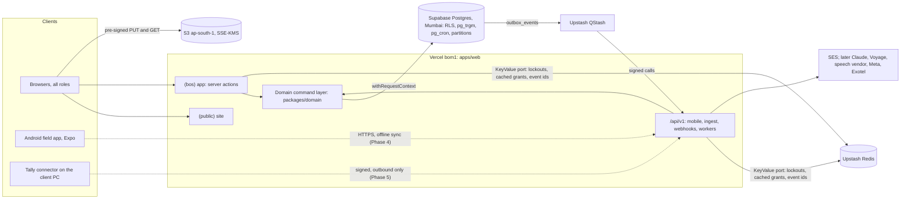
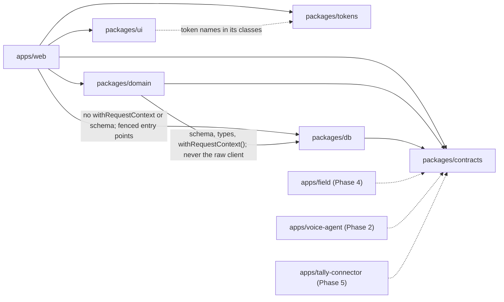
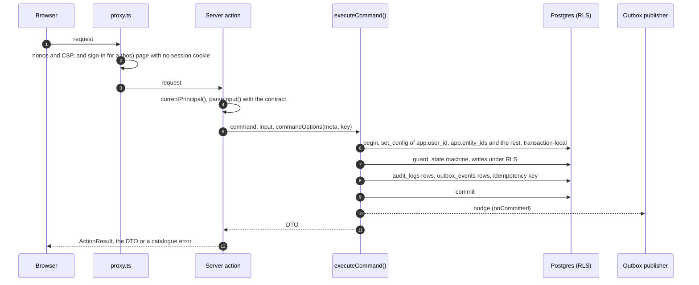
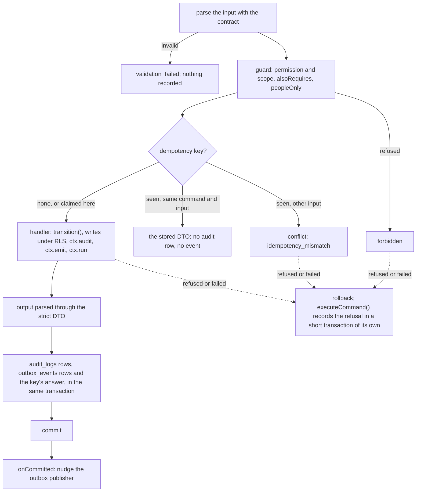
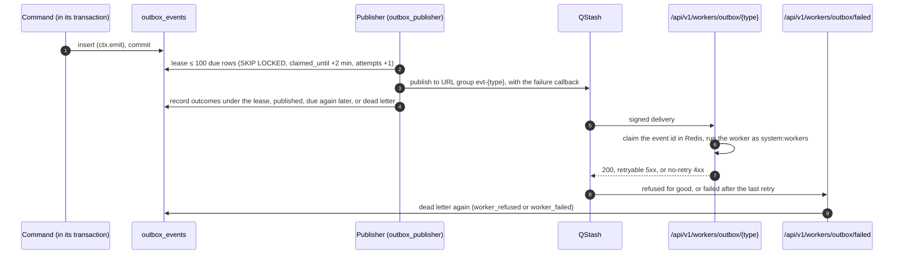
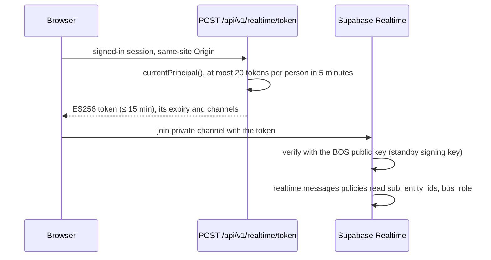
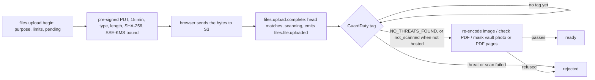

# Architecture — Shakti Prime BOS

Blueprint reference: §3–§6, §9.3, §10, §12. This document describes how the system is built and how a request, an event and an integration move through it. `docs/BLUEPRINT.md` governs on any conflict. What is built so far, and when, is in [STATUS.md](STATUS.md).

## Contents
1. [Quality attributes](#1-quality-attributes)
2. [System landscape](#2-system-landscape)
3. [Monorepo and dependency rules](#3-monorepo-and-dependency-rules)
4. [Request lifecycle (web)](#4-request-lifecycle-web)
5. [Domain command layer](#5-domain-command-layer)
6. [Events and workers](#6-events-and-workers)
7. [Integration patterns](#7-integration-patterns)
8. [Realtime](#8-realtime)
9. [Files, masking and print](#9-files-masking-and-print)
10. [Field app sync](#10-field-app-sync)
11. [AI runtime](#11-ai-runtime)
12. [Cross-cutting](#12-cross-cutting)
13. [Architecture decision records](#13-architecture-decision-records)

## 1. Quality attributes
| Attribute | Target | Mechanism |
|---|---|---|
| Correctness of money, stock and state | Zero drift | Deterministic domain layer, state machines, append-only ledgers, tax engine |
| Entity isolation | No cross-entity read or write; a shared customer is seen only through a relationship in an entity the caller holds | RLS with fail-closed policies, one request-context helper, `account_entities` as the customer scope root (ADR 0008) |
| Cost confidentiality | Cost fields never leave the DB for unauthorised roles | Restricted tables, cost-permission RLS, whitelisted DTOs |
| Latency | p95 interaction < 300 ms; ingestion → assignment < 10 s | Vercel `bom1` + Supabase Mumbai, keyset pagination, materialised dashboards |
| Availability | 99.5% in business hours; RPO ≤ 5 min; RTO ≤ 4 h | Managed services, PITR, nightly dumps, runbooks |
| Operability for one developer | Minimal vendor set, one language | TypeScript monorepo, managed services, strong CI |
| AI safety | No unsafe customer message; no cost leak to agents | Narrow tools, output filters, autonomy levels, agent principals |

## 2. System landscape

Dotted edges are planned. The domain defines the `KeyValue` port (`packages/domain/src/ports/key-value.ts`) and `apps/web` passes the Upstash implementation (`apps/web/src/auth/upstash-key-value.ts`); no command reads Redis.
- **Voice (Phase 2):** browser or app ⇄ WebRTC ⇄ LiveKit Cloud (India) ⇄ the voice worker apps/voice-agent (LiveKit Cloud Agents) ⇄ `/api/v1` as the speaking user.
- **Realtime:** Supabase Realtime private channels with a BOS-signed token (§8); the token route is built, the channels are planned.
- **Files:** S3 through 15-minute pre-signed URLs, with the malware scan and OCR masking as workers (§9).

### Runtime components and hosting
| Component | Runtime | Host |
|---|---|---|
| `apps/web` | Next.js server actions, route handlers, QStash-triggered workers | Vercel, functions pinned to `bom1` beside the database |
| apps/field (planned, Phase 4) | Expo Android app | Google Play (EAS Build/Update) |
| apps/voice-agent (planned, Phase 2) | LiveKit Agents worker (Node) | LiveKit Cloud Agents hosting, India region |
| apps/tally-connector (planned, Phase 5) | Node Windows service | Client PC beside Tally |
| Database | Postgres 17 with RLS, pg_trgm, pg_cron, partitions (pgvector with the Knowledge Vault) | Supabase (ADR 0002) |
| Queue | QStash (a workflow engine is a later choice, [DECISIONS](DECISIONS.md) 29-09-2026) | Upstash |
| Cache, locks, counters | Redis | Upstash |
| Object storage | S3 with KMS, lifecycle rules, backup bucket | AWS (ADR 0019) |

Each environment has its own project or database at each provider; the projects, plans and regions are in [accounts](runbooks/accounts.md), the only place they are listed.

## 3. Monorepo and dependency rules

- `packages/domain` takes the schema, its types and `withRequestContext()` from `packages/db` (`packages/domain/src/command/execute.ts`), never the raw client, which only `packages/db` may import (lint).
- `apps/web` names neither `withRequestContext` nor `schema`, and opens the restricted entry points of `packages/db` (`@shakti/db/auth`, `/grants`, `/outbox`, `/bootstrap`) only from the folders [AGENTS §3](../AGENTS.md#3-repository-layout-and-import-fences) names (lint); it changes data only through `executeCommand()` and reads through `executeQuery()`.
- `packages/domain` has no framework imports. It is testable with Vitest against a real Postgres.
- `packages/contracts` is the only shared surface between apps; it holds Zod schemas, DTO types, error codes and event names.
- `packages/db` owns schema, migrations, RLS SQL, seeds and the `withRequestContext()` helper.
- Turborepo tasks in `turbo.json`: `build`, `typecheck`, `test`, `test:security`, `test:e2e` (the Playwright journeys in `apps/web/e2e`, after the web build) and `db:generate`, the last three uncached. The db, tokens and contracts workspaces add the documents and icon their tests read to the inputs of `test`, and `web` adds `eslint.config.mjs`, which its fence test reads.
- `lint`, `format:check` and `copy-lint` run at the root; the root `db:*` scripts call the db workspace directly. The test layers, suite layout and CI jobs are in [TESTING.md](TESTING.md).

## 4. Request lifecycle (web)

1. **Edge:** Vercel routes the request. The proxy (`apps/web/src/proxy.ts`) gives every page request a fresh nonce and the Content-Security-Policy that trusts it; JSON routes get a fixed policy from `next.config.ts`, which also sets the other security headers.
2. **Session gate:** a request for a `(bos)` screen with no session cookie goes straight to sign-in from the proxy (`apps/web/src/session-gate.ts`, which reads only the cookie's presence). The `(bos)` layout and `currentPrincipal()` make the full check (a live, unrevoked session with its second factor) and redirect a request without a usable session.
3. **Server action or route handler** validates the input with the Zod contract from `packages/contracts`.
4. **`withRequestContext(principal, entityScope, fn, { readOnly })`** opens a transaction and sets `app.user_id`, `app.entity_ids`, `app.role`, `app.permissions`, `app.team_id` and `app.request_id` in its first statement, all transaction-local ([DATABASE §4.1](DATABASE.md#41-settings-per-transaction)).
5. **Command** runs inside the transaction: permission guard → state machine → business logic → writes → `ctx.emit()` appends `outbox_events` rows in the same transaction.
6. **Commit.** After commit the action's `onCommitted` nudges the outbox publisher, and a QStash schedule every minute is the safety net (QStash schedules are minute-granular); see §6.
7. **Response:** a server action answers the `ActionResult` envelope (`apps/web/src/actions/result.ts`): `{ ok: true, data }` with the command's DTO, or `{ ok: false, error, field?, reference? }` naming a catalogue sentence, since Next.js masks errors thrown from a server action in production. Server components re-render; other people's screens show the change on their next load (Realtime broadcasts are planned, §8).

**Reads** run inside `withRequestContext()` too, so RLS applies to reads and writes alike. `executeQuery()` always passes `readOnly`, and where `DATABASE_URL_READER` is set it runs on the `app_reader` pool (ADR 0018).

**Connections without a request context** are named and fenced by ESLint, which keeps every other module off them ([DATABASE §3](DATABASE.md#3-roles-and-connections)):
- the auth module's `auth_service` connection (identity tables only, `apps/web/src/auth`);
- the publisher's `outbox_publisher` connection (`@shakti/db/outbox`, the delivery columns of `outbox_events` only, from `apps/web/src/workers`);
- the migrator, seed and bootstrap scripts (table owner, never in a request);
- the readiness probe (`select 1`);
- the grants loader (`@shakti/db/grants`, from `apps/web/src/auth` and the import worker `apps/web/src/workers/imports.ts`), which calls `app.user_grants()`, a definer that resolves a user's own grants and returns no secret column.

## 5. Domain command layer
- **Definition:** `defineCommand({ name, permission, minScope?, alsoRequires?, peopleOnly?, input, output, constraintReasons?, auditInput?, auditFields, handler })`.
  - `permission` is a key, or a mapping from the input (a file's purpose names its permission).
  - `alsoRequires` lists further permissions the guard checks, each at its own narrowest scope.
  - `peopleOnly` makes the guard refuse an agent principal whatever it holds (SECURITY §3.3).
  - `auditInput` names what the audit row records of an input too large to record whole (an import file's rows); `auditFields` lists the keys the command's audit rows may carry, each with an Activity log label (outside production the runner refuses an undeclared key).
  - The registry is the single list of things the system can do; UI, `/api/v1`, agents, voice and imports call commands by name.
- **Context:** `{ principal, entityIds, activeEntityId, tx, emit, audit, activity, now, requestId, hosted, inImportBatch, run, savepoint }` (`packages/domain/src/command/context.ts`). `principal` is a user, an agent service principal, a voice session acting as a user, or the system principal of the workers.
  - `audit` records one changed aggregate.
  - `activity` writes one row of the customer timeline (`activities`: its type, customer, lead when it has one, company, and a payload of ids, codes, counts and short labels, or a note's text) as the caller in the command's transaction, under the insert policy, so a command that hands a lead to someone else records it first. The set-based import batch writes the same `lead_created` rows as `crm.lead.create`.
  - `run` calls another command as the same caller inside this transaction, with its own guard, DTO and idempotency key.
  - `savepoint` runs work in a savepoint whose rollback drops the audit changes and events recorded inside it.
  - `hosted` says whether the runtime is hosted (a file no scanner saw is refused there).
  - `inImportBatch` is set only when an import batch runs the command for one of its rows through `run`; the command then leaves out what only a person's own save needs, such as holding a new number.
- **The runner** (`runCommand` in `packages/domain/src/command/run-command.ts`, inside the transaction `executeCommand()` opens):

- **Permission guard:** checks `permission` against `app.permissions` with the scope rule (own / team / entity / all). Denied calls return `DomainError('forbidden')` and are audited as `outcome = denied`.
- **State machines:** `packages/domain/src/state-machines/*` define states, transitions, guards, side effects and permitted actors; commands call `transition(machine, record, event, ctx)`. Every machine, and which ones commands drive, is in the generated [state-machine index](state-machines/README.md).
- **Calculators:** TDH, kW sizing, kit availability, credit check, job-cost roll-up, incentive rules and the tax engine are pure functions with fixture-based tests. The sizing engine (`packages/domain/src/sizing`) works in SI units: `totalDynamicHead` (static head, drawdown, friction by Hazen-Williams, fittings, and the pipe velocity as advice), `pumpPower` (hydraulic, shaft and motor kW, the motor margin and the next standard HP), `suctionLift` (a surface pump's lift against its limit), `solarArrayForPump`, `rooftopSize` (the need, the roof and the sanctioned load at its ratio, and which one binds), `pumpDutyPoint` (the flow at the head on a pump's curve, or why it is off the curve), `pumpMatch` (the chosen pump's duty flow against the needed flow and its rating against the sized one), `dcrRule` and `sanctionedLoadRule`; every result carries `inBounds` and reason codes, with advice kept apart in `advisories`, `sizePump` and `sizeRooftop` combine them with the engineering constants of `WORKSHOP_DEFAULTS.sizing`, `crm.sizing.record` stores the inputs, the result and `SIZING_ENGINE_VERSION`, puts the sizing on the customer timeline and opens a `review` task for the lead's team lead when it is out of bounds, and `quoteSizingFacts` turns the newest sizing and a quote's lines into the quote guards' facts, so the quote guard reads a result the server computed.
- **DTOs:** each command declares an output schema. Cost fields exist only in DTOs of commands whose permission is `finance.cost.read` or `procurement.rate.read`.
- **Audit:** the command runner writes `audit_logs` in the command's own transaction (command, actor, entity, aggregate, redacted input, before/after, IP, device, request ID), one row per changed aggregate; `executeCommand` records denied and failed calls in a short transaction after the rollback; the auth module records sign-in and account events (docs/design/backend-weeks-3-5.md §3).

## 6. Events and workers
This section owns how an event is delivered: the lease, the backoff, dead letters and the failure callback. The event types and their payloads are generated into [EVENTS.md](data/EVENTS.md); the columns of `outbox_events` are in [DATABASE §6.10](DATABASE.md#610-platform) and who may change them in [§4.4](DATABASE.md#outbox_events).

- **Outbox:** `outbox_events` is written in the command's transaction. Its delivery columns are updated only by the `outbox_publisher` role, and rows are deleted only by the daily retention purge (`app.purge_outbox_events()`, events published more than 30 days ago; a failed run is recorded in `retention_runs` and reported failed to pg_cron).
- **Publisher lease:** one short statement leases up to 100 due events in delivery order (`FOR UPDATE SKIP LOCKED`, `claimed_until` two minutes ahead) and counts one attempt on each. The run then calls QStash with no transaction open and records the outcomes under its lease in a second short transaction. Delivery is at least once.
- **URL groups:** each event type is published to its QStash URL group `evt-<type>`; before a type's first event in each process the publisher upserts that type's worker, `/api/v1/workers/outbox/<type>`, as the group's endpoint. A type with no worker is marked delivered without sending (EVENTS.md). `print.document.requested` is the exception: the publisher sends it straight to `/api/v1/workers/pdf/render` as a `PdfRenderJob` (`EVENT_JOB_ROUTES` in `apps/web/src/workers/qstash.ts`), with the event's failure callback.
- **Released and lost attempts:** a row the delivery gave no outcome, or every row when the delivery throws, is released at once with its attempt given back. Only a run that dies before recording leaves its attempt used; the next lease dead-letters a due row whose ten attempts are spent (`last_error = 'no_outcome'`) and answers its id, so that run counts it among its dead letters and logs it by id.
- **Backoff:** a failed event is due again at its `next_attempt_at`: 1, 2, 4, 8, 16 and 32 minutes after each failure, then an hour. Each wait moves by up to a fifth either way and never past an hour, so the hourly waits only shorten (48 to 60 minutes), and the tenth attempt comes about four hours after the first.
- **Dead letters:** after ten attempts an event is dead-lettered, and Integration Health (`/admin/integrations`) shows it with its error code and Send again (`integrations.dlq.replay`).
- **Worker routes:** route handlers under `/api/v1/workers/*` refuse a body over 4 KiB (`WORKER_BODY_MAX_BYTES` in `apps/web/src/request-body.ts`), the render worker one over 24 KiB, room for a sheet of 500 labels (`PDF_JOB_MAX_BYTES`), and the failure callback `/workers/outbox/failed` one over 64 KiB (`FAILURE_BODY_MAX_BYTES` in `apps/web/src/workers/outbox-failures.ts`), since QStash sends the event again in base64 with the worker's last answer and the headers of both; then they verify the QStash signature (API §3.6). The event worker parses the publisher's `DeliveredEvent` and hands it to `deliverEvent()` (`apps/web/src/workers/events/deliver.ts`).
- **Duplicates:** `deliverEvent()` first claims the event's id in Redis (`evt:{id}`, `SET NX` with a five-minute lease). An id already handled answers `duplicate`; an id another delivery holds answers a retryable `409 conflict`. On success the id is kept as handled for seven days; on failure the claim is removed, so the retry runs it again.
- **Ordering:** the worker registered for the type in `apps/web/src/workers/events/registry.ts` declares it. `every`, the default, handles every event exactly once by id, whatever order QStash delivers them in; `latest-only` skips an event no newer than the last it handled for the aggregate (`seq:{type}:{aggregateType}:{aggregateId}`, raised to the maximum in one step by a server-side script).
- **Principal:** a worker runs as the system principal `system:workers`, scoped to the event's company, and changes data only through `executeCommand` (ADR 0020).
- **Worker answers:** a worker's `validation_failed`, `forbidden` or `not_found` answers its status with QStash's no-retry header; every other failure is retried.
- **Failure callback:** each event is published with `POST /api/v1/workers/outbox/failed`. When a worker refuses an event for good, or still fails after QStash's retries, that route, as `outbox_publisher`, turns the event back into a dead letter (`last_error` `worker_refused` or `worker_failed`, the one change of a delivered event the outbox trigger allows).
- **Alerts:** a run that dead-letters any event, or a failure callback that holds one back, reports `outbox.dead_lettered` to Sentry. The third run in a row that delivers nothing it tried reports `outbox.publisher_failing` (counted in Redis and reset by a run that delivers). Both carry counts and ids only; an alert rule sends them to the owner.
- **Readiness:** `outbox` is down only when a due event has waited more than five minutes since it became due, which means the publisher is not running; events waiting out their backoff and dead letters are logged as `outbox.backlog`.
- **Without QStash** (locally and in CI) the publisher hands subscribed events to the same `deliverEvent()` in process.
- **The import commit worker** answers `403 forbidden` with QStash's no-retry header when the person who asked is suspended or has lost the import permission in that company.
- **Long flows:** nurture cadences are follow-up tasks created when a lead moves to nurture (Phase 1); document chasing and subsidy-gate follow-ups come with Phase 4. No workflow engine runs in Phase 1; one is a later choice ([DECISIONS](DECISIONS.md), 29-09-2026).
- **Scheduled jobs:** pg_cron for materialised-view refresh, retention and reminders that are pure SQL (DATABASE §7); QStash schedules for jobs that call external services.

## 7. Integration patterns
None of these is built; the vendor harnesses in `apps/web/src/integrations` (with the pure rules in `packages/domain/src/telecom` and `packages/domain/src/tally`) wait for the vendor sandboxes ([STATUS](STATUS.md)).

| Integration | Phase | Pattern |
|---|---|---|
| Inbound webhooks (Meta WhatsApp, Lead Ads, Exotel) | 2 | Verify signature → insert raw payload in `webhook_inbox` → return 200 → QStash worker processes idempotently by provider event ID → commands. |
| Website forms | 2 | Signed ingest API per entity with Turnstile; same normalisation and dedupe as other sources (PRD CRM-01). |
| Tally connector | 5 | Reads by AlterID, pushes signed batches to `/api/v1/connector/tally/*` with `Idempotency-Key`; daily GUID snapshot for tombstones; heartbeat every 5 minutes; self-updates from signed releases. |
| Outbound WhatsApp | 2 | Commands emit `message.requested`; the messaging worker checks window, opt-out, template approval, tier budget and the deterministic output filter, then sends and records status webhooks. |
| Exotel | 2 | Click-to-dial from the caller workspace calls the Exotel API with the entity's 140/160-series caller ID; status and recording webhooks update `calls`; recordings copied to S3 and transcribed by a worker. |
| Claude, Voyage, speech vendor | 1 (Triage in shadow mode, Knowledge Vault embeddings), 2 (speech) | Provider wrappers with timeouts, retries, prompt caching, budgets, PII masking and structured outputs. |
| LiveKit | 2 | The voice worker joins the room, streams STT → Claude → TTS, and calls `/api/v1` with a short-lived token minted for the speaking user. |

## 8. Realtime

- **Built:** the token route, the key list and the discovery document (API §3.8). **Planned:** the channels and their `realtime.messages` policies, once the deferred Realtime spike runs on the production domain ([STATUS](STATUS.md)).
- Supabase Realtime private broadcast channels per user (`user:{id}`) and per entity topic (`entity:{id}:queue`, `entity:{id}:board`).
- The BOS signs a short-lived ES256 JWT (`sub`, `entity_ids`, `bos_role`, `aud: shakti-realtime`, `role: authenticated`, `exp` ≤ 15 min, ADR 0003; `RealtimeClaims` in `packages/contracts/src/api/realtime.ts`) from its own key pair, and serves its key list and discovery document at `/.well-known/jwks.json` and `/.well-known/openid-configuration` (API §3.8).
- Supabase's third-party auth accepts named vendors only, so the project verifies the token with the BOS public key imported into its JWT signing keys as a standby key; the deferred Realtime spike proves it end to end (`docs/spikes/realtime.md`).
- The token grants Realtime only; it carries no Data API role. All data still flows through commands.
- **Planned:** commands broadcast after commit through the outbox to a notify worker, so a broadcast never precedes a committed write; no notify worker exists. Until the spike passes, the notification centre (Phase 1) polls every 15 seconds while its tab is visible ([DECISIONS](DECISIONS.md), 29-09-2026).

## 9. Files, masking and print
This section owns the upload pipeline and the checks a file passes before it is `ready`; SECURITY §8 links here. The decision is ADR 0019.

- **Store:** the `FileStore` port (`packages/domain/src/ports/file-store.ts`) with `put`, `get`, `presignPut`, `presignGet`, `head`, `tags` and `delete`.
  - Hosted: `s3FileStore` (`apps/web/src/files/s3-store.ts`), one bucket per environment in `ap-south-1` (`FILES_BUCKET`), versioned, SSE-KMS under the environment's key (`FILES_KMS_KEY_ID`), GuardDuty Malware Protection tagging each new object, created by the stack `infra/aws/files.yaml` (`docs/runbooks/files-setup.md`).
  - On a developer's machine: `localDiskFileStore` in the git-ignored folder `.data/files` of `apps/web`, with the development route `PUT`/`GET /api/v1/files/local/<token>` (a signed grant; 404 on a hosted runtime).
  - `fileStore()` in `apps/web/src/files/store.ts` picks S3 when both variables are set, local disk when not hosted, and none on a hosted runtime without S3, where uploads answer `integration_unavailable` (`files_unavailable`).
- **Upload:**
  - `files.upload.begin` checks the purpose's permission (`packages/domain/src/files/purposes.ts`, the same map as `app.file_purpose_grant()`) and its type and size limits (`files/limits.ts`), and records the file as `pending` under the key `<company>/<purpose>/<file id>.<ext>`.
  - The web layer signs a PUT for 15 minutes with the type, length, SHA-256 and encryption bound into the signature, so the store refuses any other bytes. The browser sends the bytes straight to the store with progress (`Uploader` in `packages/ui`, `sendFile` in `apps/web/src/components/files`).
  - `files.upload.complete` compares what the store holds (`head`) with what the upload declared, moves the file to `scanning` and emits `files.file.uploaded` (ids and the purpose only).
  - The screens call the server actions in `apps/web/src/actions/files.ts`; the same commands are reached at `POST /api/v1/files/presign` and `POST /api/v1/files/:id/complete` (API §3.2a), which the field app uses from Phase 4.
- **Checks before `ready`:** `handleFileUploaded` (`apps/web/src/workers/files`), the event worker of `files.file.uploaded` (ordering `every`), runs as `system:workers` (`files.process:all`, held by no person's role) through `files.file.mark_scanned`, `files.file.mark_ready` and `files.file.reject` (the `file_upload` state machine).
  - **Malware scan:** GuardDuty's `GuardDutyMalwareScanStatus` tag. `NO_THREATS_FOUND` passes; no tag yet answers `integration_unavailable`, so the queue delivers again; a threat or a scan that could not run rejects the file. With no scanner the file is `not_scanned`, which `files.file.mark_scanned` accepts only when the caller says the runtime is not hosted (`RunOptions.hosted`, taken as hosted unless said otherwise).
  - **Images** are re-encoded with `sharp`: metadata dropped, orientation applied, at most 50 megapixels, the longest side at most 4,096 px.
  - **PDFs** are refused unless they have their header and end marker and name none of `/JavaScript`, `/JS`, `/Launch`, `/EmbeddedFile`, `/EmbeddedFiles`, `/XFA`, `/RichMedia` and `/AA`, escaped or inside a stream. The check fails closed: a stream other than an image that is not plain or bare Flate without decode parameters, or one that does not unpack or passes the 32 MB budget, refuses the file.
  - **Vault photos** pass the OCR masking of `apps/web/src/workers/ocr`; a **vault PDF** is drawn page by page (MuPDF, WebAssembly, loaded on first use), each page masked the same way, and only a PDF of the masked pictures is kept. The masking step reads its language data from the folder `OCR_LANG_PATH` names; without it these checks wait and are delivered again.
  - **Bytes kept:** a changed copy is stored under its own key. The key of the upload's own bytes is recorded (`scan_result.originalKey`) before the file is marked `ready` or `rejected`, and those bytes are deleted with every stored version on that delivery and again on every later one while any remain.
  - Only then does `status` become `ready`, and the uploader shows the outcome in words. A file still waiting after ten minutes is listed on Integration Health, where an Executive sends it back to its checks (`files.file.recheck`, which emits `files.file.uploaded` again).
- **Read:** a pre-signed GET for 15 minutes (`presignGet`, the `openFile` action) of a `ready` file the caller may read under RLS; views of sensitive documents are audited.
- **Field encryption:** the `FieldCipher` port (`packages/domain/src/privacy/field-cipher.ts`) seals a value with AES-256-GCM under its own data key. The table, column, company and row are bound as additional data, and the data key comes from KMS `GenerateDataKey` with the same four as its encryption context (`apps/web/src/crypto/kms-cipher.ts`, the environment's key); on a developer's machine and in CI it comes from `FIELD_ENCRYPTION_KEY`, which a hosted runtime refuses.
- **Print and PDF:** HTML templates in `apps/web/src/print/*` with Inter embedded (ADR 0009); the render worker `/api/v1/workers/pdf/render` loads a document through the loader its type registers (`apps/web/src/print/documents.ts`), prints it with Chromium (`@sparticuz/chromium` on Vercel, the installed Playwright Chromium elsewhere, no network fetch while rendering), stores the PDF through the file store and records it with `files.document.record`, as `system:workers` of the selling company; the first document is a company's proof page (Settings › Companies, Print a proof page). The same templates serve the on-screen print view.

## 10. Field app sync
Planned for Phase 4 (ADR 0012); nothing of it is built.
- Records created offline get client-generated UUIDv7 IDs, so uploads are idempotent.
- **Pull:** `/api/v1/sync/pull?since=<cursor>` returns the engineer's schedule, jobs, checklists and reference data with a server cursor.
- **Push:** `/api/v1/sync/push` sends a batch of commands with an `Idempotency-Key` per command. The server applies them in order through the command layer; status transitions are server-authoritative, survey fields merge per field by timestamp, stock and expense commands are idempotent.
- **Conflicts** are returned as a list and shown in the conflict review screen.
- Photos upload in the background with on-device compression; the record references the object key and is marked complete when the upload lands.
- A minimum-version gate blocks pushes from clients below the supported API version.

## 11. AI runtime
Built (AI0): the runtime, the provider wrapper and the Agent Inbox; no agent ships yet. The Triage agent comes in shadow mode with A1 in Phase 1, the Concierge and Co-pilot in Phase 2, the others in Phase 6 (ROADMAP §1).
- **Provider wrapper** (`packages/domain/src/ai/provider.ts`, ADR 0011): masking, labelled outside data, timeouts, bounded retries, a circuit breaker and the daily spend caps in Redis (the `KeyValue` port), Claude through `@anthropic-ai/sdk` (Haiku 4.5 by default) and Voyage embeddings over `fetch` (`vendor-transports.ts`), a fake transport for every test, and `integration_unavailable` without a key (SECURITY §6). The web runtime builds it on first use (`apps/web/src/integrations/ai.ts`).
- **Runtime path** (`runAgentStep()` in `packages/domain/src/ai/runtime.ts`): the agent's worker reads the agent's settings as the agent (`resolveAgentConfig()`), lets the agent's code ask the model through the wrapper bound to the run, and records the run with what it proposes through `agents.run.record`, which in its own transaction files the suggestion with an inbox item (Automatic, which would run the command as the agent, is not available in Phase 1). A step is keyed by its event, agent and action type, so a redelivered event is answered from the run it recorded. A refused action is recorded as a failed run; a switch that is off or a reached cap stops the run before any call.
- **Agent Inbox** (`/inbox`, with its count in the top bar) and **Admin › Agents** (`/admin/agents`): `agents.inbox.approve`, `.edit` and `.reject` decide on a Needs approval suggestion, approving runs the command as the person who decides, and `agents.inbox.dismiss` closes a Suggest one, which the person acts on themselves; `agents.config.set` and `agents.killswitch.set` set autonomy, caps and switches (SECURITY §3.3).
- **Trigger:** outbox events (lead created, message received, call ended, gate due) start an agent run; the Triage agent runs as one QStash step, and a workflow engine for longer runs is a later choice ([DECISIONS](DECISIONS.md), 29-09-2026).
- **Run:** the run builds the context (masked), calls Claude through the wrapper with typed tools that wrap commands, and records each run in `agent_runs` and each action in `agent_actions`.
- **Principal:** each agent runs as its own service principal (`agent:<name>`) inside `withRequestContext()`, so RLS and permissions apply. No agent principal holds a cost permission.
- **Autonomy:** the action's autonomy level (Suggest / Needs approval / Automatic) is read from `agent_configs` per agent × action type. Suggest and Needs approval create Agent Inbox items; Automatic executes and notifies, from Phase 6 (refused in Phase 1, design §7.1).
- **Guardrails in code:** tier prices only; out-of-bounds engineering results go to review; only people record a sizing (ADR 0021); WhatsApp window and opt-out; TRAI hours and number series; consent; output filters on every outbound message; per-agent daily spend caps; kill switches (global, per agent, per entity).
- **Ask service:** Ask the Business and voice Ask run as the user through the same retrieval and tool set, so the answer respects the user's permissions.
- **Evals:** `agent_evals` store prompt versions, eval sets and scores; a prompt or model change cannot ship without a passing eval run.

## 12. Cross-cutting
- **Configuration:** environment variables in Vercel (EAS from Phase 4, the connector's encrypted local config from Phase 5). A hosted runtime refuses to start while `productionConfigProblems()` in `apps/web/src/auth/deps.ts` (run from `instrumentation.ts`) reports a missing variable, a published or short secret, a Turnstile test key, a non-https address or a mail setting the environment does not allow.
- **Feature flags (planned, no phase set):** a `feature_flags` table with per-entity and per-role overrides, read through one helper (DATABASE §6.10; ROADMAP §11 uses them for rollout). The permission `admin.flags.write` exists; the table does not.
- **Error reporting:** Sentry (`@sentry/nextjs`) in the web app, in the group's US-region organisation, with personal data removed before an event is sent (ADR 0015).
  - On the server and the edge it starts in `instrumentation.ts`, which also reports every unhandled request error with its request id; in the browser a small loader fetches the SDK when the page is first idle, so no page's first load carries it.
  - `sendDefaultPii` is off; every event, transaction and breadcrumb passes `apps/web/src/observability/sentry-scrub.ts`, which applies the logger's redaction (`@shakti/domain/redaction`), keeps no cookie, header, query string or body, names the person by principal id only and keeps the principal and request ids as the only tags.
  - `release` is the commit and `environment` is `BOS_ENVIRONMENT`; without a DSN nothing is started or loaded, and source maps are uploaded at build time only with `SENTRY_AUTH_TOKEN`. The field app, the connector and the voice worker join with their phases.
- **Logs:** structured JSON with request ID and no PII. Every command and query writes one line, `command.completed` or `query.completed`, with `name`, `outcome`, `errorCode` when it failed, `durationMs` and `requestId`, at `warn` when it took more than 300 ms; every `executeQuery()` in `apps/web` passes `{ name }`, the action's name, which `apps/web/src/query-names.test.ts` checks.
- **Metrics and uptime:** built: Integration Health (`/admin/integrations`) shows the events waiting to go out, the last publisher run, delivery speed, dead letters and files waiting for their checks; readiness reports a stalled publisher, and Sentry alerts on dead letters (§6). Planned: the connector heartbeat (Phase 5), WhatsApp quality (Phase 2), AI spend (with the agents, from Phase 1), and uptime checks on the public site, the BOS and the ingest API before go-live.
- **Environments:** `dev`, `staging` and `production`, each its own Supabase project and its own Vercel project, with no database branching; staging holds synthetic data only. `BOS_ENVIRONMENT` names the environment (`docs/runbooks/DEPLOY.md`); the projects, plans and regions are in [accounts](runbooks/accounts.md).
- **CI:** GitHub Actions run lint, format, copy lint, typecheck, unit tests (with the contract tests in `packages/contracts/src/api`), the production build with the JavaScript budget per page, a secret scan and dependency audit, and the security suite; a merge-on-green workflow merges a PR once that run passes and runs CI again on `main` (ADR 0017, [TESTING.md](TESTING.md)).
- **Deployments:** Vercel builds a preview per PR and deploys each environment's project from `main`. A release migrates the hosted database and checks the deployment by [DEPLOY §2](runbooks/DEPLOY.md#2-every-deploy), the one procedure for it; migrations follow expand/contract (DATABASE §8). The field app ships through EAS with staged rollouts (Phase 4).

## 13. Architecture decision records
ADRs live in `docs/adr/` as `NNNN-title.md`: a header line with the status, date (DD-MM-YYYY), deciders and the sections it touches, then context, decision and consequences. An ADR records a decision when it was taken; its text is not rewritten afterwards except to correct a fact or record its status.

| ADR | Decision | Status |
|---|---|---|
| [0001](adr/0001-monorepo-pnpm-turborepo.md) | Monorepo with pnpm and Turborepo | Accepted |
| [0002](adr/0002-supabase-postgres-mumbai-rls.md) | Supabase Postgres in Mumbai with RLS as the isolation boundary | Accepted |
| [0003](adr/0003-better-auth-and-bos-signed-realtime-jwt.md) | Better Auth over Supabase Auth, with BOS-signed JWTs for Realtime | Accepted |
| [0004](adr/0004-domain-command-layer.md) | Domain command layer as the single mutation path | Accepted |
| [0005](adr/0005-transactional-outbox-qstash-workflow.md) | Transactional outbox with Upstash QStash and Workflow | Accepted; the Workflow part waits (no workflow engine in Phase 1) |
| [0006](adr/0006-uuidv7-primary-keys.md) | UUIDv7 primary keys generated by clients and server | Accepted |
| [0007](adr/0007-deterministic-tax-engine.md) | Deterministic tax engine with effective-dated rates and composite-supply valuation | Proposed (the CA's golden set) |
| [0008](adr/0008-shared-customer-master.md) | One customer record for the group with a relationship per selling entity | Accepted |
| [0009](adr/0009-chromium-html-pdf-and-print.md) | Chromium-rendered HTML for PDFs and print, in a Vercel function | Accepted |
| [0010](adr/0010-livekit-cloud-typescript-voice-agent.md) | LiveKit Cloud with a TypeScript agent worker for live voice | Proposed (the voice spike) |
| [0011](adr/0011-claude-provider-wrapper-voyage-pgvector.md) | Claude Haiku 4.5 and Sonnet 5 behind a provider wrapper; Voyage embeddings in pgvector | Proposed (shadow-mode measurements) |
| [0012](adr/0012-expo-watermelondb-offline-field-app.md) | Expo with WatermelonDB for the offline field app | Proposed (the Phase 4 build) |
| [0013](adr/0013-read-only-tally-connector.md) | Read-only Tally connector with AlterID reads and deletion tombstones | Proposed (the Tally spike) |
| [0014](adr/0014-english-interface-hinglish-speech.md) | English interface, with Roman-script Hinglish only for caller scripts, voice speech and training | Accepted |
| [0015](adr/0015-sentry-us-region-scrubbed.md) | Sentry in the group's US-region organisation, personal data removed before sending | Accepted |
| [0016](adr/0016-catalogue-and-tax-writes-for-all-companies.md) | Catalogue, tax and group-wide price writes only in a request for every company | Accepted |
| [0017](adr/0017-github-free-plan-trimmed-ci.md) | GitHub's free plan with a trimmed CI and merge-on-green, no branch rules | Accepted |
| [0018](adr/0018-app-reader-read-pool.md) | The read-only login role `app_reader` with its own pool for queries | Accepted within the Phase 1 design |
| [0019](adr/0019-s3-guardduty-kms-files.md) | Files in S3 under SSE-KMS, scanned by GuardDuty; fields sealed with KMS data keys | Accepted within the Phase 1 design |
| [0020](adr/0020-system-workers-treated-as-agent.md) | `system:workers` follows an agent's customer rules | Proposed (the owner, at T2) |
| [0021](adr/0021-people-record-sizing.md) | Only people record the sizing a quote relies on; agents only suggest | Accepted |

The review of the Proposed ADRs 0007 and 0010 to 0013 is a deferred Phase 0 gate item (ROADMAP §2); the owner's decisions are listed in [DECISIONS.md](DECISIONS.md).
