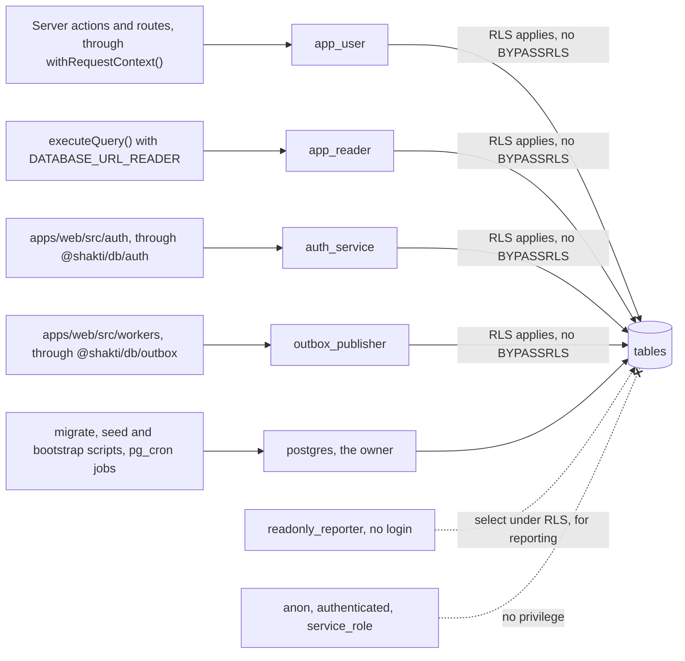
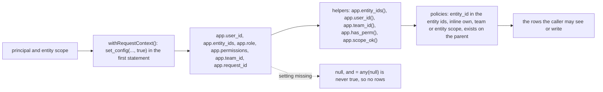

# Database — Shakti Prime BOS

Blueprint reference: §6. This document fixes the conventions every table follows, the RLS templates, the table catalogue with key columns, and the migration workflow. `docs/BLUEPRINT.md` governs on any conflict.

Generated from the code and this document by `pnpm db:docs`, with a unit test that fails when they are stale: the ERD ([docs/data/ERD.md](data/ERD.md)), the data dictionary ([docs/data/DATA-DICTIONARY.md](data/DATA-DICTIONARY.md), every column, constraint, index, trigger and policy as the migrations leave them) and the event catalogue ([docs/data/EVENTS.md](data/EVENTS.md)).

## Contents
1. [Platform](#1-platform)
2. [Conventions](#2-conventions)
3. [Roles and connections](#3-roles-and-connections)
4. [Request context and RLS](#4-request-context-and-rls): [4.1 Settings per transaction](#41-settings-per-transaction), [4.2 Policy templates](#42-policy-templates), [4.3 Restricted tables](#43-restricted-tables), [4.4 Rules of particular tables](#44-rules-of-particular-tables)
5. [Append-only tables](#5-append-only-tables)
6. [Table catalogue](#6-table-catalogue): [6.1 Org and identity](#61-org-and-identity), [6.2 CRM](#62-crm), [6.3 Catalogue, pricing and tax](#63-catalogue-pricing-and-tax), [6.4 Sales](#64-sales), [6.5 Inventory and logistics](#65-inventory-and-logistics), [6.6 Projects and field](#66-projects-and-field), [6.7 Finance and costing](#67-finance-and-costing), [6.8 HR](#68-hr), [6.9 AI and voice](#69-ai-and-voice), [6.10 Platform](#610-platform)
7. [Partitioning, indexes, retention](#7-partitioning-indexes-retention)
8. [Migrations](#8-migrations)
9. [Seeds and test data](#9-seeds-and-test-data)
10. [Backups and recovery](#10-backups-and-recovery)

## 1. Platform
Supabase Postgres 17, extensions `pg_trgm` (migration 0003, in schema `public`), `btree_gist` (0006) and `pg_cron` (0033); `pgvector` is created with the Knowledge Vault (Phase 1) and `pgcrypto` with the first migration that uses it. One database per environment, each its own Supabase project (dev, staging, production); the projects, plans and regions are in [accounts](runbooks/accounts.md). Connection through Supavisor in transaction mode; prepared statements disabled in the driver.

## 2. Conventions
| Concern | Rule |
|---|---|
| Naming | `snake_case` tables (plural) and columns; FK columns `<singular>_id`; booleans `is_*`; timestamps `*_at` |
| Primary keys | `id uuid` (UUIDv7, generated by the app or the field client); never exposed as sequential numbers. Exceptions (ADR 0006): `entities.id smallint`, `permissions.key text`, and the composite keys of `role_permissions (role_id, permission_key)`, `account_contacts (account_id, contact_id)`, `opportunity_tags (opportunity_id, tag_id)`, `idempotency_keys (principal_id, key)`, `import_rows (job_id, row_no)`, and the partitioned `audit_logs (id, created_at)` and `activities (id, created_at)` |
| Business keys | Human-facing numbers (`quote_no`, `so_no`, `proforma_no`, `challan_no`) come from `document_sequences` per entity, document type and financial year; gapless within a series |
| Entity scope | Every business table has `entity_id smallint not null references entities(id)`; a child of a scoped parent also carries a composite foreign key `(parent_id, entity_id) references parent(id, entity_id)`, so a row can never sit in a different entity from its parent. Exceptions: the shared customer master (`contacts`, `accounts` and their children carry no entity; `account_entities` is the scope root, ADR 0008) and shared reference rows (`teams`, `pipelines`, `price_lists`, `tags` allow `entity_id null` for the whole group) |
| Timestamps | `created_at timestamptz not null default now()`, `updated_at timestamptz not null` (trigger), stored in UTC |
| Actor columns | Most tables carry `created_by` and `updated_by`, referencing `principals(id)` (users, agent principals, voice sessions, the system principal); the auth module's tables, the append-only and log tables and the bookkeeping tables do not, and the [ERD](data/ERD.md)'s opening note lists every table without them, from the schema |
| Soft removal | Masters use `archived_at`; ledgers, documents and audit rows are never deleted by the app |
| Money | `numeric(14,2)`; quantities `numeric(12,3)`; rates `numeric(14,4)`; percentages `numeric(5,2)` |
| Enums | `text` columns with a `check` constraint listing allowed values; values are `snake_case`; state columns are written only by state machines |
| JSON | `jsonb` only for provider payloads, dynamic checklists and survey answers; never for money or state |
| Phones | `contact_phones.e164 text` with a check on `^\+[1-9]\d{6,14}$` |
| Names | One `name` column in English or Roman script; no per-language name columns (ADR 0014) |
| Search | `pg_trgm` GIN indexes on names and villages, tolerant of spelling variants; under RLS a search reaches them through a definer that returns candidate ids (§4.2) |
| Vectors | `vector(1024)` for Voyage embeddings with an HNSW index; iterative scan enabled for filtered queries |

## 3. Roles and connections

ESLint keeps each connection to the code shown: `@shakti/db/auth` only in `apps/web/src/auth` and `apps/web/scripts`, `@shakti/db/outbox` only in `apps/web/src/workers`, `@shakti/db/grants` only in `apps/web/src/auth` and the import worker, `@shakti/db/bootstrap` only in `apps/web/scripts`, and the raw client only inside `packages/db`.

| Role | Used by | Rights |
|---|---|---|
| `postgres` (Supabase owner) | Migrations, seeds and pg_cron jobs | Owns tables |
| `app_user` | All application connections | `SELECT/INSERT/UPDATE` per table; `UPDATE/DELETE` revoked on append-only tables; no `BYPASSRLS`; not the table owner; role settings `statement_timeout 30s`, `lock_timeout 10s`, `idle_in_transaction_session_timeout 30s` |
| `app_reader` | The queries' own pool (`executeQuery()` when `DATABASE_URL_READER` is set; ADR 0018) | `SELECT` on exactly what `app_user` may select, table by table and column by column, under the same policies (every policy naming `app_user` for select or for every command names `app_reader` too, 0062); execute on the definers a read calls (`app.lead_search_ids()` and `app.outbox_health()`, 0062; `app.user_is_active()`, 0063; `app.request_covers_group()`, 0072; `app.customer_search_ids()`, 0089; `app.stale_upload_entities()`, 0093) and on no definer that writes; no write privilege, no `BYPASSRLS`, owns nothing; the same three timeouts as `app_user` and `default_transaction_read_only = on`. Created by the migrations whether or not `APP_READER_PASSWORD` is set; without the password no one can sign in as it. A later table or select policy for `app_user` names `app_reader` in the same migration, which `grants.test.ts` checks |
| `auth_service` | The auth module only (Better Auth's adapter and session bookkeeping in `apps/web/src/auth`) | Full access to `sessions`, `auth_accounts`, `auth_verifications`, `user_two_factor`; `SELECT/UPDATE` on `users`; nothing on any business table; no `BYPASSRLS`; the same three timeouts as `app_user` |
| `outbox_publisher` | The outbox publisher and its failure callback only (`apps/web/src/workers`) | `SELECT` and a column-level `UPDATE (published_at, attempts, last_error, dead_lettered_at, next_attempt_at, claimed_until)` on `outbox_events`; nothing on any other table; no `BYPASSRLS`; the same three timeouts as `app_user` |
| `readonly_reporter` | No login; for materialised-view refresh and exports | `SELECT` only, RLS applies; no access to the auth module's tables; no execute on the definers |
| `anon`, `authenticated`, `service_role` (Supabase API roles) | Never | No privilege on any application table, sequence or function, whether it exists or is created later (default privileges); the Data API is switched off on every hosted project; no role may create temporary objects |

Agent principals, voice sessions and the system principal `system:workers` (the event workers, SECURITY §3.3) are application-level principals, not database roles. They connect as `app_user` with their own request context.

## 4. Request context and RLS


### 4.1 Settings per transaction
`withRequestContext()` sets, transaction-local (`set_config(name, value, true)`):
- `app.user_id`: principal UUID;
- `app.entity_ids`: `{1,2}` style array literal of the principal's allowed entities for this request (all allowed, or the single active entity);
- `app.role`: role key;
- `app.permissions`: comma-separated permission keys with scope suffixes, e.g. `crm.lead.read:entity,sales.quote.create:own`; a grant is written with every narrower scope as well, so `finance.cost.read:all` also yields `:entity`, `:team` and `:own` and a policy can check the scope it needs;
- `app.team_id`: for team-scoped permissions;
- `app.request_id`.

How the settings behave:
- `withRequestContext(principal, scope, fn, { readOnly, reader })` sets them all in its first statement.
- With `readOnly` that statement also sets `transaction_read_only` for the transaction, so an insert, update, delete or sequence step fails with SQLSTATE 25006; `executeQuery()` always passes it. With `reader` the transaction runs on the `app_reader` pool, whose role cannot write at all (§3, ADR 0018).
- Every setting is transaction-local, so nothing outlives the transaction on a server connection Supavisor hands to another client in transaction mode.
- A function that commits inside the transaction takes the RLS settings with it, and a write after that is refused by row security, which fails closed without them.

`app.raise_append_only()` is the trigger function of every append-only table (§5).

#### Security-definer functions
Default privileges in schema `app` grant execute to `app_user` (0000) and take it from `readonly_reporter` (0012). `public` keeps Postgres' default execute on every new function, so every `security definer` function carries an explicit `revoke ... from public, readonly_reporter`, which `grants.test.ts` checks for every definer, and checks a permission inside its body, unless the second table below lists it as an exception.

Every definer fixes its search path. An empty one (`''`) means the body names every object with its schema. `pg_catalog, public, app, pg_temp` is safe as well: no request role may create objects in `public` or `app` or create temporary objects, and with `pg_temp` last a temporary object could never stand in for a named one. The migration column names where the function was defined, then the migrations that changed it.

| Function | What it checks and answers | Search path | Migration |
|---|---|---|---|
| `app.next_document_no(entity_id, doc_type, fy, prefix)` | Re-checks `app.entity_ids()` and the permission that creates the document type, then issues the next gapless number of the series, so `document_sequences` takes no direct write from the application role; executable by `app_user` only | `pg_catalog, public, app, pg_temp` | 0006 (0012, 0024) |
| `app.reset_two_factor(user_id)` | `admin.users.write:all`; refuses the caller's own account and a person who holds a role outside the request's companies; removes the authenticator for `admin.user.two_factor.reset` (§6.1) | `''` | 0039 (0059) |
| `app.replay_dead_letter(event_id)` | `integrations.dlq.replay:all`; puts a dead letter back in the queue (§6.10) | `''` | 0044 (0054) |
| `app.outbox_health(cursor_at, cursor_id, limit)` | `admin.integrations.write:all` in a request with a company; Integration Health for the request's companies only: counts by event type (pending, due, dead-lettered, the oldest pending) and one page of dead letters newest first after the keyset cursor (ids, type, company, aggregate, attempts, times, and the last error when it is a code, `other` when not), never a payload | `''` | 0062 |
| `app.set_own_theme()`, `app.set_own_contrast()` | `profile.write:own`; change only the caller's own `users` row | `''` | 0022, 0046 |
| `app.user_roles_outside_request(user_id)` | `admin.users.write:all`; the active companies outside the request in which a person holds a role (a role in an archived company is ignored); for a person with no role at all, every active company outside the request, so only a request for the whole group changes them | `''` | 0049 (0059, 0074) |
| `app.active_executive_count()` | `admin.users.write:all`; the number of active Executives | `''` | 0049 |
| `app.user_is_active(user_id)` | `crm.lead.assign:own`; only whether a person is active and holds a role in a company of the request, which the assign command and the list of people a lead may go to need, because `app_user` reads no other person's `users` row | `''` | 0059 |
| `app.lead_search_ids(text, boolean, text, integer)` | `crm.lead.read:own` in a signed-in request; the ids of at most 200 leads that pass the `opportunities_read` rule read from the request's settings, and for an agent or system request also the `accounts_read` rule; sets and restores `pg_trgm.word_similarity_threshold` | `''` | 0052 (0057, 0064) |
| `app.customer_search_ids(text, text, integer)` | `crm.account.read:own` or `crm.lead.read:own` in a signed-in request; with plans made for each call, the ids of at most 201 customers that pass the `account_entities_read` rule read from the request's settings (never through a lead for an agent), for the customers list's search, which looks for a name from three characters and a phone from four digits and says when a search found more than the 200 it lists | `''` | 0086 (0088) |
| `app.contact_phone_status(e164, account_id)` | `crm.account.write:own`; only `held_by_other` or `clear` for a number on a live contact of another customer the caller may not change | `''` | 0088 |
| `app.lead_phone_status(e164, entity_id)` | `crm.lead.write:own` and the company; only `held_by_other` or `clear` for a number | `''` | 0055 |
| `app.attach_account_entity(account_id, entity_id)` | `crm.lead.write:own` and `crm.account.write:own`; relates a customer to a company and answers `attached`, `already_yours` (judged in the target company only), `held_by_other` or `missing` | `''` | 0016 (0024, 0026, 0047, 0057, 0059) |
| `app.hand_over_customer(lead_id, previous_owner)` | `crm.lead.assign:own` and the caller's lead write scope over the lead and over the relationship holder; moves a relationship to the lead's new owner only when the previous owner held it, and answers `unchanged`, touching nothing, for an agent or system request (ADR 0020) | `''` | 0055 (0059, 0064) |
| `app.stale_upload_entities(minutes)` | `files.process:all`, which only the worker principal holds; the ids of the companies holding an upload still `pending` that many minutes after it began, and nothing of the files themselves, so the sweep can visit each company in a request for it alone | `''` | 0093 |
| `app.recheck_site_pins(pins)` | `imports.write:all` in a request for every active company (the PIN code import's own caller); checks again the live sites of every company with those PINs whose `pin_needs_review` no longer fits `pin_codes`, clearing the flag and filling the empty tehsil, district and state of a PIN now known, flagging one no longer known, and answers only how many changed | `''` | 0095 |
| `app.import_accounts_in_use(job_id)` | `imports.write:entity` in the job's company within the request; only the ids of the customers the job made that are now in use in any company (a live lead, a consent of a contact, a relationship not made with the customer), which its rollback keeps | `''` | 0095 |
| `app.account_in_scope(account_id, perm)`, `app.contact_in_scope(contact_id, perm)` | The permission their write policy passes them (`crm.account.read` or `crm.account.write` only); executable by `app_user` only | `pg_catalog, public, app, pg_temp` | 0016 (0024, 0050) |
| `app.account_unclaimed(account_id)`, `app.contact_unlinked(contact_id)` | A signed-in caller holding `crm.account.write:own`; tell the link-table policies whether a row is being related for the first time ([review 3](reviews/2026-09-review3-audit.md)) | `pg_catalog, public, app, pg_temp` | 0018 (0024, 0047) |

The documented exceptions, which check no permission:

| Function | Why it checks none, and what it answers | Search path | Migration |
|---|---|---|---|
| `app.user_grants(user_id)` | Runs before a request context exists (it builds the principal); returns the user's own grants and no secret column | `''` | 0014 (0018, 0021, 0046) |
| `app.request_covers_group()` | Answers only whether the request acts for every active company, which the policies of shared price lists, `tax_rates`, `composite_supply_rules`, the catalogue tables, roles and group tags need and which RLS hides from `app_user` (ADR 0016) | `''` | 0019 |
| `app.tag_name_free()` (trigger) | Holds a lock on a tag's name and refuses a name a group tag and a company tag would share, reading every company's tags; no role calls it directly | `''` | 0088 |
| `app.log_price_change()` (trigger) | Writes `price_change_log` from the price change itself, so history cannot be forged, skipped or given a stale old price (the audit ([2026-09-audit](reviews/2026-09-audit.md)) M18); no role calls it directly | `pg_catalog, public, app, pg_temp` | 0024 |
| `app.ensure_account_entity()` (trigger) | Refuses an opportunity whose account has no relationship with its company, or whose site belongs to another account; no role calls it directly | `pg_catalog, public, app, pg_temp` | 0016 (0024) |

### 4.2 Policy templates
```sql
-- helper functions (STABLE, security invoker)
create function app.entity_ids() returns int[] language sql stable as $$
  select case when coalesce(current_setting('app.entity_ids', true), '') = ''
              then null else current_setting('app.entity_ids', true)::int[] end $$;
create function app.has_perm(p text) returns boolean language sql stable as $$
  select position(',' || p || ',' in ',' || coalesce(current_setting('app.permissions', true), '') || ',') > 0 $$;
create function app.team_id() returns uuid language sql stable as $$
  select case when coalesce(current_setting('app.team_id', true), '') = ''
              then null else current_setting('app.team_id', true)::uuid end $$;
-- own / team / entity in one place: entity (or wider), team for the row's team, own for the row's owner
create function app.scope_ok(perm text, row_owner uuid, row_team uuid) returns boolean language sql stable as $$
  select app.has_perm(perm || ':entity')
      or (app.has_perm(perm || ':team') and row_team is not null and row_team = app.team_id())
      or (app.has_perm(perm || ':own') and row_owner is not null and row_owner = app.user_id()) $$;

-- standard entity policy (fails closed: null entity_ids ⇒ no rows)
alter table opportunities enable row level security;
alter table opportunities force row level security;
create policy entity_read on opportunities for select
  using (entity_id = any ((select app.entity_ids())::int[]));
create policy entity_write on opportunities for insert with check
  (entity_id = any ((select app.entity_ids())::int[]));
create policy entity_update on opportunities for update
  using (entity_id = any ((select app.entity_ids())::int[]))
  with check (entity_id = any ((select app.entity_ids())::int[]));

-- scope root (the live opportunities_read): own / team / entity stated inline, each permission test
-- wrapped in a subselect so it runs once per query; app.team_id() and app.user_id() are null, never
-- an empty string cast to uuid, when the setting is absent
create policy opportunities_read on opportunities for select using (
  entity_id = any ((select app.entity_ids())::int[])
  and ((select app.has_perm('crm.lead.read:entity'))
    or ((select app.has_perm('crm.lead.read:team')) and team_id = (select app.team_id()))
    or ((select app.has_perm('crm.lead.read:own')) and owner_id = (select app.user_id()))));
-- write policies of a scope root use the helper: app.scope_ok('crm.lead.write', owner_id, team_id)

-- restricted table policy (cost permission required in addition to entity)
create policy cost_gate on item_costs for select using (
  entity_id = any ((select app.entity_ids())::int[]) and (select app.has_perm('finance.cost.read:entity')));

-- shared customer master (ADR 0008): accounts and contacts carry no entity; account_entities is the root,
-- with the same inline scope as opportunities_read on crm.account.read
create policy accounts_read on accounts for select using (
  exists (select 1 from account_entities ae where ae.account_id = accounts.id));
create policy accounts_insert on accounts for insert with check ((select app.has_perm('crm.account.write:own')));
create policy contact_phones_read on contact_phones for select using (
  exists (select 1 from account_contacts ac where ac.contact_id = contact_phones.contact_id));
create policy contact_phones_update on contact_phones for update
  using (app.contact_in_scope(contact_id, 'crm.account.write'))
  with check (app.contact_in_scope(contact_id, 'crm.account.write'));
-- reads use a plain EXISTS the planner can see into (an index probe for a page, a hash for a search);
-- the definer helpers app.account_in_scope() / app.contact_in_scope() serve the write policies only

-- child of a scoped parent (the live price_list_items): visible when the parent row is visible, because
-- the EXISTS runs under the parent's own policies; a write also needs the write permission
create policy price_list_items_read on price_list_items for select using (
  (select app.has_perm('pricing.read:entity'))
  and exists (select 1 from price_lists l where l.id = price_list_items.price_list_id));
create policy price_list_items_insert on price_list_items for insert with check (
  (select app.has_perm('pricing.write:entity'))
  and exists (select 1 from price_lists l where l.id = price_list_items.price_list_id
              and (l.entity_id is not null or (select app.request_covers_group()))));
-- a child of an owned parent adds the parent's write scope to the EXISTS:
--   and app.scope_ok('<module>.write', p.owner_id, p.team_id)
```
Rules:
- A subselect around a setting or a permission test makes it an initplan, evaluated once per query.
- A function called with the row's columns (`app.scope_ok()`, a definer helper) runs once per row and hides the predicate from the planner, so a read policy on a large table states its scope inline or uses a plain `exists`, and the helpers serve write policies. Pull request #17 (audit batch 10, commit `0870494`) records the measurements on 50,000 customers and leads.
- On a table under RLS, Postgres uses a query's condition as an index condition ahead of the policies only when its operator is leakproof: `=`, ranges and `^@` (starts with) qualify, while `like`, `ilike`, the `pg_trgm` operators (`%`, `<%`) and `word_similarity()` never do, so such a filter tests the caller's whole scope row by row.
- An index a filter should use therefore takes a leakproof form: a phone number's last digits are matched as `e164_reversed ^@ <reversed digits>`.
- A search over a large scope finds its candidate ids through a definer that applies the same rules as the read policies (`app.lead_search_ids()`, `app.customer_search_ids()`, §4.1), then reads those rows under the policies with its own conditions (docs/spikes/lists.md).
- Every policy is fail-closed: a missing setting yields `null`, and `= any(null)` is never true.
- `FORCE ROW LEVEL SECURITY` on every business table so even the owner is subject to policies during tests.
- The security suite asserts, for every table, that a connection with no context reads zero rows and that each role × entity pair reads only its rows.

### 4.3 Restricted tables
| Table or columns | Permission |
|---|---|
| `item_costs`, `job_cost_entries`, margin columns in materialised views | `finance.cost.read` |
| `vendor_quotes`, `po_lines.unit_rate`, `po_lines.amount`, `goods_receipt_lines.unit_rate`, `tally_purchase_vouchers` | `procurement.rate.read` |
| `stock_movements.unit_cost` | `finance.cost.read`; the column lives in a side table `stock_movement_costs` so the ledger itself is readable by inventory roles |
| `identity_documents`, KYC files | `documents.sensitive.read`; views audited |
| `sessions.token`, `auth_accounts`, `auth_verifications`, `user_two_factor` | `auth_service` only; no grant to `app_user` or `readonly_reporter` |
| `knowledge_chunks` with sensitivity `exec_only` / `management` | `knowledge.vault.read.exec` / `.management` |

### 4.4 Rules of particular tables
The rules of the tables whose policies go beyond the templates of §4.2; each table's row in §6 keeps its columns.

#### roles and role_permissions
- A staff role's grants are replaced as a set by `admin.role.permissions.set`, which sets `roles.customised_at`.
- `role_permissions` is written (insert, update and delete) and `roles` updated only with `admin.roles.write:all` in a request for every active company (`app.request_covers_group()`, 0073).
- `app_user` updates only `roles.customised_at`, `updated_by` and `updated_at` (column grants), never inserts roles and never writes `permissions`, which the seed owns (0074).
- The trigger `role_permissions_holder_guard` refuses, whoever writes, the seed included, a holder `app.role_may_hold(role_key, permission_key)` rejects and a role the caller cannot see. Who may hold a permission is set out once, in [SECURITY §3.1](SECURITY.md#31-model).
- The deferred constraint trigger `role_permissions_executive_keeps_admin` refuses, at commit, a transaction that leaves the Executive role without `admin.roles.write:all` and `admin.users.write:all` (0074).

#### account_entities
- Written by the lead command and by `app.attach_account_entity()` (§4.1). Who may read a customer, and how a number a colleague's customer holds is refused and routed, is the customer rule of SECURITY §4; the policy below enforces it.
- `account_entities_read` grants a row at the caller's `crm.account.read` scope, or to a person through a lead of that customer, not archived, in the same company (0057, 0059, 0064). Never to an agent or a system principal: role key `agent:%` or `system:%`, or principal kind `agent` or `system`.
- The lead form holds a new customer's number with one transaction advisory lock keyed `lead-phone:<company>:<number>` while it is checked; imports take no number lock.
- The owner and team move with a lead handed over by its holder (`app.hand_over_customer()`), never when an agent or the system hands it over.
- A direct insert or update may relate a new account (no relationship yet) or one the caller already sees; every other attach goes through `app.attach_account_entity()`, and `account_contacts` follows the same rule for contacts ([review 3](reviews/2026-09-review3-audit.md)).

#### activities
- `payload_json` holds ids, codes, counts and short labels only, at most 2,000 bytes; `body` holds a note's text only, up to 2,000 characters.
- Written by commands through `ctx.activity()`, and by the import batch as `crm.lead.create` writes it.
- Read: a row on a lead with the lead; a row of no lead with the customer in its company (`account_entities_read`, never through a lead for an agent); a note never by an agent. Each `exists` of the read policy also tests the row's own `opportunity_id`, which keeps the planner on the per-row index probe.
- Insert: the caller's own row, in a company of the request, about a lead or customer the caller reads; a lead's row names the lead's own customer and company. A note on a lead needs the caller's lead write scope over a lead that is not archived; a note on the customer, the caller's customer write scope (`app.account_in_scope()`).
- Like `audit_logs` it carries no foreign key to the rows it describes; indexes `(account_id, created_at desc, id desc)` and `(opportunity_id, created_at desc, id desc)` serve the timeline's keyset.

#### price_lists
- `pricing.list.create` makes a draft that prices nothing, from today or later, with a copy of the prices in force on the day before it starts (the company's own list then, else the group's); only approved lists price quotes (S1 reads approved lists only).
- An exclusion constraint allows one live approved list per tier and company on any day, and approving a draft ends the approved list pricing its start date there.
- `pricing.list.archive` withdraws a draft or a scheduled list, never a live or ended one, and a withdrawn scheduled list gives its days back to the list before it.
- Changes to one tier and company take turns on a transaction advisory lock keyed by both.

#### outbox_events
The delivery columns' lease, backoff, dead letters and failure callback are ARCHITECTURE §6. They change only:
- through the `outbox_publisher` role;
- through `app.replay_dead_letter()` (`integrations.dlq.replay`), which puts a dead letter back in the queue with its attempts, error, backoff and lease cleared: the one change the append-only trigger allows on a dead-lettered row, and only as the owner of that function (0059);
- through the failure callback, as `outbox_publisher`, which turns a delivered event back into a dead letter (`published_at` cleared, `dead_lettered_at` set, `last_error` `worker_failed` or `worker_refused`, nothing else changed, 0064).

Events published more than 30 days ago are deleted by the retention purge (§5, §7).

#### files
- **Keys:** `bucket` and `key` are unique together; an upload's key is `<company>/<purpose>/<file id>.<ext>` (an import file's too: it comes by the pre-signed upload like every other, 0091), and a checked copy's ends `-checked`. An import file made before 0091 keeps the key its SHA-256 named.
- **Status:** the `file_upload` machine ([specification](state-machines/file-upload.md)), and `masked` for WhatsApp filing. `scan_result` records the scanner, its verdict, how the bytes were prepared, why a file was refused and `originalKey`, the upload's own bytes the worker deletes: codes, keys and counts only.
- **Who creates and reads a file** follows its purpose, in one immutable helper the policies call, `app.file_purpose_grant(purpose, 'write' | 'read')` (0066), mirrored by `packages/domain/src/files/purposes.ts`:
  - `import` by `imports.write` at entity scope;
  - `quote_pdf` written only by the render worker (`files.process`) and `signed_quote` with `sales.quote.send`, both read with `crm.lead.read`;
  - `entity_logo` and `letterhead` written with `admin.entities.write` at all scope and read by every principal of the company;
  - `consent_evidence` by `crm.account.write`;
  - `knowledge` and the field purposes by no request yet (K1 adds `knowledge.vault.write`).
- A read permission held at entity scope reads every such file of the company, a narrower one the files the caller uploaded (S1 widens quote files to the lead's readers).
- A person inserts an upload as `pending`, as themselves, in the request's companies, and moves only their own pending upload to `scanning`; the worker principal (`files.process`, held by no person's role) reads and records every file of its companies and moves it through its checks. An upload still `pending` a day after it began is refused as abandoned (`file_upload_abandoned`) by the hourly sweep, which learns the companies to visit from `app.stale_upload_entities()` and deletes whatever bytes landed (`files.upload.sweep`, 0091 and 0093).
- `app_user` updates only `status`, `scan_result`, `key`, `content_type`, `size`, `sha256` and the `updated_*` columns; the trigger `app.files_guard_update()` stamps `updated_by` with the caller and `updated_at` with the time, and refuses a change to anything but the status from a caller without `files.process`. No delete.

## 5. Append-only tables
`stock_movements`, `stock_movement_costs`, `payments`, `audit_logs`, `activities`, `price_change_log`, `outbox_events`, `webhook_inbox`, `agent_actions`, `tally_voucher_tombstones`.
- **Enforcement:** `revoke update, delete on <table> from app_user;` plus a trigger that raises on `UPDATE`/`DELETE` for defence in depth. Corrections are new rows with a `reverses_id`.
- **Delivery bookkeeping** (`outbox_events`, `webhook_inbox`): a separate role holds a column-level `update` on the delivery columns, and the trigger allows only those columns to change.
- **Outbox retention:** the procedure `app.purge_outbox_events()`, run by pg_cron as the table owner, deletes events published more than 30 days ago, the one delete the trigger allows, and never a pending or dead-lettered event.
- **Partitions:** a partitioned append-only table keeps its partitions in a schema no request role may use (`audit_partitions` for `audit_logs`, `crm_partitions` for `activities`), so a partition is never read or written around the policies and grants on the parent.

## 6. Table catalogue
Key columns only; every table also has the standard columns from §2.

### 6.1 Org and identity
| Table | Status | Key columns |
|---|---|---|
| `entities` | Built (0001) | `id smallint`, `code`, `legal_name`, `brand_name`, `gstin` (starts with `state_code`), `state_code`, `upi_id`, and the registered address `address_line1`, `address_line2`, `city`, `pin`, entered by an Executive through `org.entity.update`; `letterhead_file_id`, the light and dark logos and `bank_json` (encrypted) arrive with documents in Phase 1 |
| `entity_channels` | Planned (Phase 2) | `entity_id`, `channel` (`whatsapp`, `call_promo_140`, `call_service_160`, `ivr`), `number_e164`, `provider_ref`, `is_active` |
| `org_locations` | Planned (Phase 3) | `entity_id null` (shared allowed), `name`, `type` (`office`, `godown`, `factory`), `geo` |
| `principals` | Built (0001) | `id`, `kind` (`user`, `agent`, `voice_session`, `system`), `display_name`; the seed writes one row per agent and the system principal of the event workers |
| `users` | Built (0013) | `id` (= `principals.id`), `name`, `email` unique lower-cased, `email_verified`, `phone`, `theme`, `contrast` (`standard`, `high`; written only through `app.set_own_contrast()`), `status` (`invited`, `active`, `suspended`, `offboarded`), `two_factor_enabled`, `last_login_at`; an administrator updates a person only when that person holds no role outside the request's companies, apart from the caller's own row (0056) |
| `auth_accounts` | Built (0013) | Better Auth account store: `user_id`, `provider_id`, `account_id`, `password` (Argon2id hash); `auth_service` only |
| `auth_verifications` | Built (0013) | Better Auth verification store for set-password and reset links; `auth_service` only |
| `user_two_factor` | Built (0013) | Better Auth two-factor store: `user_id`, `secret` and `backup_codes` (encrypted), `verified`, `failed_verification_count`, `locked_until`; `auth_service` only, except `app.reset_two_factor(user_id)` (`security definer`, checks `admin.users.write:all`, refuses the caller's own account and a person who holds a role outside the request's companies, 0059), through which `admin.user.two_factor.reset` removes a row and clears `users.two_factor_enabled` |
| `sessions` | Built (0013) | Better Auth sessions: `user_id`, `token` (readable by `auth_service` only), `ip_address`, `user_agent`, `expires_at`, `last_seen_at`, `revoked_at`, `revoked_reason`; revoked by an administrator only for a person who holds no role outside the request's companies, apart from the caller's own sessions (0056) |
| `mobile_devices` | Planned (Phase 4) | `user_id`, `device_id`, `refresh_token_hash`, `refresh_family_id`, `refresh_expires_at`, `push_token`, `revoked_at` |
| `idempotency_keys` | Built (0036) | `principal_id`, `key`, `command`, `input_hash`, `response_json`, `expires_at`; primary key `(principal_id, key)`; each caller reads and writes its own keys only; claimed and completed in the command's own transaction; 7-day retention by pg_cron |
| `roles`, `permissions`, `role_permissions` | Built (0001) | `roles(key, name, is_system, customised_at)`, `permissions(key, module, description)`, `role_permissions(role_id, permission_key, scope)`; written and guarded as §4.4 sets out |
| `user_entity_roles` | Built (0013) | `user_id`, `entity_id`, `role_id`, `team_id`; unique `(user_id, entity_id)`; read in the request's companies or as the caller's own rows (by `app_user`, and by `readonly_reporter` under the same rule, 0059), and written with `admin.users.write:all` only for the request's companies (0049); replaced as a set by `admin.user.role.set`; one of the seven tables with a delete grant for `app_user`, with `role_permissions` (above), `saved_views` (§6.10), where each person deletes only their own rows, `kit_components` and `pump_curves` (§6.3), and `contact_phones` and `opportunity_tags` (§6.2) |
| `teams` | Built (0004) | `entity_id null`, `name`, `lead_principal_id` |
| `document_sequences` | Built (0007) | `entity_id`, `doc_type`, `fy`, `prefix`, `next_no`; unique `(entity_id, doc_type, fy)`; written only by `app.next_document_no()` |
| `business_calendar` | Planned (Phase 5) | `date`, `is_holiday`, `entity_id null` |

### 6.2 CRM
| Table | Status | Key columns |
|---|---|---|
| `contacts` | Built (0004) | `name`, `name_key` (generated: the name in lower case, letters and digits only, with a partial index on live contacts, for the import's name-and-village dedupe; 0090), `email`, `preferred_language` (`hinglish` default or `en`: the language of the customer's calls and caller scripts only); shared by all entities, visible through the accounts it is linked to (ADR 0008) |
| `contact_phones` | Built (0004) | `contact_id`, `e164`, `e164_reversed` (generated as `reverse(e164)`, with a `text_pattern_ops` index, so a search by the last digits of a phone matches it with `^@`; 0051), `is_primary`, `is_whatsapp`, `dnd_checked_at`, `is_dnd`; a number goes on a contact, becomes its main one or comes off through `crm.contact.update`, which keeps at least one number on the contact and refuses a number of a live contact of another customer the caller may not change anywhere in the group (`app.contact_phone_status()`, reason `customer_held_by_colleague`), holding the lead form's number lock in each company of the request while it looks; the delete follows the contact's write rule (`app.contact_in_scope()`) |
| `accounts` | Built (0004) | `type` (`household`, `farm`, `business`, `dealer`, `referral_partner`), `name`, `tier_id`, `gstin`, `billing_state_code` (two-digit GST state code, nullable, place of supply after the site); one record for the group (ADR 0008); a change made from Account 360 (`crm.account.update`, `crm.contact.update`, `crm.site.upsert`, the consents) is audited and written to the timeline in the company whose page it is made from |
| `account_entities` | Built (0015) | `account_id`, `entity_id`, `owner_id`, `team_id`, `first_seen_at`; unique `(account_id, entity_id)`; the scope root for `crm.account.*`, through which `account_contacts`, `contacts`, `contact_phones`, `customer_sites` and `consents` are read (§4.4) |
| `account_contacts` | Built (0004) | `account_id`, `contact_id`, `role` (named on every link: `owner`, `family`, `manager`, `accountant`, `other`); exactly one `owner` per account (partial unique index), so a lead lists once with its owner |
| `customer_sites` | Built (0004) | `account_id`, `type` (`borewell`, `rooftop`, `factory`), `address`, `village`, `village_key` (generated: the village in lower case, letters and digits only, with a partial index on live sites, so the import's name-and-village dedupe is an index condition under the policies; 0090), `tehsil`, `district`, `pin`, `pin_needs_review` (the PIN is not in `pin_codes`; 0090), `state_code` (two-digit GST state code, nullable, the first choice for place of supply), `lat`, `lng`, `technical_json`; the trigger `app.customer_sites_pin_fill()` fills the tehsil, district and state a site leaves empty from the offices of its PIN, where they all agree, and sets `pin_needs_review` for a PIN outside the master; a flagged site is checked again whenever it is written, its PIN unchanged, and a PIN code import checks again the sites with its PINs (`app.recheck_site_pins()`, partial index `customer_sites_pin_idx` on live sites with a PIN) (PRD CRM-02, 0091, 0094 and 0095) |
| `pin_codes` | Built (0090) | `pin` (six digits), `office_name` (unique with the PIN in any case: `pin_codes_pin_office_unique` on `(pin, lower(office_name))`, the import's conflict target; 0094), `taluk` (the screens say tehsil), `district`, `state_code` (two-digit GST state code); the PIN code master, one row per post office of the public India Post directory, shared by every company; read by every signed-in request (and `app_reader`); written only by the `pin_codes` import, with `imports.write:all` in a request for every active company (`app.request_covers_group()`): an import adds offices and corrects the taluk, district and state of one it already has (column-level update grant), and its rollback deletes only the offices it added (0091) |
| `opportunities` | Built (0004) | `entity_id`, `account_id`, `site_id`, `pipeline_id`, `stage_id`, `owner_id`, `team_id`, `score`, `source_id`, `campaign_json`, `state` (`open`, `nurture`, `won`, `lost`, written only by the opportunity commands through the state machine), `state_changed_at`, `locked_until`; the trigger `app.ensure_account_entity()` refuses an entity with no `account_entities` row for the account, and a site of another account |
| `pipelines`, `pipeline_stages` | Built (0004) | `pipelines.lock_hours` (1 to 720, default 48: how long an assigned lead stays with its owner), `stage_exit_rules_json` |
| `activities` (partitioned by month) | Built (0075) | `entity_id`, `opportunity_id` (null for a row about the customer), `account_id`, `type` (`lead_created`, `stage_moved`, `assigned`, `nurtured`, `reopened`, `won`, `lost`, `task_created`, `task_done`, `task_rescheduled`, `task_cancelled`, `note`, `customer_updated`, `site_updated`, `consent_recorded`, `consent_withdrawn`, `tagged`, `untagged`), `actor_principal_id`, `payload_json`, `body`, `created_at`; primary key `(id, created_at)`; append-only (§4.4) |
| `tasks` | Built (0077) | `entity_id`, `opportunity_id`, `account_id` (the lead's own, by the composite key `(opportunity_id, entity_id, account_id)`), `assignee_id`, `team_id`, `kind` (`callback`, `follow_up`, `nurture`, `review`), `title` (up to 80 characters), `due_at`, `state` (`open`, `done`, `cancelled`, written only by the task commands through the task machine), `done_at` (set exactly when done); a scope root on `crm.lead.read` / `.write` with the assignee as owner and the lead readable; only `due_at`, `state` and `done_at` change after the insert; no delete; index `(assignee_id, state, due_at)` |
| `calls` | Planned (Phase 1) | `entity_id`, `opportunity_id`, `caller_id`, `direction`, `number_series` (`140`, `160`, `inbound`), `provider_call_id`, `recording_file_id`, `transcript_file_id`, `disposition_id`, `duration_s` |
| `call_dispositions` | Planned (Phase 1) | `code`, `label`, `next_action` |
| `whatsapp_threads` | Planned (Phase 2) | `entity_id`, `account_id`, `contact_phone_id`, `channel_id`, `window_open_until`, `opted_out_at` |
| `whatsapp_messages` (partitioned) | Planned (Phase 2) | `thread_id`, `direction`, `provider_message_id`, `template_name`, `body_masked`, `status`, `file_id` |
| `lead_sources` | Built (0004) | `code`, `channel`, `cost_model` |
| `tags` | Built (0079) | `entity_id null` (a group-wide tag allowed), `name`, `archived_at`; unique `(entity_id, lower(name))`; free labels a team puts on leads to filter and group them (a scheme, an exhibition, a village drive) beside the fixed pipeline, stage and source; read by whoever reads leads, made and archived with `crm.lead.assign` (a group-wide tag only in a request for every company), and only `archived_at` changes; a group tag and a company tag never share a name, whatever its case (the trigger `app.tag_name_free()`, which holds a lock on the name while it looks) |
| `opportunity_tags` | Built (0079) | `opportunity_id`, `tag_id`, `entity_id`, `account_id` (the lead's own); primary key `(opportunity_id, tag_id)`; the link table that puts a tag on a lead, following the child-table template with the composite foreign key `(opportunity_id, entity_id, account_id)` to the one unique key of `opportunities` that `tasks` also uses; a tag of one company is never put on another company's lead; put on and taken off (insert and delete) by whoever may write the lead, with a live tag of the lead's company or of the group |
| `consents` | Built (0004) | `contact_id`, `channel`, `purpose`, `source`, `text_version`, `given_at`, `withdrawn_at`, `evidence_file_id` (the proof the consent rests on: a `consent_evidence` file of the page's company that the caller may read and that has passed its checks; fixed with the rest of the evidence); only `withdrawn_at` may change after the insert, and a withdrawal stands; recorded and withdrawn through `crm.consent.record` and `crm.consent.withdraw`; whether a consent is per selling entity or group-wide is a workshop question (DPDP, DLT 160-series) |
| `customer_loans` | Planned (Phase 4) | `account_id`, `opportunity_id`, `lender`, `state` (`applied`, `sanctioned`, `disbursed`, `rejected`), `amount`, `gates_json` |
| `identity_documents` | Planned (Phase 4) | `account_id`, `type` (`aadhaar`, `pan`, `bank_proof`), `last4`, `masked_file_id`; no full number column exists |
| `referral_partners`, `commission_accruals` | Planned (Phase 1) | `partner_account_id`, `opportunity_id`, `amount`, `released_at` |

### 6.3 Catalogue, pricing and tax
| Table | Status | Key columns |
|---|---|---|
| `items` | Built (0007) | `sku`, `name`, `category` (`pump`, `motor`, `solar_module`, `controller`, `structure`, `cable`, `pipe`, `inverter`, `battery`, `other`), `hsn`, `unit`, `is_serial_tracked`, `is_dcr`, `almm_ref` (both for solar modules only), `specs_json` (always an object: the category's specifications, strict per category in `@shakti/contracts` `catalogue/specs.ts`, each key naming its unit, such as `hp`, `kw`, `wp`, `maxHeadM`); shared by every company, written with `catalogue.write` by `catalogue.item.create`, `.update` and `.archive`, and, like `kits`, `kit_components` and `pump_curves`, only by a request that acts for every active company (`app.request_covers_group()` in the write policies and the commands); an item in a kit still sold is not archived |
| `item_costs` (restricted) | Built (0007) | `item_id`, `entity_id`, `moving_avg_cost`, `last_purchase_rate`, `as_of`; reads and writes both need `finance.cost.read` until Phase 3 decides how goods receipts post costs |
| `pump_curves` | Built (0007) | `item_id`, `head_m`, `flow_lph`, one point per row, 2 to 30 per pump with flow rising and head falling; replaced as a set by `catalogue.pump_curve.set` (delete with `catalogue.write`), for pumps only; head bounds are derived by the sizing calculator |
| `kits`, `kit_components` | Built (0007) | `kit_id`, `item_id`, `qty` (above zero); a kit's components are replaced as a set by `catalogue.kit.update` (delete with `catalogue.write`), and only items still in the catalogue are taken |
| `price_tiers` | Built (0007) | `code` (`retail`, `dealer`, `commercial`) |
| `price_lists` | Built (0007) | `tier_id`, `entity_id null`, `version`, `effective_from`, `effective_to` (exclusive), `approved_by` and `approved_at` (set together by `pricing.list.approve`); drafts, approval and withdrawal as §4.4 sets out |
| `price_list_items` | Built (0007) | `price_list_id`, `item_id` or `kit_id`, `price` |
| `price_change_log` (append-only) | Built (0007) | `price_list_item_id`, `old_price`, `new_price`, `reason`, `changed_by`; written only by a trigger on `price_list_items`, with the reason from the transaction setting `app.price_reason` |
| `tax_rates` | Built (0007) | `hsn` or `item_id`, `rate_pct`, `effective_from`, `effective_to`, `source_ref`; exclusion constraints reject overlapping periods per HSN or item; carries no company, so it is written with `tax.rates.write` only by a request that acts for every active company (0048) |
| `composite_supply_rules` | Built (0007) | `segment`, `goods_share_pct`, `services_share_pct`, `goods_rate_pct`, `services_rate_pct`, `effective_from`, `effective_to`; shares sum to 100; no overlapping periods per segment; written as `tax_rates` is (0048) |

### 6.4 Sales
| Table | Status | Key columns |
|---|---|---|
| `quotes` | Planned (Phase 1) | `entity_id`, `quote_no`, `opportunity_id`, `account_id`, `site_id`, `tier_id`, `price_list_id`, `valid_until`, `state`, `round_off`, `pdf_file_id`, `accepted_via` |
| `quote_lines` | Planned (Phase 1) | `quote_id`, `item_id` or `kit_id`, `qty`, `unit_price`, `hsn`, `tax_rate_id`, `composite_rule_id`, `taxable_value`, `goods_taxable`, `services_taxable`, `cgst`, `sgst`, `igst`, `line_total` |
| `quote_versions` | Planned (Phase 1) | `quote_id`, `version`, `snapshot_json` |
| `sales_orders` | Planned (Phase 1) | `entity_id`, `so_no`, `quote_id null`, `account_id`, `state`, `credit_release_by null` |
| `sales_order_lines` | Planned (Phase 1) | `so_id`, `item_id`, `qty_ordered`, `qty_reserved`, `qty_dispatched`, price and tax columns as `quote_lines` |
| `dealer_terms` | Planned (Phase 1) | `account_id`, `tier_id`, `credit_limit`, `credit_days` |
| `targets` | Planned (Phase 1) | `entity_id`, `scope` (`caller`, `team`), `metric`, `period`, `value` |

### 6.5 Inventory and logistics
| Table | Status | Key columns |
|---|---|---|
| `warehouses`, `bins` | Planned (Phase 3) | `location_id`, `code` |
| `stock_movements` (append-only) | Planned (Phase 3) | `entity_id`, `item_id`, `serial_id null`, `from_bin_id`, `to_bin_id`, `qty`, `reason`, `ref_type`, `ref_id`, `reverses_id` |
| `stock_movement_costs` (restricted, append-only) | Planned (Phase 3) | `movement_id`, `unit_cost` |
| `stock_balances` | Planned (Phase 3) | `warehouse_id`, `bin_id`, `item_id`, `qty_on_hand`, `qty_reserved` (maintained by trigger from movements) |
| `reservations` | Planned (Phase 3) | `so_line_id`, `item_id`, `qty`, `expires_at`, `state` |
| `serials` | Planned (Phase 3) | `item_id`, `serial_no`, `state`, `bin_id`, `customer_site_id`, `warranty_until`, `dcr_validated_at` |
| `surplus_pool` | Planned (Phase 3) | `project_id`, `item_id`, `qty`, `state` |
| `vendors` | Planned (Phase 3) | `name`, `gstin`, `terms_json` |
| `vendor_quotes` (restricted) | Planned (Phase 3) | `vendor_id`, `item_id`, `rate`, `valid_until` |
| `purchase_orders` | Planned (Phase 3) | `entity_id`, `po_no`, `vendor_id`, `state`, `expected_at` |
| `po_lines` | Planned (Phase 3) | `po_id`, `entity_id`, `item_id`, `qty`, `qty_received`, `unit_rate` and `amount` (both restricted to `procurement.rate.read`, §4.3), `hsn` |
| `goods_receipts` | Planned (Phase 3) | `entity_id`, `po_id`, `warehouse_id`, `received_at`, `received_by` |
| `goods_receipt_lines` | Planned (Phase 3) | `receipt_id`, `entity_id`, `po_line_id`, `item_id`, `bin_id`, `qty`, `unit_rate` (restricted, §4.3); each serial captured at receipt by camera or scanner becomes a `serials` row |
| `dispatches` | Planned (Phase 3) | `entity_id`, `so_id`, `state` (`draft`, `ready`, `in_transit`, `delivered`, `cancelled`), `vehicle_no`, `driver_name`, `driver_phone`, `consignment_value` |
| `dispatch_lines` | Planned (Phase 3) | `dispatch_id`, `so_line_id`, `qty`, serials |
| `delivery_challans` | Planned (Phase 3) | `dispatch_id`, `challan_no`, `pdf_file_id` |
| `eway_bills` | Planned (Phase 3) | `dispatch_id`, `ewb_no`, `valid_from`, `valid_until`, `vehicle_no`, `linked_ref_type` (`invoice`, `challan`), `linked_ref` |
| `warranty_claims` | Planned (Phase 3) | `serial_id`, `account_id`, `state`, `replacement_serial_id`, `supplier_rma_ref`, `cost_entry_id` |

### 6.6 Projects and field
| Table | Status | Key columns |
|---|---|---|
| `projects` | Planned (Phase 4) | `entity_id`, `so_id`, `account_id`, `site_id`, `flow_template_id`, `state`, `pm_user_id` |
| `project_flow_templates` | Planned (Phase 4) | `segment`, `steps_json` (editable by Executives) |
| `project_milestones` | Planned (Phase 4) | `project_id`, `code`, `state`, `due_at`, `done_at` |
| `subsidy_applications` | Planned (Phase 4) | `project_id`, `portal_ref`, `sanctioned_load_kw`, `state` |
| `subsidy_gates` | Planned (Phase 4) | `application_id`, `gate`, `state`, `required_docs_json`, `rejection_reason` |
| `surveys` | Planned (Phase 4) | `entity_id`, `project_id`, `engineer_id`, `answers_json` (merged field by field on sync), `state`, `submitted_at` |
| `survey_photos` | Planned (Phase 4) | `survey_id`, `entity_id`, `file_id`, `geo`, `taken_at` (the device's time of capture), `requirement_code null` |
| `checklists`, `qc_inspections` | Planned (Phase 4) | `project_id`, `items_json`, `signed_off_by` |
| `schedule_slots` | Planned (Phase 4) | `engineer_id` or `crew_id`, `project_id`, `starts_at`, `ends_at`, `state`, `travel_min` |
| `documents` | Planned (Phase 4) | `entity_id`, `project_id` or `account_id`, `requirement_code null`, `file_id`, `classification`, `confidence`, `confirmed_by`; filed only against the customer who sent the file |
| `document_requirements` | Planned (Phase 4) | `entity_id null`, `segment`, `flow_template_id null`, `gate null`, `code`, `name`, `is_mandatory`, `accepted_classifications`; the requirement templates a project's completeness gates check, so a gate cannot close with a mandatory document missing |
| `cmc_register` | Planned (Phase 4) | `project_id`, `starts_on`, `ends_on`, `state` |

### 6.7 Finance and costing
| Table | Status | Key columns |
|---|---|---|
| `proformas` | Planned (Phase 5) | `entity_id`, `proforma_no`, `so_id`, lines and tax as quotes, `pdf_file_id` |
| `payment_milestones` | Planned (Phase 5) | `so_id` or `project_id`, `seq`, `amount`, `due_rule`, `loan_gate`, `state` |
| `payments` (append-only) | Planned (Phase 5) | `entity_id`, `account_id`, `amount`, `source` (`tally_receipt`, `upi`), `tally_voucher_id`, `reverses_id` |
| `tally_vouchers` | Planned (Phase 5) | `entity_id`, `tally_company`, `guid`, `alter_id`, `type` (`sales`, `receipt`, `credit_note`), `date`, `party_name`, `party_gstin`, `buyer_order_no`, `amount`, `payload_json`, `deleted_at` |
| `tally_purchase_vouchers` (restricted) | Planned (Phase 5) | same shape for `purchase` and `debit_note` |
| `tally_voucher_tombstones` (append-only) | Planned (Phase 5) | `voucher_guid`, `detected_at`, `reversal_applied_at` |
| `tally_ledgers` | Planned (Phase 5) | `tally_company`, `name`, `group`, `closing_balance`, `as_of` |
| `reconciliation_links` | Planned (Phase 5) | `voucher_id`, `ref_type`, `ref_id`, `matched_by`, `confidence` |
| `unlinked_vouchers` | Planned (Phase 5) | review queue rows |
| `dealer_outstanding` | Planned (Phase 1) | `account_id`, `entity_id`, `outstanding`, `oldest_overdue_days`, `as_of` |
| `job_cost_entries` (restricted) | Planned (Phase 5) | `project_id` or `so_id`, `type` (`material`, `labour`, `expense`, `warranty`, `other`), `amount`, `ref_type`, `ref_id` |
| `expense_claims` | Planned (Phase 4) | `entity_id`, `employee_id`, `state` (the expense-claim machine), `manager_approved_by`, `approved_by`, `total`, `submitted_at` |
| `expense_lines` | Planned (Phase 4) | `claim_id`, `entity_id`, `category` (`travel`, `fuel`, `food`, `site_purchase`), `spent_on`, `amount`, `receipt_file_id`, `project_id null` (null is overhead), `over_limit` |

### 6.8 HR
| Table | Status | Key columns |
|---|---|---|
| `employees` | Planned (Phase 5) | `entity_id` (the employing company), `user_id null` (staff who sign in), `employee_code`, `name`, `designation`, `department`, `manager_id`, `shift_id`, `office_location_id`, `joined_on`, `left_on` |
| `attendance_events` | Planned (Phase 4) | `type`, `geo`, `selfie_file_id`, `site_id null` |
| `shifts` | Planned (Phase 5) | `entity_id null`, `name`, `start_time`, `end_time` (`time`, IST wall clock), `grace_min`, `weekly_off_days` |
| `leave_types` | Planned (Phase 5) | `entity_id null`, `code`, `name`, `annual_quota_days`, `carries_forward`, `is_paid` |
| `leave_requests` | Planned (Phase 5) | `entity_id`, `employee_id`, `leave_type_id`, `from_date`, `to_date`, `days`, `state` (`requested`, `approved`, `rejected`, `cancelled`), `approved_by` |
| `holidays` | Planned (Phase 5) | `entity_id null`, `date`, `name`, `location_id null`; feeds `business_calendar` and the scheduling board's leave check |
| `incentive_rules` | Planned (Phase 5) | `rule_json` |
| `incentive_accruals` | Planned (Phase 5) | `released_on_event` |
| `salary_sheets` | Planned (Phase 5) | `period`, `file_id` |

### 6.9 AI and voice
| Table | Status | Key columns |
|---|---|---|
| `knowledge_files` | Planned (Phase 1) | `entity_id null`, `file_id`, `sensitivity` (`exec_only`, `management`, `staff_ai_ok`), `source_type` |
| `knowledge_chunks` | Planned (Phase 1) | `file_id`, `entity_id null`, `sensitivity`, `chunk_text`, `embedding vector(1024)` |
| `playbook_directives` | Planned (Phase 2) | `type`, `text`, `source_file_id`, `state` (`draft`, `approved`, `retired`), `approved_by`, `conflicts_with` |
| `agent_configs` | Planned (Phase 1) | `agent`, `action_type`, `autonomy` (`suggest`, `needs_approval`, `automatic`), `daily_spend_cap`, `enabled` |
| `agent_runs` | Planned (Phase 1) | `agent`, `principal_id`, `trigger_event_id`, `model`, `tokens_in`, `tokens_out`, `cost`, `state` |
| `agent_actions` (append-only) | Planned (Phase 1) | `run_id`, `command`, `input_json`, `autonomy`, `state`, `approved_by`, `edited` |
| `agent_evals` | Planned (Phase 1) | `agent`, `prompt_version`, `eval_set`, `score`, `ran_at` |
| `voice_sessions` | Planned (Phase 2) | `user_id`, `mode`, `consent_recording`, `audio_file_id`, `transcript_file_id`, `minutes`, `cost` |

### 6.10 Platform
| Table | Status | Key columns |
|---|---|---|
| `outbox_events` (append-only) | Built (0034) | `sequence`, `entity_id`, `type`, `aggregate_type`, `aggregate_id`, `payload_json` (ids, codes, counts and times only; every type and payload is in docs/data/EVENTS.md), `published_at`, `attempts`, `last_error`, `dead_lettered_at`, `next_attempt_at`, `claimed_until`; the last six are delivery bookkeeping (§4.4) |
| `webhook_inbox` (append-only) | Planned (Phase 2) | `provider`, `provider_event_id` (unique per provider), `signature_ok`, `payload_json`, `processed_at`, `error` |
| `audit_logs` (partitioned, append-only; partitions in schema `audit_partitions`) | Built (0032) | `entity_id`, `actor_principal_id`, `actor_kind`, `on_behalf_of_user_id`, `command`, `aggregate_type`, `aggregate_id`, `outcome`, `error_code`, `input_json`, `before_json`, `after_json`, `ip`, `device`, `request_id`; `app_user` inserts its own rows, `auth_service` inserts `auth.*` events only (docs/design/backend-weeks-3-5.md §3) |
| `retention_runs` | Built (0053) | `job` (a pg_cron job name such as `outbox-events-purge` or `audit-logs-detach`), `started_at`, `finished_at`, `rows_affected`, `error` (at most 500 characters); one row per run of a retention job, written only by the jobs, which pg_cron runs as the table owner; read with `audit.read:all`; no request role inserts, updates or deletes (migrations 0053 and 0054) |
| `notifications` | Planned (Phase 1) | `user_id`, `type`, `payload_json`, `read_at`, `channel_sent_json` |
| `saved_views` | Built (0045) | `principal_id`, `screen` (`leads`, `team_members`, `price_lists`, `imports`, `catalogue_items`, `catalogue_kits`, `customers`), `name` (1 to 60 characters, trimmed, unique per person and screen), `settings_json` (`columns`, `sort`, `filters`, `density`); each person reads, writes and deletes their own views only, in any company; written by `profile.view.save` and `profile.view.delete` (migrations 0045, 0069 and 0085) |
| `import_mapping_templates` | Built (0040) | `entity_id`, `kind` (`leads`, `accounts`, `pin_codes`, `items`, `tally_masters`), `name` (unique per entity and kind), `mapping_json`; written once; read and written with `imports.write` in the entity (migrations 0040, 0041 and 0090) |
| `import_jobs` | Built (0040) | `entity_id`, `kind` (`leads`; `accounts`, customers with a relationship per row's company and the rows of one mobile number folded into one customer; `pin_codes`, the PIN code master; `items` and `tally_masters` with their modules), `file_id` (unique: one uploaded file starts one job, 0090) and `template_id` (composite keys with `entity_id`), `format` (`csv`, `xlsx`), `columns_json`, `mapping_json`, `state` (`uploaded`, `mapped`, `previewed`, `committing`, `committed`, `rolled_back`, `failed`), `total_rows`, `valid_rows`, `invalid_rows`, `skipped_rows`, `committed_rows`, `failed_batch`, `batch_count` (the batches committed so far, from which the next batch takes its number; 0058), `entity_ids` (the companies the checked rows name, the job's own first; a commit or rollback is refused in a request that leaves one out, and the import worker acts for exactly these; 0094); `imports.write` in the entity, and the worker principal's `imports.process` in its company to stop a job its last try could not finish (0095); only the working columns are updatable; no delete |
| `import_rows` | Built (0040) | primary key `(job_id, row_no)`, `entity_id`, `raw_json` (what the file said, never updated), `normalised_json`, `errors_json`, `dedupe_json`, `state` (`pending`, `valid`, `invalid`, `committed`, `skipped`, `rolled_back`), `created_type` (`opportunity`, `account`, `pin_code`: the record the row made; `account_link`: the existing customer a customers row was added to, which a rollback leaves as it is; none for an office a PIN code file corrected; 0094), `created_id`, `committed_batch`; follows its job's policies; not granted to `readonly_reporter` |
| `files` | Built (0040) | `entity_id` (not null), `purpose` (`job_photo`, `survey_photo`, `qc_photo`, `receipt`, `signature`, `selfie`, `customer_document`, `import`, `quote_pdf`, `signed_quote`, `entity_logo`, `letterhead`, `knowledge`, `consent_evidence`), `bucket`, `key`, `name`, `content_type`, `size`, `sha256`, `status` (`pending`, `scanning`, `scanned`, `not_scanned`, `masked`, `ready`, `rejected`), `scan_result`; index `(entity_id, purpose, created_at desc)` for a company's current logo and letterhead, and the partial index `(entity_id, created_at) where status = 'pending'` for the sweep of abandoned uploads (§4.4) |
| `feature_flags` | Planned (no phase set) | `key`, `enabled`, `overrides_json` |
| `privacy_incidents` | Planned (no phase set) | `detected_at`, `summary`, `affected_count`, `board_notified_at`, `principals_notified_at`, `runbook_log_json` |

## 7. Partitioning, indexes, retention
- **Monthly partitions:** `activities` and `audit_logs` (built); `whatsapp_messages` (Phase 2).
  - `audit_logs`: the pg_cron job `audit-logs-partitions` runs `app.ensure_audit_partitions(3)` on the 25th of each month at 03:00 UTC, making the current month's partition and the next three.
  - `activities`: its partitions live in the schema `crm_partitions` with a default partition; the job `activities-partitions` runs `app.ensure_activity_partitions(3)` on the 25th at 03:05 UTC, making each month apart, so a month that fails leaves the later ones made, and records each run in `retention_runs` with the partitions made and the months that failed. Its partitions are kept until a retention job of their own exists.
  - Audit archive: the job `audit-logs-detach` runs `call app.detach_audit_partitions()` on the 1st of each month at 03:30 UTC and detaches every monthly partition whose month ended more than eight years ago (BLUEPRINT §7.9) into the schema `audit_archive`, which no request role may use, logging the run and the number of partitions in `retention_runs` (0062).
- **Indexes:**
  - phones: `contact_phones(e164)` and `contact_phones(e164_reversed text_pattern_ops)` (0051);
  - search: trigram on `accounts.name`, `contacts.name` and `customer_sites.village`, which ⌘K lead search reaches through `app.lead_search_ids()` (§4.1, §4.2);
  - leads: `opportunities(entity_id, stage_id, owner_id, updated_at desc)`;
  - outbox: `outbox_events_pending_idx` on `outbox_events(sequence) where published_at is null and dead_lettered_at is null`, and `outbox_events_dead_letters_idx` on `outbox_events(dead_lettered_at) where dead_lettered_at is not null`;
  - planned with their tables (§6): unique `webhook_inbox(provider, provider_event_id)`, `tally_vouchers(guid)` and `serials(serial_no)`, and HNSW on `knowledge_chunks.embedding`.
- **Keyset pagination** on every list by the chosen sort column and `id` (`packages/domain/src/queries/keyset-sort.ts`), each list with its own default order (the leads list and board by `(updated_at, id)`, the customers list by `(name, id)` through the index `accounts_name_id_idx`), the Activity log and the customer timeline by `(created_at, id)`, and a person's open tasks by `(due_at, id)`; the cursor carries the sort value as Postgres text, never a millisecond `Date`, because rows written in one transaction share `now()` to the microsecond.
- **Materialised views (planned, with the dashboards of their phases):** `mv_pipeline_by_stage`, `mv_collections_ageing`, `mv_stock_health` and `mv_project_margins` (restricted), refreshed by pg_cron every 5 minutes.
- **Built pg_cron jobs:**
  - `audit-logs-partitions`, `activities-partitions` and `audit-logs-detach` (above); the detach is a procedure written as the purge below is, and a failed run records its error, detaches nothing and raises.
  - `idempotency-keys-purge` runs `app.purge_idempotency_keys()` daily at 02:30 UTC.
  - `outbox-events-purge` runs `call app.purge_outbox_events()` daily at 02:45 UTC: a procedure that records its run in `retention_runs` and commits, deletes events published more than 30 days ago, and on a failure records the error on the run, commits it and raises, so pg_cron reports the run failed (0059).
  - A procedure that commits cannot pin a search path, so it names every object and operator with its schema, its comparisons of the run's id included (0060); no request role may run it.
- **Retention jobs (planned):** pg_cron jobs, each run logged in `retention_runs`, implement blueprint §7.9 as the data they cover arrives: delete call audio after 12 months and WhatsApp media after 3 years (Phase 2), anonymise unqualified leads after 24 months, archive financial rows after 8 years. The audit archive is built (`audit-logs-detach`, above).

## 8. Migrations
1. Change the Drizzle schema in `packages/db/src/schema`.
2. `pnpm db:generate` produces the numbered SQL migration; add a sibling hand-written migration for RLS policies, triggers, partitions or grants in the same sequence.
3. Every new business table ships with:
   - `entity_id` (or, for customer-master children, an `exists` on `account_entities` or `account_contacts` for reads and the `app.account_in_scope()` / `app.contact_in_scope()` predicate for writes, per ADR 0008);
   - RLS enabled and forced, the standard policies, grants to `app_user` (and the select grant and read policies for `app_reader`, §3), and a security-suite test;
   - its name in `SHARED_TABLES` or `ENTITY_TABLES` of the testing module, so the fail-closed loop covers it; a table in `ENTITY_TABLES` also gets a fixture row per company in `packages/db/src/testing/entity-matrix-fixture.ts` and a read rule in `role-entity-matrix.test.ts`;
   - or, outside the generic loops, its own list with its own test file: `AUTH_TABLES` (owned by the auth module), `OUTBOX_TABLES` (insert-only for the application), `PRINCIPAL_TABLES` (scoped to the calling principal) or `PLATFORM_TABLES` (written only by a database job, read at scope `all`).
4. Expand/contract for renames and type changes: add the new column, dual-write, backfill, switch reads, drop the old column in a later release.
5. `pnpm db:migrate` runs in CI against a fresh database. Once staging holds data worth keeping, every migration is also applied to a copy of staging before it reaches production ([AGENTS §10](../AGENTS.md#10-definition-of-done)); the hosted procedure is [DEPLOY §2](runbooks/DEPLOY.md#2-every-deploy).
6. Applied migrations are never edited.
7. The migrator takes an advisory lock, gives up on a busy table lock after 10 s, and fails unless every migration on disk is applied exactly as written; `pnpm db:verify` runs the same check alone. A migration never changes after it merges: a fix is a new migration, with a journal time after the last one (a unit test checks the journal). Hosted environments migrate only by [DEPLOY §2](runbooks/DEPLOY.md#2-every-deploy), and indexes built `concurrently` by its §3.
8. Supabase's database advisors on a migrated project report five kinds of notice, each accepted. The list below was checked on the dev project on 29-09-2026, at migration 0060; it is to re-check after 0062, which brings definers and policies of its own:
   - `function_search_path_mutable` for eight `security invoker` helpers (`app.entity_ids()`, `app.user_id()`, `app.team_id()`, `app.has_perm()`, `app.scope_ok()`, the trigger functions `app.set_updated_at()` and `app.raise_append_only()`, and the procedure `app.purge_outbox_events()`): they name no table without its schema, run with the caller's own rights, and are reached by request roles that can create nothing in any schema and no temporary table, while a `set search_path` would stop the SQL helpers being inlined into the policies;
   - `extension_in_public` for `pg_trgm` and `btree_gist`, placed there on purpose (DEPLOY §1.1, 0003, 0052);
   - `auth_rls_initplan` on `account_entities_read`, whose `current_setting('app.role')` already sits in an uncorrelated subquery evaluated once;
   - `unindexed_foreign_keys`, mostly the audit columns `created_by` and `updated_by`, which are never joined on, and otherwise owner, team, stage and entity keys that the queries reach through composite indexes led by `entity_id`, with no index led by the key itself because principals, entities, teams and stages are archived, never deleted;
   - `unused_index`, which lists every index of an empty database.

## 9. Seeds and test data
- `packages/db/seeds` holds the four entities, the permission catalogue, the roles and their grants (the matrix in SECURITY §3.2), the agent principals, the pipelines with their stages, the lead sources and the price tiers. Tax rates and the number format are workshop inputs and are not seeded; the security suite creates its own catalogue, customers and leads as fixtures.
- Re-running the seed keeps Admin edits: it writes only code-owned columns (keys, codes, kinds, segments, channels, permission descriptions) and adds missing rows, placing a new stage last when its position is taken.
- A role no Executive has customised (`roles.customised_at` null) gets the permission matrix as a set; a customised role (one saved in Admin › Roles through `admin.role.permissions.set`) keeps its grants and gains only permissions created after the customisation.
- Role keys are a fixed set (`roles_key_check`); every list-valued check equals its contract enum, which a security test compares.
- The security suite seeds one user per role per entity and asserts row visibility per table.
- Staging is refreshed from seeds plus anonymised structure only; production PII never leaves production.

## 10. Backups and recovery
**Targets for production**, none of which runs on dev and staging (their plans are in [accounts](runbooks/accounts.md)): Supabase PITR (RPO ≤ 5 min) plus a nightly `pg_dump` to the S3 backup bucket with 30-day retention, and a quarterly restore drill into a scratch project:
1. Restore the latest nightly dump (or a PITR point) into a new scratch Supabase project in the production project's region.
2. Run `pnpm db:verify` against it to prove every migration is present exactly as written.
3. Compare row counts of `entities`, `accounts`, `opportunities`, `stock_movements`, `payments` and the latest `audit_logs` partition with the source at the dump time.
4. Sign in as an Executive and open a lead, a quote and the activity log.
5. Record the time from start to a working sign-in against the 4-hour RTO, then delete the scratch project.

Hosted environments are created and migrated as [DEPLOY](runbooks/DEPLOY.md) describes; its §2 is the one procedure for a hosted migration.
