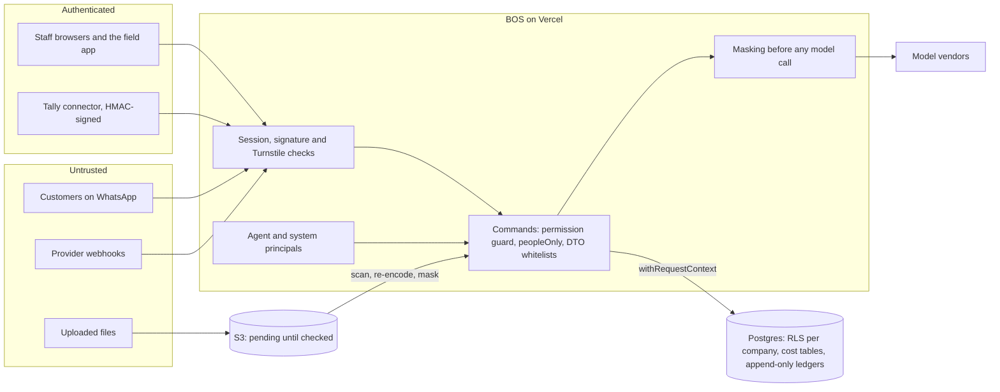

# Security — Shakti Prime BOS

Blueprint reference: §7, §9.3, §12. This document is the working security specification: threat model, identity, the permission catalogue, data isolation, data protection, AI and telecom compliance, application and infrastructure security, and operations. `docs/BLUEPRINT.md` governs on any conflict.

## Contents
1. [Threat model](#1-threat-model)
2. [Identity and authentication](#2-identity-and-authentication)
3. [Authorization](#3-authorization): [3.1 Model](#31-model), [3.2 Permission catalogue](#32-permission-catalogue), [3.3 Agent principals](#33-agent-principals), [3.4 Voice principals](#34-voice-principals)
4. [Data isolation](#4-data-isolation)
5. [Data protection](#5-data-protection-dpdp-act-2023-rules-2025)
6. [AI security](#6-ai-security)
7. [Telecom compliance](#7-telecom-compliance)
8. [Application security](#8-application-security)
9. [Infrastructure security](#9-infrastructure-security)
10. [Operations](#10-operations)
11. [Security test suite](#11-security-test-suite)

## 1. Threat model
**Assets:** customer PII and KYC documents; supplier rates, costs and margins; price lists; Tally financial mirrors; call recordings and WhatsApp conversations; the Executive Knowledge Vault; credentials and API keys; the integrity of stock, money and state.

**Actors and trust boundaries:**
| Actor | Trust | Main risks |
|---|---|---|
| Staff users (11 roles) | Authenticated, least privilege | Over-privileged reads, cross-entity access, export leakage |
| Customers on WhatsApp | Untrusted | Prompt injection, spam, document spoofing, social engineering of the Concierge |
| Providers (Meta, Exotel, Google, LiveKit) | Verified by signature, otherwise untrusted | Forged webhooks, replay |
| Tally connector | Signed, outbound only | Key theft on the client PC, tampered batches |
| AI agents | Internal service principals | Acting beyond autonomy, leaking cost data, runaway spend |
| Overseas AI vendors | Contracted processors | Retention of PII, model misuse |
| Developers and operators | Trusted with audit | Key-person risk, secret sprawl |

Each arrow into the BOS crosses a check: a session with its second factor, a provider or QStash signature, the connector's HMAC, or Turnstile on public forms. Inside, every change is a command run under the caller's own permissions and RLS; untrusted content reaches a model only as masked data, never as instructions.

**Boundaries enforced in code and in the database:** RLS per entity; two cost permissions; command-only mutations; webhook inbox; masked LLM inputs; DTO whitelists.

## 2. Identity and authentication
- **Passwords:** Argon2id (m = 64 MiB, t = 3, p = 1); minimum 12 characters; breached-password check.
- **Bot and brute-force controls:**
  - Cloudflare Turnstile on login and public forms.
  - The exponential lockout in Redis applies to one account from one address, so a stranger who knows an email cannot keep its owner out and one office address is not locked for everyone behind it. The account-wide count only escalates, emailing the owner at every tenth failure.
  - Per-address request caps bound what one address tries across accounts. Requests whose address cannot be read share one count per path, so a missing address never lifts a cap, and the server's own calls (an invitation) are not counted.
  - An Executive can lift an account's locks through the audited command `admin.user.lock.clear`.
  - The trade-off: a spread-out guessing attempt meets Turnstile, the caps and the owner's alert rather than a hard lock. A suspended account locks like an active one, so the lock does not reveal it, and no session is created for an inactive user.
- **Sessions:**
  - Database sessions with rotation on privilege change; idle timeout 12 h; absolute 7 d; admins can force logout; a role change revokes sessions.
  - A revoked or expired session is refused on every auth route and in-process call, not only in `currentPrincipal()`; no device is ever remembered past the second factor.
  - The session token column is readable by the auth module's database role only; application code sees session metadata, never the token. The session cookie is `__Host-` prefixed in production.
  - Per-address request caps bound the password-hashing and mail-sending endpoints on top of the sign-in lockout.
- **Cookies:** HttpOnly, Secure, SameSite=Lax, `__Host-` prefix.
- **2FA:**
  - TOTP required for Executive, GM and Accounts; each code verifies once; five wrong codes lock the second factor for an hour; the sign-in lock clears and the last sign-in is recorded only after the second factor; recovery codes; recovery email via SES only.
  - A user who has lost both the app and the backup codes is reset by an Executive (`admin.user.two_factor.reset`, never their own account) only after the Executive has confirmed who is asking by phone or in person. The reset signs the user out everywhere, emails them (only when the reset removed an app, and once per form submission) and makes them set up a new app at the next sign-in.
- **Set-password links:**
  - Stored hashed; an invitation lasts 24 h and a forgotten-password link 1 h; a new link withdraws the person's earlier ones; attempts are capped per link and per address.
  - Staff ask for a new link on the "Forgot your password?" screen. An address that is not one is marked on its field before anything else runs; then Turnstile, and the same answer and the same wait whether or not the email has an account.
  - The answer waits only for the per-address cap and the Turnstile check, which refuse before anything reads the account. Finding the account, storing the link, the mail and the audit row run after it (`requestResetInBackground`); a failure there is logged as `auth.reset_failed` or `auth.mail_failed`, never shown.
  - An Executive re-sends an invitation by inviting the person again, and is told when the email did not go out.
- **Endpoints:** the auth module serves over HTTP only the link a set-password email opens; every other auth endpoint answers not found over HTTP and is reached by the screens' server actions in-process.
- **Deployment guard:**
  - Every production runtime is hosted except a build started with `BOS_ENVIRONMENT=local` whose `BETTER_AUTH_URL` is on localhost, 127.0.0.1 or [::1] and which is not on Vercel (the end-to-end journeys and Lighthouse on a developer's machine or a CI runner).
  - A hosted runtime refuses to start with a missing variable, a published or short `BETTER_AUTH_SECRET`, a non-https base URL, Cloudflare's Turnstile test keys, or a mail setting other than `ses` or `log` (production accepts only `ses`, Amazon SES with its verified sender).
  - Readiness checks both database connections, the key-value store (a write and read back), the configuration and the outbox (down when a due event has waited more than five minutes since it became due). The public route answers only ready or not ready, capped at 20 calls a minute per address, and names the failing check in the log alone.
- **Mobile:** 15-minute access tokens, rotating refresh tokens in the Android Keystore, per-device revocation, minimum-version gate.
- **Voice:** a 5-minute user-scoped token per session so the worker acts as the speaking user.
- **Realtime:** BOS-signed ES256 JWT (≤ 15 min) with Realtime-only claims, verified by Supabase with the BOS public key imported as a standby signing key, since Supabase's third-party auth accepts named vendors only (ADR 0003, ARCHITECTURE §8).
- **Connector:** HMAC-SHA256 request signing with per-connector keys and a 5-minute skew window.

## 3. Authorization

### 3.1 Model
Roles are permission templates that Executives can edit; the set of roles is fixed (no custom roles), and an edited role is marked customised so a deploy never undoes the edit, while it still receives permissions the catalogue gains later. A permission is `module.resource.action` with a scope: `own`, `team`, `entity` or `all`. Users hold a role per entity; agents are service principals with fixed permission sets.

**The role editor** (Admin › Roles, `admin.role.permissions.set`, `admin.roles.write:all` with `admin.users.write:all`):
- It replaces a staff role's grants as a set, in a request acting for every active company, since a role's grants reach every company (ADR 0016); a request narrowed to some companies sees a notice and cannot save. It never edits an agent role or a system role (`role_not_editable`).
- **Who may hold a permission** is fixed, whoever writes (BLUEPRINT §7.1 to §7.3; `roleMayHold()` in `@shakti/contracts` and `app.role_may_hold()`, which a security test compares for every role and permission):
  - every `admin.*` permission and `integrations.dlq.replay`: the Executive role only (`EXECUTIVE_ONLY_PERMISSIONS`);
  - `finance.cost.read`: Executive and Accounts only; `procurement.rate.read`: Executive, Inventory Manager and Accounts only (`COST_PERMISSION_HOLDERS`);
  - platform-only permissions (`PLATFORM_ONLY_PERMISSIONS`: `files.process`): a system role only.
- The command refuses any other holder (`permission_not_for_role`, `permission_platform_only`), the trigger `role_permissions_holder_guard` refuses it in the database, the seed included, and the editor shows such a permission locked with its reason.
- Each permission is offered only at the scopes it honours (`PERMISSION_SCOPES`, the scopes the matrix in §3.2 uses for it: `admin.*` all companies, the cost permissions a company or all; `scope_not_offered`).
- The Executive role always keeps `admin.roles.write:all` and `admin.users.write:all` (`EXECUTIVE_KEPT_GRANTS`, `executive_keeps_admin`), which a deferred constraint trigger also checks at the end of every transaction, so the group cannot lock itself out.
- A save carries the fingerprint of the grant set the editor read and is refused when the role changed since (`role_changed_meanwhile`).
- A save marks the role customised and signs out everyone holding it in any company (`role_changed`), a role left in an archived company not counted against the caller, apart from the caller's own current sign-in, which the server action names from the session. Nothing is saved if a holder's session cannot be revoked (`role_holders_kept`).
- Every holder's cached access is then dropped; a cache that cannot be reached is logged and the save stands, since the holders are already signed out. The editor warns in plain words on the two cost permissions.

### 3.2 Permission catalogue
Columns are the staff roles of `STAFF_ROLE_KEYS` (`packages/contracts/src/roles.ts`); CC is the Tele-Caller for cold calling (`tele_caller_cc`) and LC the Tele-Caller for lead calling (`tele_caller_lc`), which receives the leads CC qualifies.

| Permission | Executive | GM | Sales Lead | CC | LC | Store | Inventory | Project Mgr | Field | Accounts | HR |
|---|---|---|---|---|---|---|---|---|---|---|---|
| `crm.lead.read` | all | entity | team | own | own | own | – | entity | – | entity | – |
| `crm.lead.write` | all | entity | team | own | own | own | – | – | – | – | – |
| `crm.lead.assign` | all | entity | team | – | – | – | – | – | – | – | – |
| `crm.lead.merge` | all | entity | team | – | – | – | – | – | – | – | – |
| `crm.account.read` / `.write` | all | entity | team | own | own | own | entity (read) | entity | own (read) | entity (read) | – |
| `calls.dial` | all | entity | team | own | own | own | – | – | – | – | – |
| `calls.recording.listen` | all | entity | team | – | – | – | – | – | – | – | – |
| `sales.quote.create` / `.send` | all | entity | team | – | own | own | – | – | – | – | – |
| `sales.order.create` / `.confirm` | all | entity | team | – | own | own | – | – | – | – | – |
| `sales.order.cancel` | all | entity | – | – | – | – | – | – | – | – | – |
| `sales.credit.release` | all | – | – | – | – | – | – | – | – | – | – |
| `pricing.read` | all | entity | entity | entity | entity | entity | entity | entity | – | entity | – |
| `pricing.write` | all | – | – | – | – | – | – | – | – | – | – |
| `catalogue.write` | all | entity | – | – | – | – | entity | – | – | – | – |
| `tax.rates.write` | all | – | – | – | – | – | – | – | – | entity | – |
| `inventory.stock.read` | all | entity | – | – | entity | entity | entity | entity | own | entity | – |
| `inventory.stock.move` / `.adjust` | all | – | – | – | – | – | entity | – | own (move) | – | – |
| `inventory.dispatch.write` | all | entity | – | – | – | – | entity | entity | – | – | – |
| `inventory.eway.write` | all | – | – | – | – | – | entity | – | – | entity | – |
| `inventory.warranty.write` | all | – | – | – | – | – | entity | – | – | – | – |
| `procurement.po.write` / `.grn.write` | all | – | – | – | – | – | entity | – | – | – | – |
| `procurement.rate.read` | all | – | – | – | – | – | entity | – | – | entity | – |
| `projects.read` / `.write` | all | entity | – | – | own (read) | – | – | entity | own | entity (read) | – |
| `projects.gate.approve` / `.qc.signoff` | all | entity | – | – | – | – | – | entity | – | – | – |
| `projects.schedule.write` | all | entity | – | – | – | – | – | entity | – | – | – |
| `documents.read` / `.write` | all | entity | – | – | own | own | – | entity | own | entity | – |
| `documents.sensitive.read` | all | – | – | – | – | – | – | entity | – | entity | – |
| `finance.proforma.write` / `.payment.write` / `.recon.write` | all | – | – | – | – | – | – | – | – | entity | – |
| `finance.cost.read` | all | – | – | – | – | – | – | – | – | entity | – |
| `finance.expense.submit` | own | own | own | own | own | own | own | own | own | own | own |
| `finance.expense.approve` | all | entity (manager step) | team | – | – | – | – | entity | – | entity | – |
| `finance.expense.verify` | all | – | – | – | – | – | – | – | – | entity | – |
| `hr.employee.write` / `.attendance.manage` / `.leave.approve` / `.incentive.manage` | all | entity (leave) | team (leave) | – | – | – | – | – | – | – | all |
| `hr.export` | all | – | – | – | – | – | – | – | – | all | all |
| `knowledge.vault.read.staff` | all | all | all | all | all | all | all | all | all | all | all |
| `knowledge.vault.read.management` | all | all | – | – | – | – | – | – | – | all | – |
| `knowledge.vault.read.exec` | all | – | – | – | – | – | – | – | – | – | – |
| `knowledge.playbook.approve` | all | – | – | – | – | – | – | – | – | – | – |
| `agents.inbox.act` | all | entity | team | own | own | own | entity | entity | – | entity | – |
| `agents.autonomy.write` | all | – | – | – | – | – | – | – | – | – | – |
| `agents.killswitch` | all | all | – | – | – | – | – | – | – | – | – |
| `voice.use` | all | all | – | – | – | – | – | – | – | – | – |
| `reports.export` | all | entity | team | – | – | – | entity | entity | – | entity | all |
| `audit.read` | all | entity | – | – | – | – | – | – | – | entity | – |
| `imports.write` | all | entity | – | – | – | – | – | – | – | – | – |
| `profile.write` | own | own | own | own | own | own | own | own | own | own | own |
| `admin.users.write` / `.roles.write` / `.entities.write` / `.integrations.write` / `.flags.write` | all | – | – | – | – | – | – | – | – | – | – |
| `integrations.dlq.replay` | all | – | – | – | – | – | – | – | – | – | – |
| `files.process` | – | – | – | – | – | – | – | – | – | – | – |

"–" means not granted. The matrix is data in `role_permissions`; this table is its seed and its test oracle (`packages/db/src/permission-matrix.test.ts`). The seed keeps to the holder rules and scopes of §3.1 (a security test): only the Executive role holds `admin.*` and `integrations.dlq.replay`, and the cost permissions only the roles named for them.

**Shared rows (ADR 0016):** GST rates and composite-supply splits (`tax_rates`, `composite_supply_rules`) and the catalogue (`items`, `kits`, `kit_components`, `pump_curves`) carry no company, so `tax.rates.write` and `catalogue.write` change them only in a request that acts for every active company, as shared price lists are written.

The catalogue commands say so (`catalogue_needs_all_companies`) and the tables' write policies enforce it; a General Manager or Inventory Manager who holds the grant in one company reads the catalogue there and changes it from All companies only, holding the grant in every company.

**The customer timeline, tasks, tags and Account 360** (docs/design/phase1.md §6.5) add no permission:
- A timeline row (`activities`) is read with its lead, or, for a row of no lead, with its customer in that company; a note is never read by an agent.
- A task is a scope root on `crm.lead.read` / `.write` with the person it is for as its owner, on a lead the caller reads; a task for someone else also needs `crm.lead.assign` at the scope that covers them (team scope for the caller's own team, company scope for anyone else).
- Tags are made and archived with `crm.lead.assign` by people only (a tag for the whole group only in a request for every company, and a group tag and a company tag never share a name), and put on or taken off a lead with `crm.lead.write`; a company's tag never goes on another company's lead.
- Customer, contact and site edits and consents need `crm.account.write` over the customer (`app.account_in_scope()`, `app.contact_in_scope()`); reading a customer through a lead gives no right to change it, and no agent holds `crm.account.write`. A number put on a contact is refused and routed when it belongs to another customer the caller may not change (§4).
- A note on a lead needs `crm.lead.write` over a lead that is not archived, and a note on the customer needs `crm.account.write` over the customer; notes are for people only.
- The customers screens open with `crm.account.read` at own scope in the menu, which every staff role that reads leads holds; their queries take `crm.account.read` or `crm.lead.read` and refuse an agent principal.

### 3.3 Agent principals
| Principal | Permissions |
|---|---|
| `agent:triage` | `crm.lead.read:entity`, `crm.lead.write:entity` (score, pipeline, entity fields only), `crm.lead.assign:entity`, `crm.lead.merge:entity` (suggest only) |
| `agent:concierge` | `crm.lead.read:own`, `crm.lead.write:own`, `crm.account.read:own`, `documents.write:own`. Read the current thread's account and opportunity; write qualification fields; book callback and site-visit slots; send approved templates and in-window messages; file documents; hand off. No cross-customer queries, no price edits, no internal notes |
| `agent:copilot` | `crm.lead.read:entity`, write summaries, dispositions and follow-up tasks; read approved knowledge |
| `agent:sizing` | `pricing.read:entity`, `inventory.stock.read:entity`, `sales.quote.create:entity` (draft); no cost permissions; suggests a sizing, never records one (ADR 0021) |
| `agent:orchestrator` | `projects.read/write:entity`, `projects.schedule.write:entity` (suggest), `documents.write:entity`, message requests |
| `agent:chief` | `crm.lead.read:entity`, `crm.account.read:entity`, `projects.read:entity`, `inventory.stock.read:entity`. Read across modules at entity scope for briefings and anomalies; no cost permissions, no writes except Agent Inbox items |
| `system:workers` | The system principal the event workers act as (`apps/web/src/workers/events`): one seeded principal of kind `system`, scoped to the company of the event it handles. Its grants are `SYSTEM_MATRIX` in `packages/contracts/src/system-principal.ts`, which the seed writes: `files.process:all` for the file checks of `files.file.uploaded` and for the render worker, which reads a company's details and sealed bank account to print them and records the PDF it stores (the delivery check's worker writes no row). Each later worker adds only the grant its command needs, and never a cost, admin, audit, integrations or sensitive-document permission. It follows an agent's customer rules (ADR 0020, Proposed until the owner decides at T2): a request is a service's when its role key is `agent:%` or `system:%` or its principal row is of kind `agent` or `system` (0064) |

What no agent principal holds or does:
- No agent principal holds `procurement.rate.read`, `finance.cost.read`, `documents.sensitive.read`, `knowledge.vault.read.exec`, any admin permission, or the human controls (`agents.inbox.act`, `agents.autonomy.write`, `agents.killswitch`, `knowledge.playbook.approve`, `sales.credit.release`).
- The Triage and Co-pilot agents work on opportunity data without customer names or phone numbers.
- No agent reads or adds a customer note, makes or archives a tag, or reads the customers screens' queries: the command guard refuses an agent, a voice session and the system principal for a command marked for people (`peopleOnly`), before it checks any permission and whatever it holds (`people_only`), while the Co-pilot still adds follow-up tasks and the Triage agent tags leads. No agent holds `crm.account.write`; of the agents, only the Concierge (`crm.account.read:own`) and the Chief of Staff (`crm.account.read:entity`) read customers, and the customer rule of §4 never lets an agent read a customer through a lead (0057).
- Only people record the sizing a quote relies on (ADR 0021): `crm.sizing.record` is for people only, so its guard refuses a principal of kind `agent`, `system` or `voice_session` and any role key `agent:%` or `system:%`; the `sizings` insert policy holds the recorder to a principal of kind `user`, the definer `app.open_sizing_review()` that opens the team lead's review task refuses the same principals, `latestSizing` answers only a sizing a person recorded, and the agent refusal sweep (`packages/domain/tests/security/agent-refusals.test.ts`) asserts the refusal for every agent and the system principal over every command for people only. `agent:sizing` drafts quotes from a person's sizing; it never records one.
- An agent's lead handover never moves the customer relationship: `app.hand_over_customer()` answers `unchanged` for an agent request and touches nothing (0059).
- Ask the Business and voice Ask run as the user.

### 3.4 Voice principals
A `voice_session` principal (`principals.kind`) stands for one "Talk to Shakti" session (blueprint §9.2, ADR 0010). It is not an agent: it acts as the speaking user.

| Rule | Source |
|---|---|
| Only a user holding `voice.use` (Executive and GM, §3.2) can start a session through `POST /voice/session`; Executives and GMs first | Blueprint §9.2, ADR 0010 |
| The worker calls `/api/v1` with a 5-minute BOS token for the speaking user (`VoiceTokenClaims`, `aud: shakti-voice`, `sid` = the session), so every tool call is a command run with that user's own grants and entity scope, under RLS and cost masking; the worker holds no database credentials and no service role | Blueprint §9.2, ADR 0010 |
| Command mode proposes actions that the user confirms with a tap before they run | Blueprint §9.2 |
| A recording question before every session (`consentRecording`), a visible listening indicator, PII masking before any model call, and per-user daily minute and spend caps checked when the session starts (`voice_cap_reached`) and enforced by the worker during it | Blueprint §9.2, ADR 0010 |
| Proposed: the principal never carries `finance.cost.read` or `procurement.rate.read`, even for an Executive, so a spoken answer never reads out a cost or supplier rate; cost figures stay on the screen reports that run under the viewer's own permissions | Proposed, from the blueprint's cost masking for voice (§9.2) |
| Proposed: each command a session runs is audited with `actor_kind = voice_session` and the speaking user in `on_behalf_of_user_id` | Proposed (`audit_logs`, DATABASE §6.10) |

## 4. Data isolation
- RLS on every business table with fail-closed policies (`docs/DATABASE.md` §4); `FORCE ROW LEVEL SECURITY`; `app_user` is not the owner and has no `BYPASSRLS`; queries may run as `app_reader`, which can only read (ADR 0018).
- Two cost permissions enforced in RLS and in DTOs: `procurement.rate.read` (supplier rates, PO values, purchase vouchers) and `finance.cost.read` (item costs, job costs, margins).
- Cost columns live in side tables (`item_costs`, `stock_movement_costs`, `job_cost_entries`, `tally_purchase_vouchers`) so operational tables carry no cost data.
- **Customers (ADR 0008).** This is the one statement of who sees a customer; [DATABASE §4.4](DATABASE.md#account_entities) gives the policy that enforces it.
  - A person sees a customer in a company through the relationship at their `crm.account.read` scope, or through one of the customer's leads there that they can read and that is not archived (0057, 0059).
  - An agent, and the system principal of the workers, sees a customer only through `crm.account.read`, which only `agent:concierge` (own) and `agent:chief` (company) hold (§3.3; 0057, 0064, ADR 0020).
  - A new lead or import row whose number belongs to a customer a colleague looks after in the company is refused and routed (`customer_held_by_colleague`, `app.lead_phone_status()`), judged in that company only, so the All-companies view cannot get round it. A number put on a contact is refused the same way when it belongs to another customer the caller may not change anywhere in the group (`app.contact_phone_status()`).
  - The lead form holds a new customer's number while it is checked, so two leads typed at once with one new number cannot both find it free; imports take no number lock, so an import committing a brand-new number at the same moment as a form or another import can make a second customer, which the duplicate cards (CRM-03, slice D1) are to catch.
  - A lead handed over by its holder takes the customer relationship with it (`app.hand_over_customer()`, 0055); an agent's handover never does (0059).
  - Administrators update people and revoke sessions only for people who work solely in the request's companies, in RLS as well as in the commands (0055 to 0057).
- Exports are permission-gated commands and audited with the row count and filter.
- Materialised views with margins are readable only through commands that require `finance.cost.read`.
- **Search candidates:** ⌘K lead search finds its candidates through the definer `app.lead_search_ids()` (0052), which applies the same scope rules as the read policies of leads and customers, returns lead ids only and never more than 200; the search then reads those leads under RLS. The customers list's search does the same through `app.customer_search_ids()`, which applies the `account_entities_read` rule (never through a lead for an agent) and returns at most 200 customer ids to list (DATABASE §4.1).

## 5. Data protection (DPDP Act 2023, Rules 2025)
- **Consent:** per channel, purpose and source with evidence; opt-out honoured by humans and agents; consent text versions stored. Proof is uploaded as a `consent_evidence` file of the company and must have passed its checks before a consent names it; Account 360 offers to open it only to a caller the `files` policies let read it (`crm.account.write` at company scope, or the person who uploaded it).
- **Rights:** data-principal export and deletion commands, subject to retention obligations; requests logged with due dates.
- **Aadhaar:** never stored. OCR masking at capture keeps only the last four digits and a masked image; the original is deleted. This applies to WhatsApp uploads, field-app photos and web uploads. A twelve-digit number typed into any field, and a number of ten digits or more given as a number outside a time or amount field, is hidden in full in the logs and the audit trail, and the identity fields are removed from both (§8).
- **Bank details:** field-level encryption, opened only to print or pay with them and in the Executive's own bank account form (a clear-text read writes no audit row; each change does), through the `FieldCipher` port (ARCHITECTURE §9, ADR 0019). Each value is sealed under its own data key with the table, column, company and row bound into the seal and into the KMS encryption context, so a sealed value copied to another column, row or company opens neither there nor in KMS. A developer's machine and CI use `FIELD_ENCRYPTION_KEY`, which a hosted runtime refuses to start with. A company's bank account (bank, account number, IFSC, branch) is set by an Executive through `org.entity.update` on Settings › Companies and stored only sealed in `entities.bank_json`, a column no request role may select; it is read in clear only through `app.entity_bank_envelope()`, which admits `admin.entities.write` at all scope (the Executive's bank account form) or `files.process` (the print loader, run as `system:workers`) for a company in the request, and the query refuses anyone else before the database does (`readEntityBankDetails`, 0091). The company DTO says only whether an account is recorded; the audit row records the last four digits of the account number before and after (`bankAccount`), never the bank, IFSC, branch or the rest of the number, and the logs carry none of it.
- **Masking before LLM calls:** phone numbers, Aadhaar digits, bank details and street addresses replaced by placeholders in text; documents pass through the masking step before vision classification; transcripts are masked before summarisation.
- **Vendors:** data processing terms confirmed with Anthropic, Voyage, the speech vendor and LiveKit, including retention settings; listed in the privacy notice. Sentry, in the group's US-region organisation, receives error reports with personal data removed before sending (ADR 0015).
- **Retention:** schedule in blueprint §7.9, executed by logged jobs.
- **Breach handling:** `privacy_incidents` register; runbook to contain, assess, notify the Data Protection Board and affected principals in plain language within the Rules' timelines, and record every step.
- **Calendar:** consent notices, rights handling and breach protocol live before 14 May 2027.

## 6. AI security
- Untrusted inputs (customer messages, uploads, transcripts, webhook payloads) are labelled as data in prompts and never concatenated as instructions.
- Concierge tools are the six listed in §3.3; tool inputs are validated with `strict` schemas; every tool call is a domain command with its own permission guard.
- Deterministic output filters on every outbound message: no internal data, no other customer's PII, claims limited to approved Playbook directives, length limit, link allowlist.
- Rate limits per conversation; abuse detection; automatic handoff after repeated failed turns, complaints or legal topics.
- Autonomy levels per agent × action type; promotion to Automatic only after ≥ 95% unedited over ≥ 200 cases with Executive sign-off.
- Kill switches (global, per agent, per entity); per-agent daily spend caps; token budgets per run.
- Prompt-injection test set (data exfiltration, price manipulation, unauthorised promises, tool misuse) runs in CI; every case must fail safely.
- Evals gate every prompt or model change.

## 7. Telecom compliance
- Each entity registered on DLT as a Principal Entity; headers and consent templates registered.
- 140-series numbers for promotional outbound; 160-series for service calls to leads with recorded consent; inbound IVR on standard virtual numbers.
- TRAI hours (9 AM–9 PM) and DND scrubbing enforced in the dial command; recording notice on every call.
- WhatsApp: opt-in and opt-out, 24-hour window, approved templates per number, quality-rating monitoring, portfolio messaging-limit budget with service messages first.

## 8. Application security
- CSP with nonces; CSRF origin checks on server actions; Zod validation on every input; output encoding by React.
- **Uploads:** each purpose names the permission that creates and reads its files (`app.file_purpose_grant()`, 0066, mirrored by `packages/domain/src/files/purposes.ts`; the list is [DATABASE §4.4](DATABASE.md#files)). No AI agent holds any of those write permissions, and the checks run as the worker principal with `files.process`, which no person's role or AI agent holds; a person changes only their own pending upload's status.
  - Each purpose also names its types and largest size (`files/limits.ts`, checked by `files.upload.begin` and by the uploader before sending).
  - A pre-signed PUT lasts 15 minutes and binds the type, length, SHA-256 and SSE-KMS encryption into its signature, and `files.upload.complete` checks the stored size and SHA-256.
  - The bucket blocks public access, enforces its owner, keeps versions, refuses calls without TLS and accepts browser uploads from the environment's own address only (`infra/aws/files.yaml`, ADR 0019).
  - Nothing is `ready` before its checks: the malware verdict, image re-encoding, the PDF refusal list and masking of vault photos, as ARCHITECTURE §9 lists them. A refused or replaced file's bytes are deleted with every stored version, retried on every delivery until none remains, and earlier versions expire after a day.
- Secrets only in Vercel, EAS and the connector's encrypted local store; none in the repo, `tooling.json` or `.mcp.json`.
- **Logging:** structured JSON; request IDs; no phone numbers, Aadhaar digits, bank details or message bodies; log redaction tested. Every logged value passes the redaction in `packages/domain/src/ports/redaction.ts`, which the logger (`ports/logger.ts`) applies:
  - secret-named fields and the Aadhaar, UID, PAN, account number and IFSC fields are removed; the identity fields are matched without case or separators under the spellings people give them (`aadhar`, `aadharno`, `panno`, `accountno`, `bankaccountno` among them);
  - in free text, email addresses, UPI addresses (`name@bank`, no dot after the @), set-password links and credentials are replaced, and a phone number keeps its last four digits, including a mobile number written spaced or after a 0, 91 or +91 (`98765 43210`, `+91-98765-43210`);
  - a twelve-digit number (as Aadhaar numbers are printed) is hidden in full, the number shapes standing alone, so a UUID's groups are never taken for one; a number of ten digits or more given as a number is hidden in full as well;
  - a value in an id or code field (ids, `code`, `sku`, `hsn`, `gstin`, `pin`, `barcode` and the named document numbers: `CODE_KEYS` and `isCodeKey()`, never a field named for a phone, email, Aadhaar or UPI id, nor `sourceCode`) is kept whole only when it has a code's shape and holds nothing the text scrub would change (`keepsAsCode()`), and a long number in a time or amount field (`isMeasureKey()`) is kept;
  - the audit trail treats every value the same way (`redactForAudit()`), so a number typed into a name or address field never reaches it, and Better Auth's own log lines drop every field that names a person before they are logged.
- Supply chain: Dependabot (weekly, grouped; minor and patch bumps merge automatically once CI passes, majors wait for the owner's review), `pnpm audit --audit-level=moderate` and a gitleaks secret scan over the history in CI; CodeQL once the repository has GitHub Advanced Security; pinned lockfile; provenance-checked releases for the connector.
- Staging holds synthetic data only.

## 9. Infrastructure security
- Supabase: SSL enforced; audit of dashboard access.
- Vercel: environment separation (a project per environment), deployment protection on previews.
- **Targets before production** (not in place on dev and staging; the plans and accounts are in [accounts](runbooks/accounts.md)):
  - Supabase network restrictions to Vercel and the workers, and point-in-time recovery on the production project;
  - a protected production branch: the free GitHub plan has no branch rules, so nothing blocks a direct push to `main` today (ADR 0017; the audit ([2026-09-audit](reviews/2026-09-audit.md)) M45).
- AWS: one least-privilege IAM user per environment for S3 and SES; KMS key per environment with rotation; S3 block public access; lifecycle rules; backup bucket in a separate account or with object lock.
- Upstash: separate databases per environment; signing keys rotated.
- LiveKit: room tokens with 5-minute TTL; worker credentials per environment.
- Client PC (connector): encrypted config, least-privilege Windows service account, signed self-updates.

## 10. Operations
- **Secret rotation:** every 6 months and on offboarding. `BETTER_AUTH_SECRET` also encrypts the stored authenticator secrets, so it is never replaced outright: the new key goes first in `BETTER_AUTH_SECRETS` (`<version>:<secret>` entries) and the previous `BETTER_AUTH_SECRET` stays set as the legacy key until every enrolled user has re-enrolled or the data is re-encrypted.
- **Offboarding:** revoke sessions, rotate shared keys, remove from GitHub, Vercel, Supabase, AWS, Meta, Exotel, Anthropic within one business day.
- **Incident response:** severity levels, on-call contact, containment steps, communication template, post-incident review within 5 working days.
- **Pentest:** external test before go-live (Phase 7) and annually; findings tracked to closure.
- **Restore drills:** quarterly.
- **Access review:** quarterly review of roles and agent autonomy settings by an Executive.

## 11. Security test suite
Runs on every PR against real Postgres. Items 1 to 3 run today, and item 5 for the token route; each other item joins with its feature in the phase named (TESTING.md §3):
1. For every business table and every role × entity pair: only that entity's rows are visible (`role-entity-matrix.test.ts`, every role in every company, acting as the fixture rows' owner in their team, so it proves isolation between companies); no context ⇒ zero rows (`fail-closed.test.ts`). Scope inside one company (own, team, company) is proved by `crm-scope.test.ts`, `list-leads-scope.test.ts` and `customer-read-through-leads.test.ts`, and requests for all companies by `resolve-principal.test.ts` (the narrowest role wins), `admin-users.test.ts` and `user-company-scope.test.ts`.
2. Cost fields absent from every DTO unless the command requires a cost permission; GM sees no rates and no margins; Inventory Manager sees rates and no margins; purchase vouchers gated.
3. Agent principals and the system principal `system:workers` cannot call cost, admin, audit, integrations, tax, price, catalogue or sensitive-document commands, and no seeded agent or system role holds those permissions. The sensitive-document commands join the sweep when they are registered, with the document vault in Phase 4.
4. Voice tokens act only as the issuing user and expire. Phase 2, with live voice.
5. Realtime JWTs for user A cannot subscribe to user B's or another entity's channels. The token route's tests run today; the channel-policy check runs with the Realtime spike on the production site with the client's domain (`docs/spikes/realtime.md`) (`pnpm --filter web realtime-spike`).
6. Vector retrieval respects sensitivity per role. Phase 1, with the Knowledge Vault.
7. WhatsApp documents file only against the sending customer. Phase 4, with the document vault's WhatsApp filing.
8. Masking: Aadhaar digits never appear in storage, logs or LLM payloads (assertion on captured requests). Phase 4, with the document vault that stores the OCR worker's masked copies; the worker's masking rules have unit tests today.
9. Webhooks: invalid signatures rejected; duplicates ignored. Phase 2, with the webhook routes.
10. Dial command: blocked outside TRAI hours, for DND without consent, and on the wrong number series. Phase 2, with click-to-dial.
