# Entity-relationship diagram — Shakti Prime BOS

The tables built so far, one diagram per module; a table another module owns appears as a name only. Generated by `pnpm db:docs` from `packages/db/migrations/meta/0065_snapshot.json`, the SQL migrations up to `0065_hsn_four_six_eight` and the table catalogue in [DATABASE.md](../DATABASE.md) §6; `packages/db/src/docs/data-docs.test.ts` fails when this file and those sources differ, so it is regenerated, never edited.

Every table also carries `created_by` and `updated_by`, which reference `principals`; those links are left out of the diagrams. Column meanings, constraints and row-level security are in the [data dictionary](DATA-DICTIONARY.md); tables still to be built are drawn under [Planned tables](#planned-tables) from their DATABASE.md §6 entries.

## Org

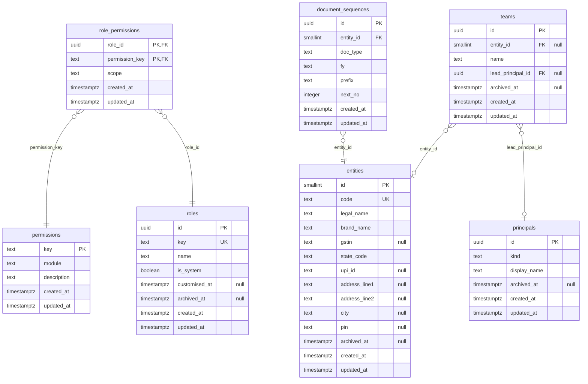

## Identity

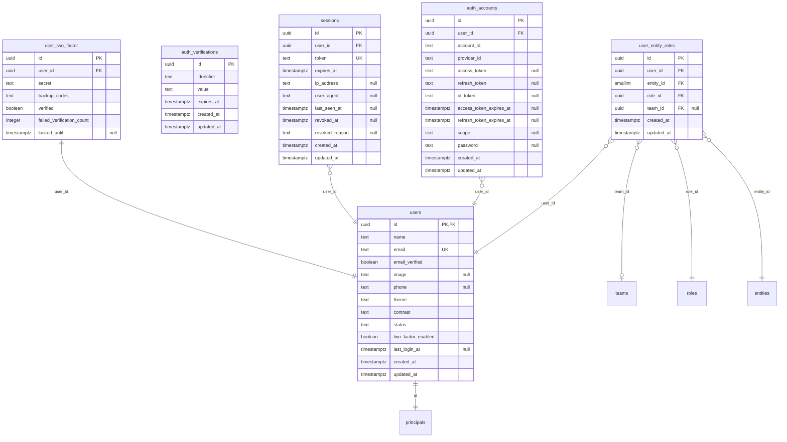

## CRM

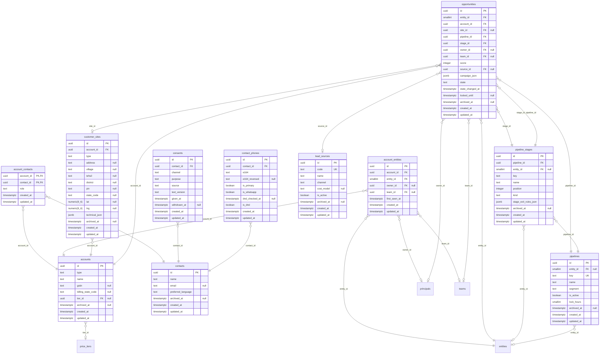

## Catalogue, pricing and tax

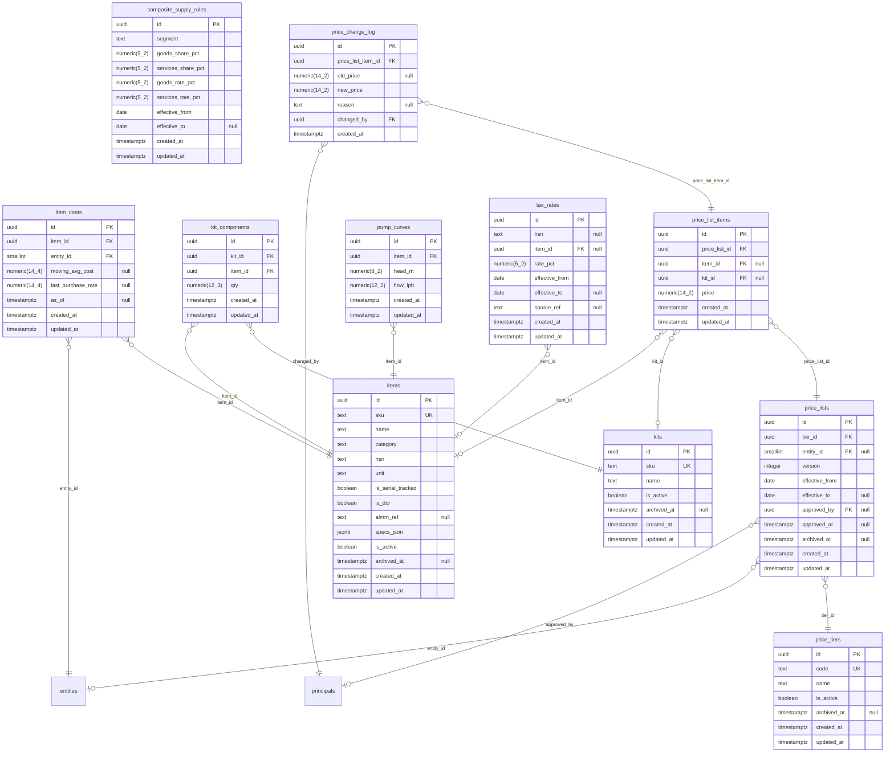

## Platform

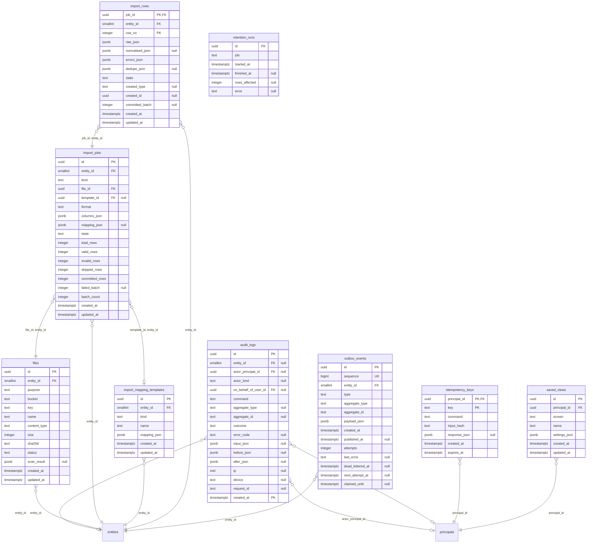

## Planned tables

Tables DATABASE.md §6 documents that no migration has created yet, one diagram per section. Each shows the columns its entry names and the standard `id` of DATABASE.md §2. A type comes from the entry or from the §2 naming conventions (`entity_id` smallint, other `*_id` references uuid, `*_at` timestamptz, `is_*` boolean, `*_json` jsonb); a column whose type neither fixes shows `untyped`. A relationship is inferred from a `*_id` column's name and drawn to the table it names; the migration that builds the table fixes the real keys, and the table then moves to its module above.

### Org and identity

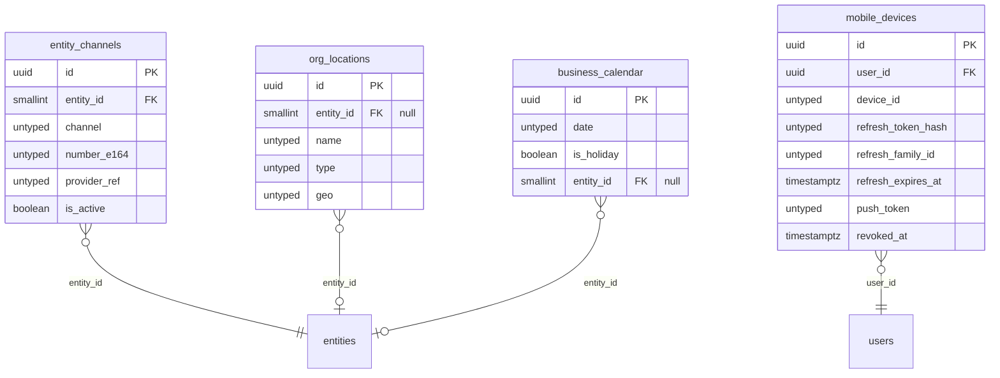

### CRM

```mermaid
erDiagram
  activities {
    uuid id PK
    smallint entity_id FK
    uuid opportunity_id FK
    uuid account_id FK
    untyped type
    uuid actor_principal_id FK
    jsonb payload_json
  }
  tasks {
    uuid id PK
    untyped assignee_id
    timestamptz due_at
    untyped state
  }
  calls {
    uuid id PK
    smallint entity_id FK
    uuid opportunity_id FK
    untyped caller_id
    untyped direction
    untyped number_series
    untyped provider_call_id
    uuid recording_file_id FK
    uuid transcript_file_id FK
    uuid disposition_id FK
    untyped duration_s
  }
  call_dispositions {
    uuid id PK
    untyped code
    untyped label
    untyped next_action
  }
  whatsapp_threads {
    uuid id PK
    smallint entity_id FK
    uuid account_id FK
    uuid contact_phone_id FK
    uuid channel_id FK
    untyped window_open_until
    timestamptz opted_out_at
  }
  whatsapp_messages {
    uuid id PK
    uuid thread_id FK
    untyped direction
    untyped provider_message_id
    untyped template_name
    untyped body_masked
    untyped status
    uuid file_id FK
  }
  tags {
    uuid id PK
    smallint entity_id FK "null"
    untyped name
    timestamptz archived_at
  }
  customer_loans {
    uuid id PK
    uuid account_id FK
    uuid opportunity_id FK
    untyped lender
    untyped state
    untyped amount
    jsonb gates_json
  }
  identity_documents {
    uuid id PK
    uuid account_id FK
    untyped type
    untyped last4
    uuid masked_file_id FK
  }
  referral_partners {
    uuid id PK
    uuid partner_account_id FK
    uuid opportunity_id FK
    untyped amount
    timestamptz released_at
  }
  commission_accruals {
    uuid id PK
    uuid partner_account_id FK
    uuid opportunity_id FK
    untyped amount
    timestamptz released_at
  }
  activities }o--|| entities : "entity_id"
  activities }o--|| opportunities : "opportunity_id"
  activities }o--|| accounts : "account_id"
  activities }o--|| principals : "actor_principal_id"
  calls }o--|| entities : "entity_id"
  calls }o--|| opportunities : "opportunity_id"
  calls }o--|| files : "recording_file_id"
  calls }o--|| files : "transcript_file_id"
  calls }o--|| call_dispositions : "disposition_id"
  whatsapp_threads }o--|| entities : "entity_id"
  whatsapp_threads }o--|| accounts : "account_id"
  whatsapp_threads }o--|| contact_phones : "contact_phone_id"
  whatsapp_threads }o--|| entity_channels : "channel_id"
  whatsapp_messages }o--|| whatsapp_threads : "thread_id"
  whatsapp_messages }o--|| files : "file_id"
  tags }o--o| entities : "entity_id"
  customer_loans }o--|| accounts : "account_id"
  customer_loans }o--|| opportunities : "opportunity_id"
  identity_documents }o--|| accounts : "account_id"
  identity_documents }o--|| files : "masked_file_id"
  referral_partners }o--|| accounts : "partner_account_id"
  referral_partners }o--|| opportunities : "opportunity_id"
  commission_accruals }o--|| accounts : "partner_account_id"
  commission_accruals }o--|| opportunities : "opportunity_id"
```

### Sales

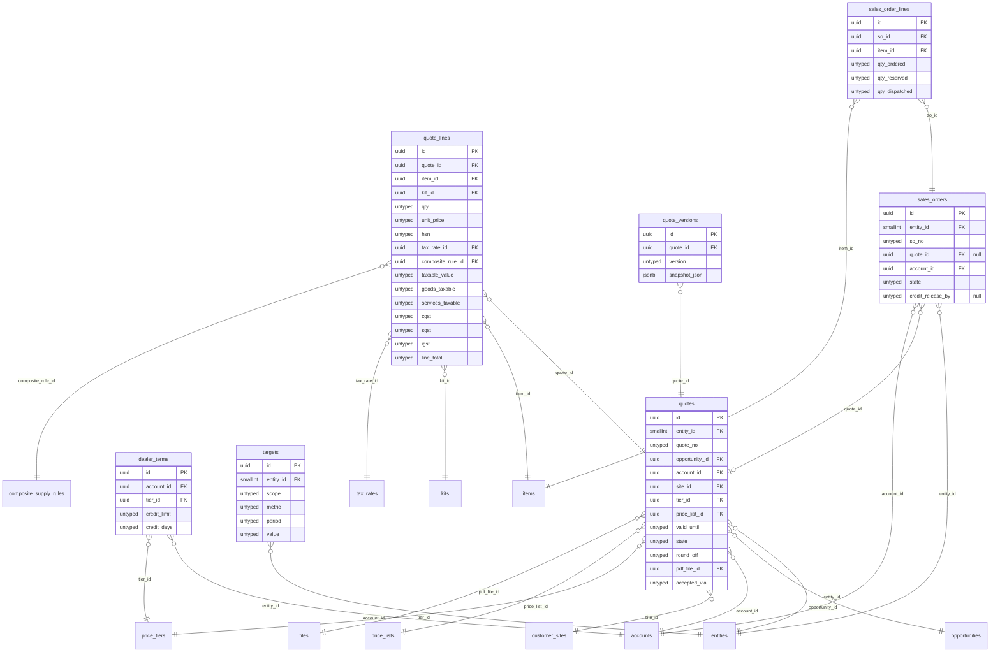

### Inventory and logistics

```mermaid
erDiagram
  warehouses {
    uuid id PK
    uuid location_id FK
    untyped code
  }
  bins {
    uuid id PK
    uuid location_id FK
    untyped code
  }
  stock_movements {
    uuid id PK
    smallint entity_id FK
    uuid item_id FK
    uuid serial_id FK "null"
    uuid from_bin_id FK
    uuid to_bin_id FK
    untyped qty
    untyped reason
    untyped ref_type
    untyped ref_id
    uuid reverses_id FK
  }
  stock_movement_costs {
    uuid id PK
    uuid movement_id FK
    untyped unit_cost
  }
  stock_balances {
    uuid id PK
    uuid warehouse_id FK
    uuid bin_id FK
    uuid item_id FK
    untyped qty_on_hand
    untyped qty_reserved
  }
  reservations {
    uuid id PK
    uuid so_line_id FK
    uuid item_id FK
    untyped qty
    timestamptz expires_at
    untyped state
  }
  serials {
    uuid id PK
    uuid item_id FK
    untyped serial_no
    untyped state
    uuid bin_id FK
    uuid customer_site_id FK
    untyped warranty_until
    timestamptz dcr_validated_at
  }
  surplus_pool {
    uuid id PK
    uuid project_id FK
    uuid item_id FK
    untyped qty
    untyped state
  }
  vendors {
    uuid id PK
    untyped name
    untyped gstin
    jsonb terms_json
  }
  vendor_quotes {
    uuid id PK
    uuid vendor_id FK
    uuid item_id FK
    untyped rate
    untyped valid_until
  }
  purchase_orders {
    uuid id PK
    smallint entity_id FK
    untyped po_no
    uuid vendor_id FK
    untyped state
    timestamptz expected_at
  }
  po_lines {
    uuid id PK
    uuid po_id FK
    smallint entity_id FK
    uuid item_id FK
    untyped qty
    untyped qty_received
    untyped unit_rate
    untyped amount
    untyped hsn
  }
  goods_receipts {
    uuid id PK
    smallint entity_id FK
    uuid po_id FK
    uuid warehouse_id FK
    timestamptz received_at
    untyped received_by
  }
  goods_receipt_lines {
    uuid id PK
    uuid receipt_id FK
    smallint entity_id FK
    uuid po_line_id FK
    uuid item_id FK
    uuid bin_id FK
    untyped qty
    untyped unit_rate
  }
  dispatches {
    uuid id PK
    smallint entity_id FK
    uuid so_id FK
    untyped state
    untyped vehicle_no
    untyped driver_name
    untyped driver_phone
    untyped consignment_value
  }
  dispatch_lines {
    uuid id PK
    uuid dispatch_id FK
    uuid so_line_id FK
    untyped qty
  }
  delivery_challans {
    uuid id PK
    uuid dispatch_id FK
    untyped challan_no
    uuid pdf_file_id FK
  }
  eway_bills {
    uuid id PK
    uuid dispatch_id FK
    untyped ewb_no
    untyped valid_from
    untyped valid_until
    untyped vehicle_no
    untyped linked_ref_type
    untyped linked_ref
  }
  warranty_claims {
    uuid id PK
    uuid serial_id FK
    uuid account_id FK
    untyped state
    uuid replacement_serial_id FK
    untyped supplier_rma_ref
    uuid cost_entry_id FK
  }
  warehouses }o--|| org_locations : "location_id"
  bins }o--|| org_locations : "location_id"
  stock_movements }o--|| entities : "entity_id"
  stock_movements }o--|| items : "item_id"
  stock_movements }o--o| serials : "serial_id"
  stock_movements }o--|| bins : "from_bin_id"
  stock_movements }o--|| bins : "to_bin_id"
  stock_movements }o--o| stock_movements : "reverses_id"
  stock_movement_costs }o--|| stock_movements : "movement_id"
  stock_balances }o--|| warehouses : "warehouse_id"
  stock_balances }o--|| bins : "bin_id"
  stock_balances }o--|| items : "item_id"
  reservations }o--|| sales_order_lines : "so_line_id"
  reservations }o--|| items : "item_id"
  serials }o--|| items : "item_id"
  serials }o--|| bins : "bin_id"
  serials }o--|| customer_sites : "customer_site_id"
  surplus_pool }o--|| projects : "project_id"
  surplus_pool }o--|| items : "item_id"
  vendor_quotes }o--|| vendors : "vendor_id"
  vendor_quotes }o--|| items : "item_id"
  purchase_orders }o--|| entities : "entity_id"
  purchase_orders }o--|| vendors : "vendor_id"
  po_lines }o--|| purchase_orders : "po_id"
  po_lines }o--|| entities : "entity_id"
  po_lines }o--|| items : "item_id"
  goods_receipts }o--|| entities : "entity_id"
  goods_receipts }o--|| purchase_orders : "po_id"
  goods_receipts }o--|| warehouses : "warehouse_id"
  goods_receipt_lines }o--|| goods_receipts : "receipt_id"
  goods_receipt_lines }o--|| entities : "entity_id"
  goods_receipt_lines }o--|| po_lines : "po_line_id"
  goods_receipt_lines }o--|| items : "item_id"
  goods_receipt_lines }o--|| bins : "bin_id"
  dispatches }o--|| entities : "entity_id"
  dispatches }o--|| sales_orders : "so_id"
  dispatch_lines }o--|| dispatches : "dispatch_id"
  dispatch_lines }o--|| sales_order_lines : "so_line_id"
  delivery_challans }o--|| dispatches : "dispatch_id"
  delivery_challans }o--|| files : "pdf_file_id"
  eway_bills }o--|| dispatches : "dispatch_id"
  warranty_claims }o--|| serials : "serial_id"
  warranty_claims }o--|| accounts : "account_id"
  warranty_claims }o--|| serials : "replacement_serial_id"
  warranty_claims }o--|| job_cost_entries : "cost_entry_id"
```

### Projects and field

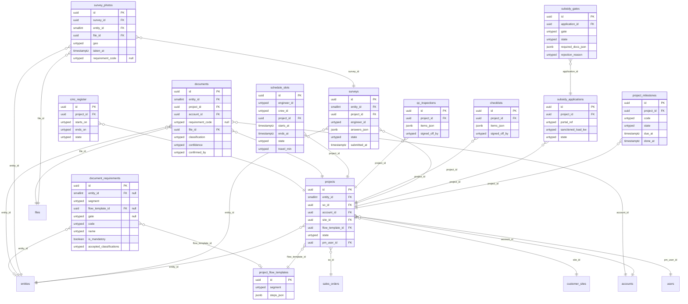

### Finance and costing

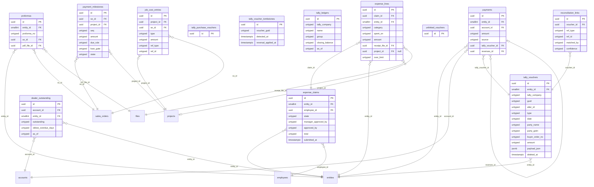

### HR

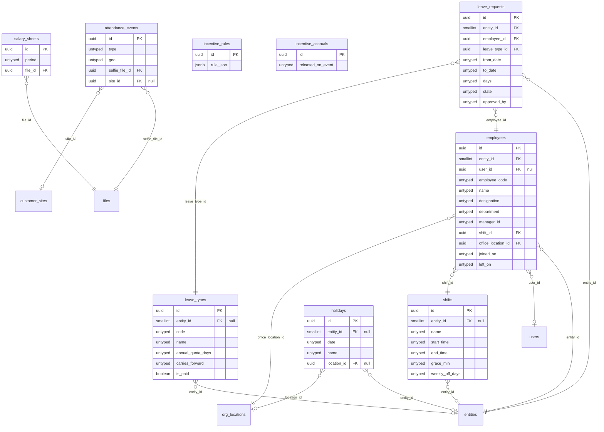

### AI and voice

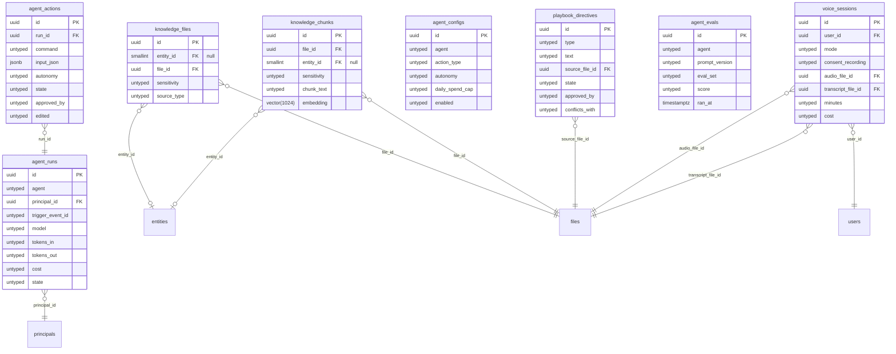

### Platform

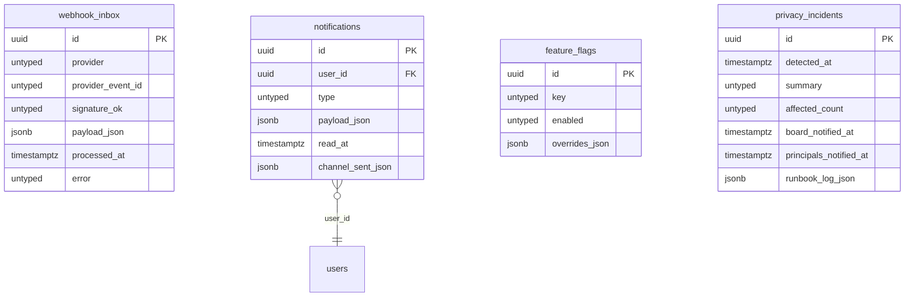
