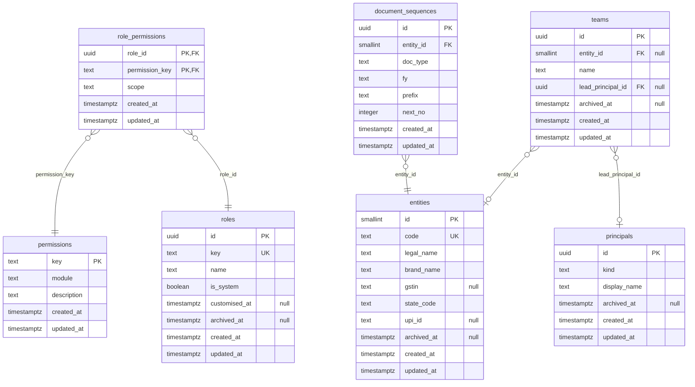
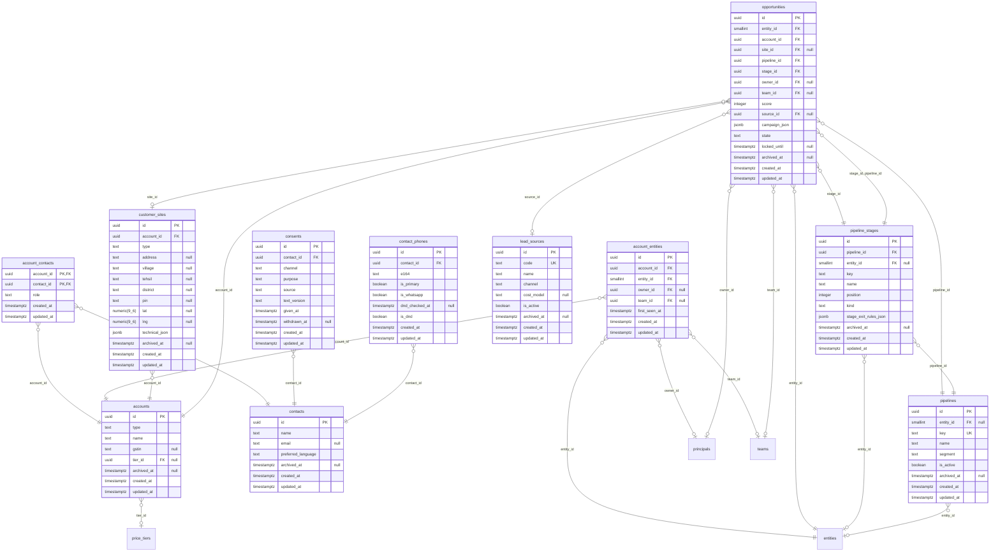
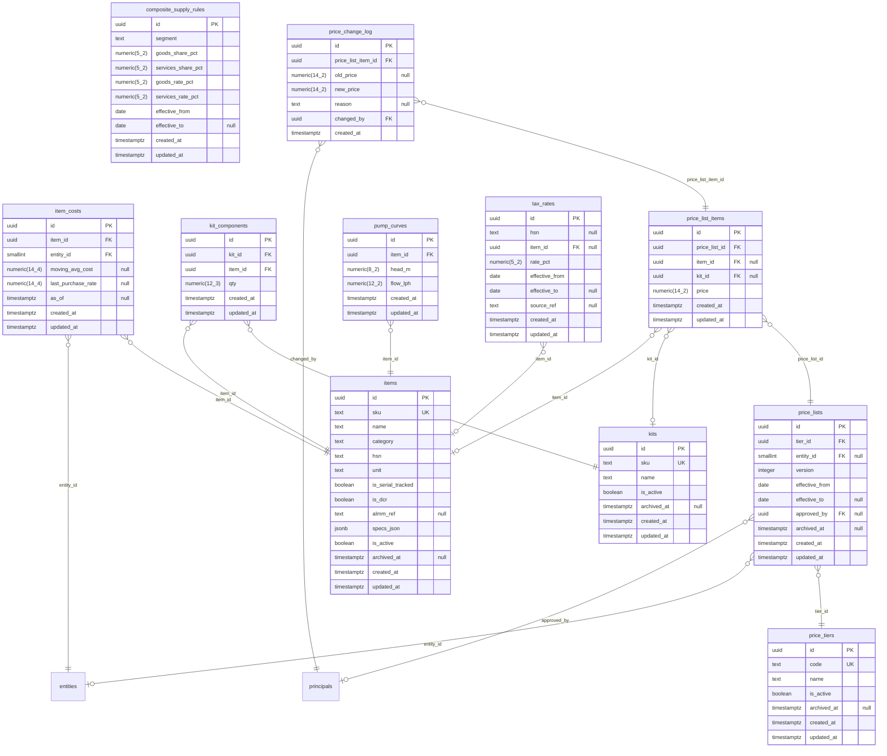
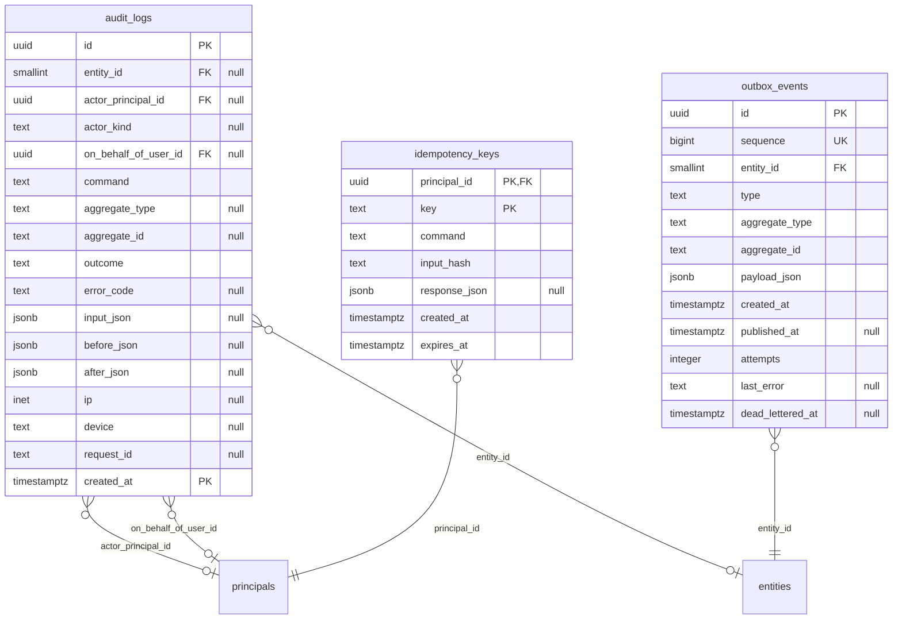

# Entity-relationship diagram — Shakti Prime BOS

The tables built so far, one diagram per module; a table another module owns appears as a name only. Generated by `pnpm db:docs` from `packages/db/migrations/meta/0039_snapshot.json`, the SQL migrations up to `0039_two_factor_reset` and the table catalogue in [DATABASE.md](../DATABASE.md) §6; `packages/db/src/docs/data-docs.test.ts` fails when this file and those sources differ, so it is regenerated, never edited.

Every table also carries `created_by` and `updated_by`, which reference `principals`; those links are left out of the diagrams. Column meanings, constraints and row-level security are in the [data dictionary](DATA-DICTIONARY.md); tables still to be built are listed there under "Planned tables".

## Org

## Identity

## CRM

## Catalogue, pricing and tax

## Platform

