# Entity-relationship diagram — Shakti Prime BOS

The tables built so far, one diagram per module; a table another module owns appears as a name only. Generated by `pnpm db:docs` from `packages/db/migrations/meta/0120_snapshot.json`, the SQL migrations up to `0120_notifications_push_pending` and the table catalogue in [05-database.md](../05-database.md) §6; `packages/db/src/docs/data-docs.test.ts` fails when this file and those sources differ, so it is regenerated, never edited.

Most tables also carry `created_by` and `updated_by`, which reference `principals`; those links are left out of the diagrams. Tables without either: `activities`, `agent_runs`, `audit_logs`, `auth_accounts`, `auth_verifications`, `calls`, `dealer_outstanding`, `document_sequences`, `idempotency_keys`, `notification_preferences`, `notifications`, `outbox_events`, `permissions`, `price_change_log`, `push_subscriptions`, `quote_lines`, `retention_runs`, `sales_order_lines`, `saved_views`, `sessions`, `user_two_factor`. Tables with one of them: `agent_actions` (only `created_by`), `commission_accruals` (only `created_by`), `dealer_terms` (only `created_by`), `opportunity_tags` (only `created_by`), `quote_versions` (only `created_by`), `sizings` (only `created_by`).

A type with a precision is drawn without it, and the precision is in the comment (`numeric "(14,2)"`), as is "null" for a column that may be empty. Column types, constraints and row-level security are in the [data dictionary](data-dictionary.md); tables still to be built are drawn under [Planned tables](#planned-tables) from their 05-database.md §6 entries.

## Org

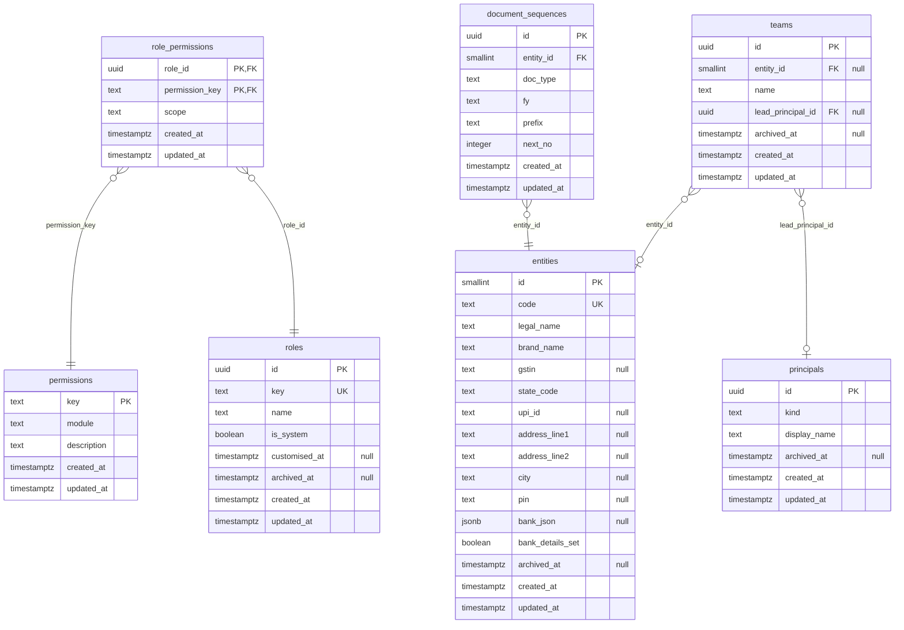

## Identity

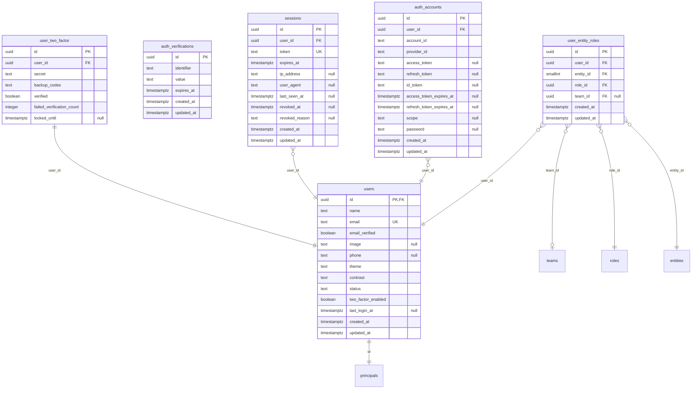

## CRM

```mermaid
erDiagram
  account_contacts {
    uuid account_id PK, FK
    uuid contact_id PK, FK
    text role
    timestamptz created_at
    timestamptz updated_at
  }
  account_entities {
    uuid id PK
    uuid account_id FK
    smallint entity_id FK
    uuid owner_id FK "null"
    uuid team_id FK "null"
    timestamptz first_seen_at
    timestamptz created_at
    timestamptz updated_at
  }
  accounts {
    uuid id PK
    text type
    text name
    text gstin "null"
    text billing_state_code "null"
    uuid tier_id FK "null"
    timestamptz archived_at "null"
    timestamptz created_at
    timestamptz updated_at
  }
  activities {
    uuid id PK
    smallint entity_id FK
    uuid opportunity_id "null"
    uuid account_id
    text type
    uuid actor_principal_id FK
    jsonb payload_json
    text body "null"
    timestamptz created_at PK
  }
  call_dispositions {
    uuid id PK
    smallint entity_id FK "null"
    text segment "null"
    smallint key
    text code
    text label
    text next_action
    smallint position
    timestamptz archived_at "null"
    timestamptz created_at
    timestamptz updated_at
  }
  calls {
    uuid id PK
    smallint entity_id FK
    uuid opportunity_id FK
    uuid caller_id FK
    text direction
    text number_series
    uuid disposition_id FK
    smallint attempt_no
    timestamptz started_at
    integer duration_s "null"
    timestamptz created_at
  }
  commission_accruals {
    uuid id PK
    smallint entity_id FK
    uuid partner_id FK
    uuid opportunity_id FK
    uuid sales_order_id FK, UK
    uuid commission_rule_id FK
    text basis
    numeric rate "(14,2)"
    numeric measure "(14,3)"
    numeric amount "(14,2)"
    text state
    timestamptz released_at "null"
    timestamptz created_at
    timestamptz cancelled_at "null"
    uuid cancelled_by FK "null"
  }
  commission_rules {
    uuid id PK
    uuid partner_id FK "null"
    text basis
    numeric amount "(14,2)"
    text trigger
    date effective_from
    date effective_to "null"
    timestamptz archived_at "null"
    timestamptz created_at
    timestamptz updated_at
  }
  consents {
    uuid id PK
    uuid contact_id FK
    text channel
    text purpose
    text source
    text text_version
    timestamptz given_at
    timestamptz withdrawn_at "null"
    uuid evidence_file_id FK "null"
    timestamptz created_at
    timestamptz updated_at
  }
  contact_phones {
    uuid id PK
    uuid contact_id FK
    text e164
    text e164_reversed "null"
    boolean is_primary
    boolean is_whatsapp
    timestamptz dnd_checked_at "null"
    boolean is_dnd
    timestamptz created_at
    timestamptz updated_at
  }
  contacts {
    uuid id PK
    text name
    text email "null"
    text preferred_language
    text name_key "null"
    timestamptz archived_at "null"
    timestamptz created_at
    timestamptz updated_at
  }
  customer_merges {
    uuid id PK
    smallint entity_id FK
    uuid kept_account_id FK
    uuid merged_account_id FK
    uuid candidate_id FK "null"
    jsonb moved_json
    timestamptz undone_at "null"
    uuid undone_by FK "null"
    timestamptz created_at
    timestamptz updated_at
  }
  customer_sites {
    uuid id PK
    uuid account_id FK
    text type
    text address "null"
    text village "null"
    text village_key "null"
    text tehsil "null"
    text district "null"
    text pin "null"
    text state_code "null"
    boolean pin_needs_review
    numeric lat "(9,6), null"
    numeric lng "(9,6), null"
    jsonb technical_json
    timestamptz archived_at "null"
    timestamptz created_at
    timestamptz updated_at
  }
  duplicate_candidates {
    uuid id PK
    smallint entity_id FK
    text kind
    uuid account_id FK "null"
    uuid other_account_id FK "null"
    uuid opportunity_id FK "null"
    uuid other_opportunity_id FK "null"
    text reason
    jsonb signals_json
    smallint confidence
    text state
    uuid decided_by FK "null"
    timestamptz decided_at "null"
    timestamptz created_at
    timestamptz updated_at
  }
  lead_score_rules {
    uuid id PK
    smallint entity_id FK "null"
    text segment "null"
    text factor
    jsonb match_json
    smallint points
    smallint position
    timestamptz archived_at "null"
    timestamptz created_at
    timestamptz updated_at
  }
  lead_sources {
    uuid id PK
    text code UK
    text name
    text channel
    text cost_model "null"
    boolean is_active
    timestamptz archived_at "null"
    timestamptz created_at
    timestamptz updated_at
  }
  opportunities {
    uuid id PK
    smallint entity_id FK
    uuid account_id FK
    uuid site_id FK "null"
    uuid pipeline_id FK
    uuid stage_id FK
    uuid owner_id FK "null"
    uuid team_id FK "null"
    integer score
    jsonb score_reasons_json
    timestamptz score_changed_at "null"
    uuid score_changed_by FK "null"
    uuid referral_partner_id FK "null"
    uuid source_id FK "null"
    jsonb campaign_json
    text state
    timestamptz state_changed_at
    timestamptz locked_until "null"
    timestamptz archived_at "null"
    timestamptz created_at
    timestamptz updated_at
  }
  opportunity_tags {
    uuid opportunity_id PK, FK
    uuid account_id FK
    uuid tag_id PK, FK
    smallint entity_id FK
    timestamptz created_at
  }
  pin_codes {
    uuid id PK
    text pin
    text office_name
    text taluk "null"
    text district
    text state_code "null"
    timestamptz created_at
    timestamptz updated_at
  }
  pipeline_stages {
    uuid id PK
    uuid pipeline_id FK
    smallint entity_id FK "null"
    text key
    text name
    integer position
    text kind
    jsonb stage_exit_rules_json
    timestamptz archived_at "null"
    timestamptz created_at
    timestamptz updated_at
  }
  pipelines {
    uuid id PK
    smallint entity_id FK "null"
    text key UK
    text name
    text segment
    boolean is_active
    smallint lock_hours
    integer first_contact_sla_minutes "null"
    timestamptz archived_at "null"
    timestamptz created_at
    timestamptz updated_at
  }
  referral_partners {
    uuid account_id PK, FK
    text code
    boolean is_active
    timestamptz created_at
    timestamptz updated_at
  }
  sizings {
    uuid id PK
    smallint entity_id FK
    uuid opportunity_id FK
    uuid site_id FK "null"
    text kind
    uuid item_id FK "null"
    jsonb inputs_json
    jsonb result_json
    boolean in_bounds
    jsonb reasons_json
    text engine_version
    timestamptz created_at
  }
  tags {
    uuid id PK
    smallint entity_id FK "null"
    text name
    timestamptz archived_at "null"
    timestamptz created_at
    timestamptz updated_at
  }
  tasks {
    uuid id PK
    smallint entity_id FK
    uuid opportunity_id FK
    uuid account_id FK
    uuid assignee_id FK
    uuid team_id FK "null"
    text kind
    text title "null"
    timestamptz due_at
    text state
    timestamptz done_at "null"
    timestamptz created_at
    timestamptz updated_at
  }
  account_contacts }o--|| accounts : "account_id"
  account_contacts }o--|| contacts : "contact_id"
  account_entities }o--|| accounts : "account_id"
  account_entities }o--|| entities : "entity_id"
  account_entities }o--o| principals : "owner_id"
  account_entities }o--o| teams : "team_id"
  accounts }o--o| price_tiers : "tier_id"
  activities }o--|| principals : "actor_principal_id"
  activities }o--|| entities : "entity_id"
  call_dispositions }o--o| entities : "entity_id"
  calls }o--|| principals : "caller_id"
  calls }o--|| call_dispositions : "disposition_id"
  calls }o--|| entities : "entity_id"
  calls }o--|| opportunities : "opportunity_id, entity_id"
  commission_accruals }o--o| principals : "cancelled_by"
  commission_accruals }o--|| commission_rules : "commission_rule_id"
  commission_accruals }o--|| entities : "entity_id"
  commission_accruals }o--|| opportunities : "opportunity_id"
  commission_accruals }o--|| sales_orders : "sales_order_id, entity_id"
  commission_accruals }o--|| referral_partners : "partner_id"
  commission_rules }o--o| referral_partners : "partner_id"
  consents }o--|| contacts : "contact_id"
  consents }o--o| files : "evidence_file_id"
  contact_phones }o--|| contacts : "contact_id"
  customer_merges }o--o| duplicate_candidates : "candidate_id"
  customer_merges }o--|| entities : "entity_id"
  customer_merges }o--|| accounts : "kept_account_id"
  customer_merges }o--|| accounts : "merged_account_id"
  customer_merges }o--o| principals : "undone_by"
  customer_sites }o--|| accounts : "account_id"
  duplicate_candidates }o--o| accounts : "account_id"
  duplicate_candidates }o--o| principals : "decided_by"
  duplicate_candidates }o--|| entities : "entity_id"
  duplicate_candidates }o--o| opportunities : "opportunity_id, entity_id"
  duplicate_candidates }o--o| accounts : "other_account_id"
  duplicate_candidates }o--o| opportunities : "other_opportunity_id, entity_id"
  lead_score_rules }o--o| entities : "entity_id"
  opportunities }o--|| accounts : "account_id"
  opportunities }o--|| entities : "entity_id"
  opportunities }o--o| principals : "owner_id"
  opportunities }o--|| pipelines : "pipeline_id"
  opportunities }o--o| referral_partners : "referral_partner_id"
  opportunities }o--o| principals : "score_changed_by"
  opportunities }o--o| customer_sites : "site_id"
  opportunities }o--o| lead_sources : "source_id"
  opportunities }o--|| pipeline_stages : "stage_id"
  opportunities }o--|| pipeline_stages : "stage_id, pipeline_id"
  opportunities }o--o| teams : "team_id"
  opportunity_tags }o--|| entities : "entity_id"
  opportunity_tags }o--|| opportunities : "opportunity_id, entity_id, account_id"
  opportunity_tags }o--|| tags : "tag_id"
  pipeline_stages }o--o| entities : "entity_id"
  pipeline_stages }o--|| pipelines : "pipeline_id"
  pipelines }o--o| entities : "entity_id"
  referral_partners ||--|| accounts : "account_id"
  sizings }o--|| entities : "entity_id"
  sizings }o--o| items : "item_id"
  sizings }o--|| opportunities : "opportunity_id, entity_id"
  sizings }o--o| customer_sites : "site_id"
  tags }o--o| entities : "entity_id"
  tasks }o--|| principals : "assignee_id"
  tasks }o--|| entities : "entity_id"
  tasks }o--|| opportunities : "opportunity_id, entity_id, account_id"
  tasks }o--o| teams : "team_id"
```

## Catalogue, pricing and tax

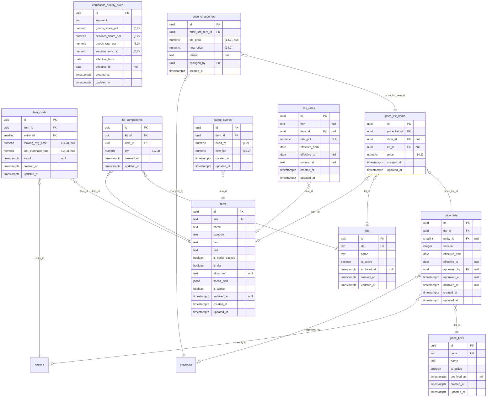

## Platform

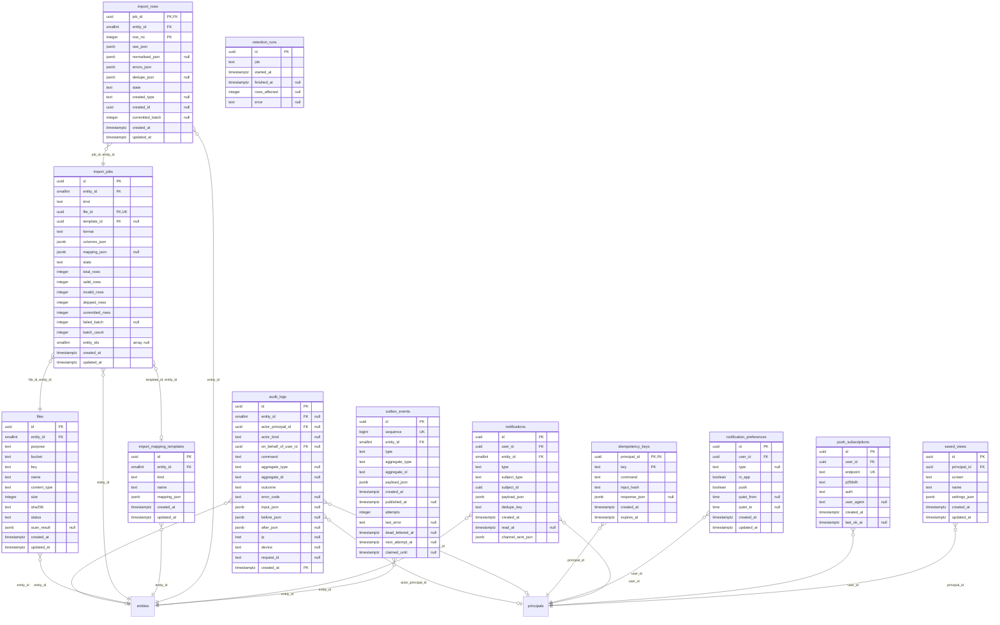

## AI and voice

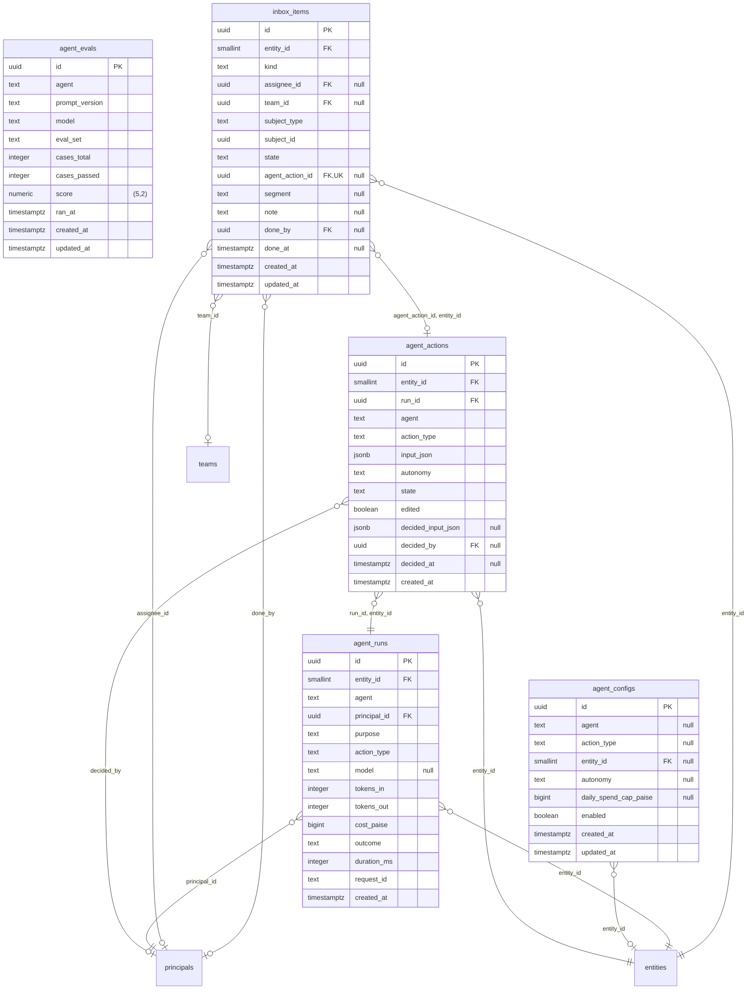

## Finance and costing

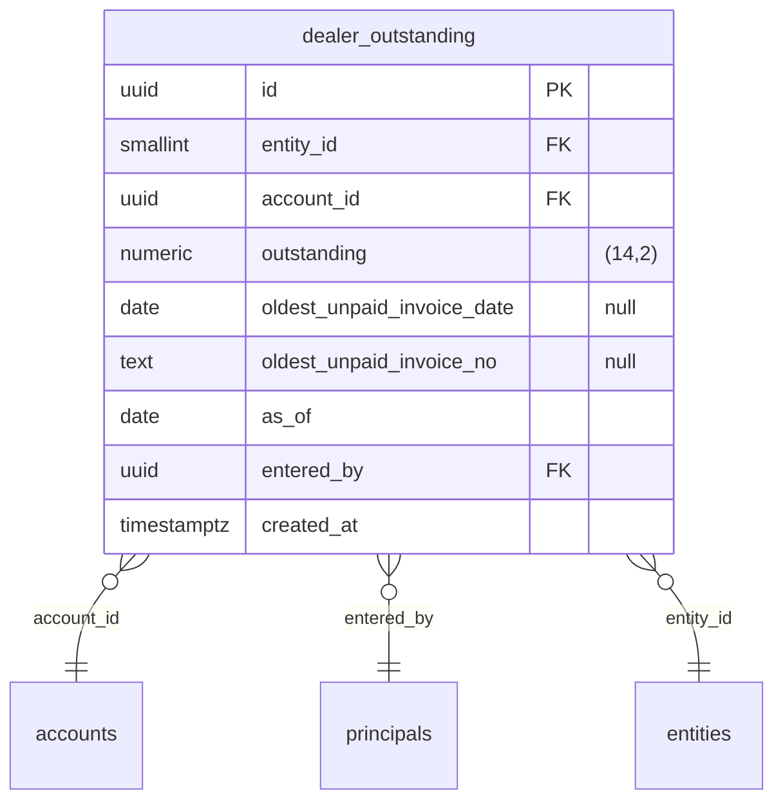

## Sales

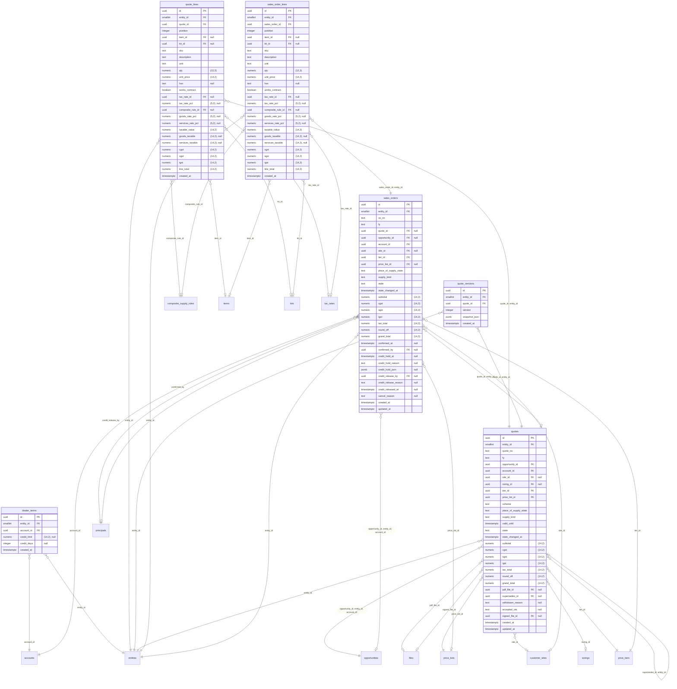

## Planned tables

Tables 05-database.md §6 documents that no migration has created yet, one diagram per section. Each shows the columns its entry names and the standard `id` of 05-database.md §2. A type comes from the entry or from the §2 naming conventions (`entity_id` smallint, other `*_id` references uuid, `*_at` timestamptz, `is_*` boolean, `*_json` jsonb); a column whose type neither fixes shows `untyped`. A relationship is inferred from a `*_id` column's name and drawn to the table it names; the migration that builds the table fixes the real keys, and the table then moves to its module above.

### Org and identity

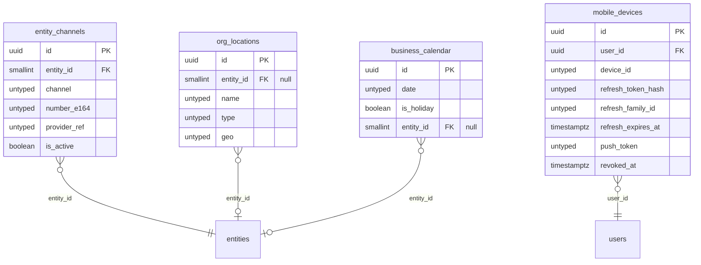

### CRM

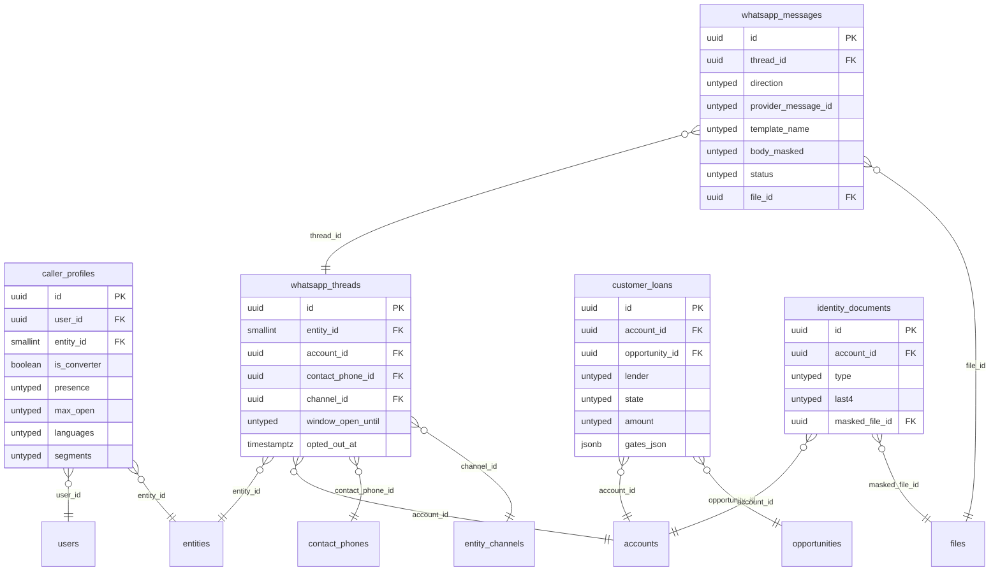

### Sales

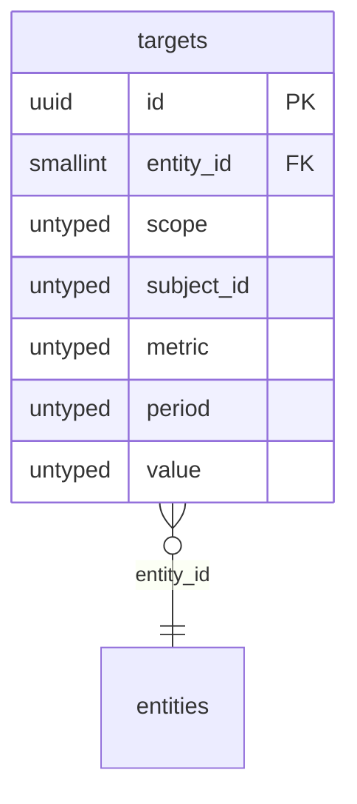

### Inventory and logistics

```mermaid
erDiagram
  warehouses {
    uuid id PK
    uuid location_id FK
    untyped code
  }
  bins {
    uuid id PK
    uuid location_id FK
    untyped code
  }
  stock_movements {
    uuid id PK
    smallint entity_id FK
    uuid item_id FK
    uuid serial_id FK "null"
    uuid from_bin_id FK
    uuid to_bin_id FK
    untyped qty
    untyped reason
    untyped ref_type
    untyped ref_id
    uuid reverses_id FK
  }
  stock_movement_costs {
    uuid id PK
    uuid movement_id FK
    untyped unit_cost
  }
  stock_balances {
    uuid id PK
    uuid warehouse_id FK
    uuid bin_id FK
    uuid item_id FK
    untyped qty_on_hand
    untyped qty_reserved
  }
  reservations {
    uuid id PK
    uuid so_line_id FK
    uuid item_id FK
    untyped qty
    timestamptz expires_at
    untyped state
  }
  serials {
    uuid id PK
    uuid item_id FK
    untyped serial_no
    untyped state
    uuid bin_id FK
    uuid customer_site_id FK
    untyped warranty_until
    timestamptz dcr_validated_at
  }
  surplus_pool {
    uuid id PK
    uuid project_id FK
    uuid item_id FK
    untyped qty
    untyped state
  }
  vendors {
    uuid id PK
    untyped name
    untyped gstin
    jsonb terms_json
  }
  vendor_quotes {
    uuid id PK
    uuid vendor_id FK
    uuid item_id FK
    untyped rate
    untyped valid_until
  }
  purchase_orders {
    uuid id PK
    smallint entity_id FK
    untyped po_no
    uuid vendor_id FK
    untyped state
    timestamptz expected_at
  }
  po_lines {
    uuid id PK
    uuid po_id FK
    smallint entity_id FK
    uuid item_id FK
    untyped qty
    untyped qty_received
    untyped unit_rate
    untyped amount
    untyped hsn
  }
  goods_receipts {
    uuid id PK
    smallint entity_id FK
    uuid po_id FK
    uuid warehouse_id FK
    timestamptz received_at
    untyped received_by
  }
  goods_receipt_lines {
    uuid id PK
    uuid receipt_id FK
    smallint entity_id FK
    uuid po_line_id FK
    uuid item_id FK
    uuid bin_id FK
    untyped qty
    untyped unit_rate
  }
  dispatches {
    uuid id PK
    smallint entity_id FK
    uuid so_id FK
    untyped state
    untyped vehicle_no
    untyped driver_name
    untyped driver_phone
    untyped consignment_value
  }
  dispatch_lines {
    uuid id PK
    uuid dispatch_id FK
    uuid so_line_id FK
    untyped qty
  }
  delivery_challans {
    uuid id PK
    uuid dispatch_id FK
    untyped challan_no
    uuid pdf_file_id FK
  }
  eway_bills {
    uuid id PK
    uuid dispatch_id FK
    untyped ewb_no
    untyped valid_from
    untyped valid_until
    untyped vehicle_no
    untyped linked_ref_type
    untyped linked_ref
  }
  warranty_claims {
    uuid id PK
    uuid serial_id FK
    uuid account_id FK
    untyped state
    uuid replacement_serial_id FK
    untyped supplier_rma_ref
    uuid cost_entry_id FK
  }
  warehouses }o--|| org_locations : "location_id"
  bins }o--|| org_locations : "location_id"
  stock_movements }o--|| entities : "entity_id"
  stock_movements }o--|| items : "item_id"
  stock_movements }o--o| serials : "serial_id"
  stock_movements }o--|| bins : "from_bin_id"
  stock_movements }o--|| bins : "to_bin_id"
  stock_movements }o--o| stock_movements : "reverses_id"
  stock_movement_costs }o--|| stock_movements : "movement_id"
  stock_balances }o--|| warehouses : "warehouse_id"
  stock_balances }o--|| bins : "bin_id"
  stock_balances }o--|| items : "item_id"
  reservations }o--|| sales_order_lines : "so_line_id"
  reservations }o--|| items : "item_id"
  serials }o--|| items : "item_id"
  serials }o--|| bins : "bin_id"
  serials }o--|| customer_sites : "customer_site_id"
  surplus_pool }o--|| projects : "project_id"
  surplus_pool }o--|| items : "item_id"
  vendor_quotes }o--|| vendors : "vendor_id"
  vendor_quotes }o--|| items : "item_id"
  purchase_orders }o--|| entities : "entity_id"
  purchase_orders }o--|| vendors : "vendor_id"
  po_lines }o--|| purchase_orders : "po_id"
  po_lines }o--|| entities : "entity_id"
  po_lines }o--|| items : "item_id"
  goods_receipts }o--|| entities : "entity_id"
  goods_receipts }o--|| purchase_orders : "po_id"
  goods_receipts }o--|| warehouses : "warehouse_id"
  goods_receipt_lines }o--|| goods_receipts : "receipt_id"
  goods_receipt_lines }o--|| entities : "entity_id"
  goods_receipt_lines }o--|| po_lines : "po_line_id"
  goods_receipt_lines }o--|| items : "item_id"
  goods_receipt_lines }o--|| bins : "bin_id"
  dispatches }o--|| entities : "entity_id"
  dispatches }o--|| sales_orders : "so_id"
  dispatch_lines }o--|| dispatches : "dispatch_id"
  dispatch_lines }o--|| sales_order_lines : "so_line_id"
  delivery_challans }o--|| dispatches : "dispatch_id"
  delivery_challans }o--|| files : "pdf_file_id"
  eway_bills }o--|| dispatches : "dispatch_id"
  warranty_claims }o--|| serials : "serial_id"
  warranty_claims }o--|| accounts : "account_id"
  warranty_claims }o--|| serials : "replacement_serial_id"
  warranty_claims }o--|| job_cost_entries : "cost_entry_id"
```

### Projects and field

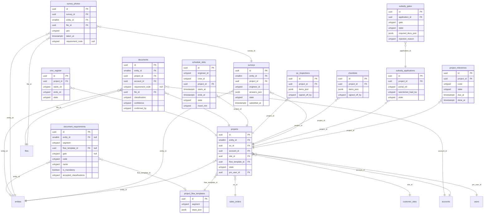

### Finance and costing

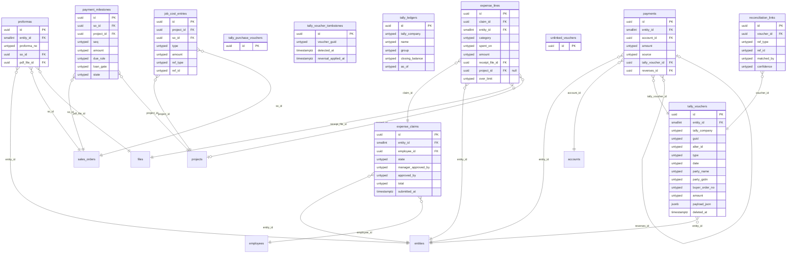

### HR

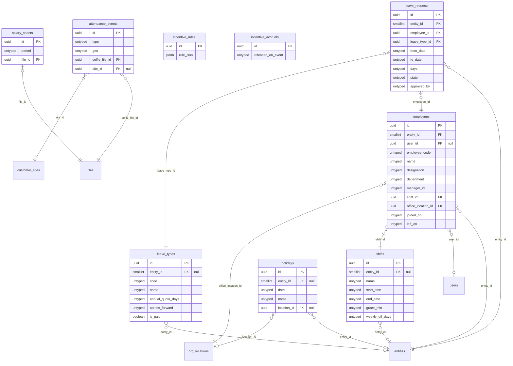

### AI and voice

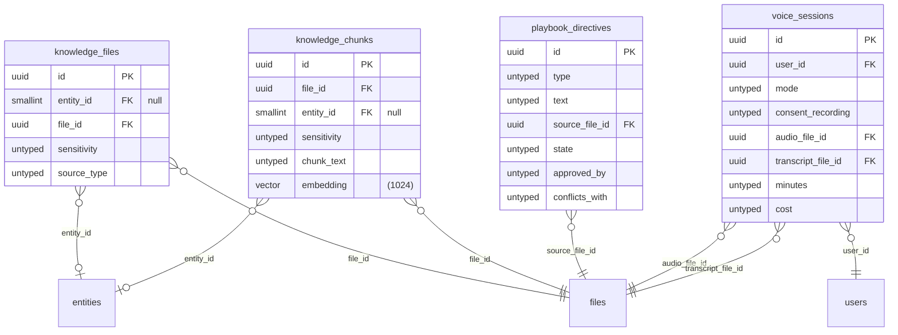

### Platform

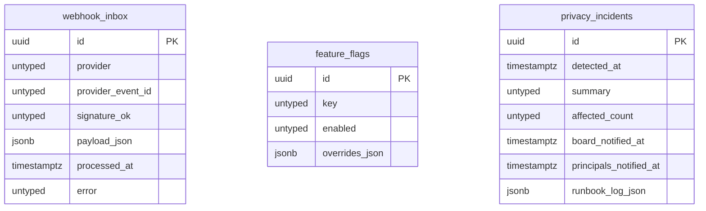
