# Working in cloud sessions and on the PC

How Shakti Prime BOS work is split between Claude Code cloud sessions and the owner's Windows PC, and how a piece of work moves between them. This page is the one owner of that split.

**Each working session runs wholly on the PC or wholly in a cloud session, as the owner chooses that day** (owner, 09-10-2026, [DECISIONS](../11-decisions.md)). A PC day follows [CLAUDE.md](../../CLAUDE.md) and [slice-integration](slice-integration.md) on the PC. This page is the cloud day: the lead session, its builders and reviewers, the merge with `main`, integration, baselines, pull requests, the hosted steps and the end-of-day documents all run in one cloud session. The trial of [§10](#10-the-trial) showed each part works.

The slice procedure itself (brief, build, review, merge with `main`, integration, baselines, pull request) is [slice-integration](slice-integration.md); the hosted migration is [DEPLOY §2](deploy.md#2-every-deploy).

**Contents:** [1. What runs where](#1-what-runs-where) · [2. What a cloud session has and lacks](#2-what-a-cloud-session-has-and-lacks) · [3. The cloud environment, once](#3-the-cloud-environment-once) · [4. Starting a builder or a reviewer](#4-starting-a-builder-or-a-reviewer) · [5. How many at once](#5-how-many-at-once) · [6. How a cloud day ends](#6-how-a-cloud-day-ends) · [7. Moving a session between the cloud and the PC](#7-moving-a-session-between-the-cloud-and-the-pc) · [8. What only the PC has](#8-what-only-the-pc-has) · [9. A reclaimed VM or a usage limit](#9-a-reclaimed-vm-or-a-usage-limit) · [10. The trial](#10-the-trial)

## 1. What runs where
On a cloud day everything runs in the cloud: the lead session is itself a cloud session, and nothing waits on the PC.

| Task | Where on a cloud day | How |
|---|---|---|
| Start the day | The lead's cloud session on `main` | The owner opens claude.ai/code (environment `shakti_prime`, branch `main`) and types "start the day"; the `start-session` skill runs as on the PC |
| Write a slice's run file (its brief) | The lead session | Committed on the slice's branch and pushed before any agent starts |
| Build, review and fix a slice | Subagents of the lead session in the same VM, each slice in its own worktree with its own Postgres container | `bash tools/integration/setup-worktree.sh <slug> <branch> <db-port> <app-port>` puts the worktree beside the checkout ([slice-integration §2](slice-integration.md#2-set-up-a-slice)); the models and efforts of [models-and-usage §3](models-and-usage.md#3-who-runs-what) |
| Take `main` into a slice, renumber its migrations | The lead session | [slice-integration §5](slice-integration.md#5-take-main-into-the-slice) |
| The integration run (`integrate.sh`) | The lead session | In parts with `INTEGRATE_STEPS` (for example `install lint format copylint generated typecheck`, then `unit`, then `security dbverify`, then `audit build jsbudget gitleaks`, then `e2e`), each under the 30-minute limit of [§2](#2-what-a-cloud-session-has-and-lacks); `E2E_SPECS` for the slice's own journeys |
| Linux screenshot baselines (`e2e:snap`) | The lead session | The Playwright image in the VM's Docker, the slice's own screens |
| Push, open the pull request | The lead session | `gh pr create` (signed in through the GitHub proxy); the merge workflow merges on green |
| Migrate dev and staging, check health | The lead session | `gh workflow run migrate.yml` as [DEPLOY §2](deploy.md#2-every-deploy) says; the workflow's `db:verify` is the migration check, since the Supabase tools are on the PC only; health with `curl` (both sites are on the environment's network list) |
| Any other change to a hosted service | The owner, with the lead's steps | The cloud has no Vercel, Upstash, AWS or Sentry tools; the standing go-ahead and its scope: [DECISIONS](../11-decisions.md) |
| STATUS, CHANGELOG and DECISIONS at the end of the day | The lead session | The `end-session` skill, its pull request opened with `gh` |
| Look up a library's documentation | Any session | No Context7 in the cloud: read the installed package's types and README under `node_modules` |

```mermaid
flowchart LR
  A[Owner: cloud session on main, start the day] --> B[Lead: run file, worktree, push]
  B --> C[Builder subagent]
  C --> D[Reviewer subagent, once]
  D --> E[One fix round; lead reads the diff]
  E --> F[Lead: merge main, integrate in parts, baselines]
  F --> G[Lead: pull request, merge on green]
  G --> H[Lead: migrate dev, then staging, health]
  H --> I[Lead: end the day, documents pull request]
```



## 2. What a cloud session has and lacks
From Anthropic's documentation (04-10-2026):
- Each session is an Ubuntu 24.04 VM with about 4 vCPUs, 16 GB of memory and 30 GB of disk. Node, pnpm, Docker with docker compose, PostgreSQL and Redis are installed, none of them running.
- The repository is cloned from GitHub at the session's branch. Handover between the cloud and the PC is always through a pushed branch.
- `gh` is installed and signed in as the owner through a GitHub proxy; `gh workflow run` works there.
- The environment's setup script runs as root before Claude starts, and its result is kept as a snapshot; running processes are not kept, so the session-start hook starts Docker and Postgres each time.
- The repository's `.claude/settings.json` hooks run in the cloud as on the PC; `CLAUDE_CODE_REMOTE=true` marks a cloud session.
- A foreground command waits 2 minutes by default (10 at most); a command sent to the background runs at most 30 more minutes, unless the environment raises `BASH_DEFAULT_TIMEOUT_MS` and `BASH_MAX_TIMEOUT_MS`.
- An idle VM pauses after a few minutes and may be reclaimed: background work is lost, the conversation is kept.
- The plugins and MCP servers signed in on the PC are absent: no Context7, Supabase, Vercel, Upstash, AWS or Sentry tools. The browser pane and `.claude/launch.json` belong to the desktop app on the PC.
- Usage counts against the owner's Claude plan, shared with the PC's sessions.

What this repository adds:
- `tools/integration/cloud-setup.sh` (the setup script): Node of `.node-version` (24; the image's Node 22 comes first on `PATH`, so the session hook and `lib.sh` put `/usr/local/bin` first) and the pnpm of `package.json` from npm (corepack cannot start pnpm 12), the packages, the Playwright Chromium the journeys use, and the Postgres, gitleaks and Playwright images, pulled in parallel.
- `.claude/hooks/cloud-session.sh` (a session-start hook that does nothing on the PC): `.env` from `.env.example` with `E2E_BASE_URL` on `BETTER_AUTH_URL`'s port, the packages when the checkout has none, the Docker daemon and the local Postgres on `127.0.0.1:54322`. The security suites and the journeys migrate and seed that database themselves (`prepareDatabase()` in `packages/db/src/testing`); the dev server needs `pnpm db:migrate && pnpm db:seed` first.
- `.claude/hooks/tooling-check.mjs` prints a short cloud note instead of the PC's tool list.

What the setup has to work around:
- The Node download from nodejs.org, the Docker daemon and the Postgres and Playwright image pulls work.
- The image's `PLAYWRIGHT_BROWSERS_PATH` holds an older Chromium than `@playwright/test` runs, so `ensure_playwright_browsers` copies the builds from the Playwright image.
- The proxy refuses `ghcr.io`'s blob host and Docker Hub sometimes answers 429, so `ensure_gitleaks_image` takes the same gitleaks release from Docker Hub and is retried after a minute when it fails.
- A branch made before `lib.sh` put `/usr/local/bin` first in `PATH` takes `main` first; otherwise pnpm must be installed with npm.

## 3. The cloud environment, once
The owner does these steps once, in the browser. The labels follow Anthropic's documentation; if a screen names a step differently, the setting is the same.

1. **Install the Claude GitHub App** on the repository: open https://github.com/apps/claude, choose Install (or Configure), pick the account `techaust`, choose *Only select repositories*, select `techaust/shakti_prime` and save.
2. **Create the environment:** open https://claude.ai/code, open the environment menu beside the repository and choose to add an environment.
   - **Name:** `shakti_prime`, as the repository.
   - **Network access:** *Custom*, with **Also include default list of common package managers** ticked (without it the npm registry, nodejs.org, Docker Hub and the other image registries are refused), plus exactly these hosts (the owner's network row in [DECISIONS](../11-decisions.md)), one per line:
     ```
     challenges.cloudflare.com
     api.pwnedpasswords.com
     cdn.playwright.dev
     playwright.download.prss.microsoft.com
     shakti-prime-dev.vercel.app
     shakti-prime-staging.vercel.app
     ```
     The first two are the sign-in screens' outside calls (the Turnstile widget and the breached-password check); the Playwright hosts serve the browser download; the two sites answer the health checks.
   - **Environment variables** (visible to anyone who uses the environment, so never a secret):
     ```
     BASH_DEFAULT_TIMEOUT_MS=600000
     BASH_MAX_TIMEOUT_MS=1800000
     ```
   - **Setup script:** paste the whole of `tools/integration/cloud-setup-env.sh`. The box runs before the checkout is in the session's working directory (a bare `bash tools/integration/cloud-setup.sh` stops with *No such file or directory*), so the pasted script finds the repository's `cloud-setup.sh` and runs it, or installs Node 24 and pnpm and leaves the rest to the session-start hook.
3. **Check it:** start a session on `main` and send `Say what the session-start hooks printed.` The answer names the cloud note of `[tooling-check]` and a `[cloud-session]` line saying Postgres is up. If a line reports a problem, the setup script's log is in `/tmp/cloud-setup-*.log` and the hook's in `/tmp/cloud-session-*.log`.

## 4. Starting a builder or a reviewer
Before a cloud session starts, the lead session on the PC writes or updates the slice's run file `docs/runs/phase1/<slice>.md` ([the run files](../runs/phase1/readme.md)), commits it on the slice's branch and pushes the branch. The session clones that branch.

Start the session on claude.ai/code (environment `shakti_prime`, the slice's branch), or from the PC with `claude --cloud "<message>"`, which starts a cloud session on the checkout's current branch once it is pushed. The first message, with the slice's names filled in:

**Builder:**
```
You are the slice builder for <slice> on Shakti Prime BOS, in a Claude Code cloud session on
branch <branch>. Read docs/runs/phase1/<slice>.md (your brief) and follow
.claude/agents/slice-builder.md completely. The session-start hook started the local Postgres on
port 54322. Commit at least every 20 minutes and push your branch after each commit. When you are
done, or stopped by a rule, write your report into the run file's Report section, commit and push.
Never open a pull request, merge, or touch a hosted service.
```

**Reviewer:**
```
You are the slice reviewer for <slice> on Shakti Prime BOS, in a Claude Code cloud session on
branch <branch>. Read docs/runs/phase1/<slice>.md and follow .claude/agents/slice-reviewer.md
completely. Write your findings into the run file's Review section, the only file you change,
then commit and push. Never open a pull request, merge, or touch a hosted service.
```

## 5. How many at once
- Up to three builders at once on a cloud day ([models-and-usage §3](models-and-usage.md#3-who-runs-what)), each in its own worktree and Postgres container in the lead's VM; heavy commands still take turns through `bash tools/integration/heavy.sh <command>`, since the VM has 16 GB and 4 vCPUs.
- One agent per slice and per branch: two agents pushing one branch overwrite each other's work.
- A builder started instead as its own cloud session (the first messages of [§4](#4-starting-a-builder-or-a-reviewer)) counts toward the three.
- No cloud session runs while a PC session works, and the reverse: a day is wholly one or the other.

## 6. How a cloud day ends
- The lead runs the `end-session` skill in the cloud: STATUS, CHANGELOG, DECISIONS and the run files, a documents pull request opened with `gh`, merged on green.
- Every branch is pushed and every pull request merged or recorded in STATUS before the session closes: the VM and anything not pushed are lost when it is reclaimed.
- A cloud session never force-pushes, deletes a remote branch or pushes to `main`; the merge workflow merges.
- The PC's Claude memory does not reach a cloud session: the repository's documents are the whole record.

## 7. Moving a session between the cloud and the PC
Every move goes through a pushed branch: commit and push before moving.
- **PC to cloud:** in the desktop app, *Continue in cloud* sends the session up; from a terminal, `claude --cloud "<message>"` starts a cloud session on the current branch.
- **Cloud to PC:** `claude --teleport <session id>` in a terminal, or `/teleport` inside Claude Code, brings the cloud session and its branch to the PC. On the PC, a slice's work continues in its worktree ([slice-integration §2](slice-integration.md#2-set-up-a-slice)), which has its own Postgres and ports.
- A branch that GitHub refuses to update without a force push (history rewritten on one side) goes up under a fresh name, such as `feat/c3-pipelines-r2`; the run file names the branch in use.

## 8. What only the PC has
- **The Supabase, Vercel, Upstash, AWS and Sentry tools** ([tooling](tooling.md)): on a cloud day the migrate workflow's `db:verify` replaces the migration count, and any other look at a hosted service is done by the owner from the steps the lead gives.
- **Context7 and the browser pane** (`.claude/launch.json`, the preview logs).
- **The owner's secret scripts** (hidden-prompt PowerShell scripts): a step that needs a secret is done by the owner on the PC or in the service's own console.

## 9. A reclaimed VM or a usage limit
- **The VM was reclaimed or paused:** the conversation is kept, the running commands are not. Reopen the session (or start a fresh one on the branch with the same first message); the session-start hook brings Postgres back, and the suites prepare the database again. Work committed and pushed survives; anything else is lost, which is why a cloud builder pushes after every commit.
- **The usage limit stopped the session:** every session on the plan stops at once. After the limit resets, continue the same session, or start a fresh one with the first message of [§4](#4-starting-a-builder-or-a-reviewer); the run file and the branch say where it stopped.
- **A session is stuck** (no tool call for about 20 minutes): stop it and start a fresh one from the last pushed commit, with the run file updated to say what is left.

## 10. The trial
The trial showed that the cloud can run the steps of [§1](#1-what-runs-where) marked cloud: a review in the cloud, a builder in the cloud on a slice in flight, and the merge with `main`, `integrate.sh` and `e2e:snap` in a cloud session on a slice ready to integrate.

It passed with S1, D1 and T1 (#115, #118, #119). Each took `main` by a merge commit, renumbered its migrations, ran `integrate.sh` in five parts (none near the 30-minute limit) and made its baselines in the Linux image; each merge with `main` found a clash the plain merge did not show and fixed it ([slice-integration §10](slice-integration.md#10-lessons)).

The owner decided on 09-10-2026 that a session runs wholly in the cloud or wholly on the PC, chosen each day ([DECISIONS](../11-decisions.md)).
