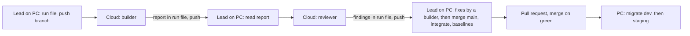

# Working in cloud sessions and on the PC

How Shakti Prime BOS work is split between Claude Code cloud sessions and the owner's Windows PC, and how a piece of work moves between them. This page is the one owner of that split.

It follows the owner's decisions of 04-10-2026 ([DECISIONS](../DECISIONS.md)): slices are built and reviewed in cloud sessions; merging with `main`, the integration run, the Linux baselines, the pull request and every hosted step stay on the PC until a trial proves the cloud can do them; the PC is the fallback for everything.

The slice procedure itself (brief, build, review, merge with `main`, integration, baselines, pull request) is [slice-integration](slice-integration.md); the hosted migration is [DEPLOY §2](DEPLOY.md#2-every-deploy).

**Contents:** [1. What runs where](#1-what-runs-where) · [2. What a cloud session has and lacks](#2-what-a-cloud-session-has-and-lacks) · [3. The cloud environment, once](#3-the-cloud-environment-once) · [4. Starting a builder or a reviewer](#4-starting-a-builder-or-a-reviewer) · [5. How many at once](#5-how-many-at-once) · [6. How a cloud session ends](#6-how-a-cloud-session-ends) · [7. Moving a session between the cloud and the PC](#7-moving-a-session-between-the-cloud-and-the-pc) · [8. What stays on the PC, and why](#8-what-stays-on-the-pc-and-why) · [9. A reclaimed VM or a usage limit](#9-a-reclaimed-vm-or-a-usage-limit) · [10. The trial](#10-the-trial)

## 1. What runs where
| Task | Where | Why |
|---|---|---|
| Write a slice's run file (its brief) | PC, the lead session | The lead plans and reviews every slice; the run file is pushed on the slice's branch before a cloud session starts |
| Build a slice | Cloud (PC as fallback) | Each session is its own VM with Docker and its own Postgres, so slices share no ports, memory or database |
| Review a slice | Cloud (PC as fallback) | Read-only; it runs the suites on its own database |
| Take `main` into a slice, renumber its migrations | Cloud from S1, the trial (PC as fallback) | Cloud-first (owner, 05-10-2026): the 8 GB PC cannot run these beside other work |
| The integration run (`integrate.sh`) | Cloud from S1, the trial (PC as fallback) | It runs 30 to 60 minutes, longer than a cloud command may run ([§2](#2-what-a-cloud-session-has-and-lacks)), so a cloud session runs it in parts with `INTEGRATE_STEPS` (for example `install lint format copylint generated typecheck`, then `unit`, then `security dbverify`, then `audit build jsbudget gitleaks`, then `e2e`), each under 30 minutes |
| Linux screenshot baselines (`e2e:snap`) | Cloud from S1, the trial (PC as fallback) | The VM is Linux, as the baselines are |
| Push for review, open the pull request | PC, the lead session | The lead checks the diff first; a cloud session never opens a pull request |
| Migrate dev and staging, check health | PC | Decision 1; the migration count reads the hosted database through the Supabase tools, which exist only on the PC |
| Any other change to a hosted service | PC, with the owner's go-ahead | The standing go-ahead and its scope: [DECISIONS](../DECISIONS.md) |
| STATUS, CHANGELOG and DECISIONS at the end of a session | PC, the lead session | The `end-session` skill |
| Look up a library's documentation with Context7 | PC | Context7 is a plugin signed in on the PC; in the cloud, read the installed package's types and README under `node_modules` |



## 2. What a cloud session has and lacks
From Anthropic's documentation (04-10-2026):
- Each session is an Ubuntu 24.04 VM with about 4 vCPUs, 16 GB of memory and 30 GB of disk. Node, pnpm, Docker with docker compose, PostgreSQL and Redis are installed, none of them running.
- The repository is cloned from GitHub at the session's branch. Handover between the cloud and the PC is always through a pushed branch.
- `gh` is installed and signed in as the owner through a GitHub proxy; `gh workflow run` works there.
- The environment's setup script runs as root before Claude starts, and its result is kept as a snapshot; running processes are not kept, so the session-start hook starts Docker and Postgres each time.
- The repository's `.claude/settings.json` hooks run in the cloud as on the PC; `CLAUDE_CODE_REMOTE=true` marks a cloud session.
- A foreground command waits 2 minutes by default (10 at most); a command sent to the background runs at most 30 more minutes, unless the environment raises `BASH_DEFAULT_TIMEOUT_MS` and `BASH_MAX_TIMEOUT_MS`.
- An idle VM pauses after a few minutes and may be reclaimed: background work is lost, the conversation is kept.
- The plugins and MCP servers signed in on the PC are absent: no Context7, Supabase, Vercel, Upstash, AWS or Sentry tools. The browser pane and `.claude/launch.json` belong to the desktop app on the PC.
- Usage counts against the owner's Claude plan, shared with the PC's sessions.

What this repository adds:
- `tools/integration/cloud-setup.sh` (the setup script): Node of `.node-version` (24; the image's Node is older), corepack and pnpm, the packages, the Playwright Chromium the journeys use, and the Postgres, gitleaks and Playwright images, pulled in parallel.
- `.claude/hooks/cloud-session.sh` (a session-start hook that does nothing on the PC): `.env` from `.env.example` with `E2E_BASE_URL` on `BETTER_AUTH_URL`'s port, the packages when the checkout has none, the Docker daemon and the local Postgres on `127.0.0.1:54322`. The security suites and the journeys migrate and seed that database themselves (`prepareDatabase()` in `packages/db/src/testing`); the dev server needs `pnpm db:migrate && pnpm db:seed` first.
- `.claude/hooks/tooling-check.mjs` prints a short cloud note instead of the PC's tool list.

Not yet tried in a cloud session (the first session of [the trial](#10-the-trial) confirms each): the Node download from nodejs.org, starting the Docker daemon with `service docker start`, the image pulls from Docker Hub, `ghcr.io` and `mcr.microsoft.com` under the Trusted network level, and whether the setup script finishes within the snapshot's time.

## 3. The cloud environment, once
The owner does these steps once, in the browser. The labels follow Anthropic's documentation; if a screen names a step differently, the setting is the same.

1. **Install the Claude GitHub App** on the repository: open https://github.com/apps/claude, choose Install (or Configure), pick the account `techaust`, choose *Only select repositories*, select `techaust/shakti_prime` and save.
2. **Create the environment:** open https://claude.ai/code, open the environment menu beside the repository and choose to add an environment.
   - **Name:** `shakti_prime`, as the repository.
   - **Network access:** *Custom*, with **Also include default list of common package managers** ticked (without it the npm registry, nodejs.org, Docker Hub and the other image registries are refused), plus exactly these hosts (decision 4 of 04-10-2026), one per line:
     ```
     challenges.cloudflare.com
     api.pwnedpasswords.com
     cdn.playwright.dev
     playwright.download.prss.microsoft.com
     shakti-prime-dev.vercel.app
     shakti-prime-staging.vercel.app
     ```
     The first two are the sign-in screens' outside calls (the Turnstile widget and the breached-password check); the Playwright hosts serve the browser download; the two sites answer the health checks.
   - **Environment variables** (visible to anyone who uses the environment, so never a secret):
     ```
     BASH_DEFAULT_TIMEOUT_MS=600000
     BASH_MAX_TIMEOUT_MS=1800000
     ```
   - **Setup script:** paste the whole of `tools/integration/cloud-setup-env.sh`. The box runs before the checkout is in the session's working directory (a bare `bash tools/integration/cloud-setup.sh` stops with *No such file or directory*), so the pasted script finds the repository's `cloud-setup.sh` and runs it, or installs Node 24 and pnpm and leaves the rest to the session-start hook.
3. **Check it:** start a session on `main` and send `Say what the session-start hooks printed.` The answer names the cloud note of `[tooling-check]` and a `[cloud-session]` line saying Postgres is up. If a line reports a problem, the setup script's log is in `/tmp/cloud-setup-*.log` and the hook's in `/tmp/cloud-session-*.log`.

## 4. Starting a builder or a reviewer
Before a cloud session starts, the lead session on the PC writes or updates the slice's run file `docs/runs/phase1/<slice>.md` ([the run files](../runs/phase1/README.md)), commits it on the slice's branch and pushes the branch. The session clones that branch.

Start the session on claude.ai/code (environment `shakti_prime`, the slice's branch), or from the PC with `claude --cloud "<message>"`, which starts a cloud session on the checkout's current branch once it is pushed. The first message, with the slice's names filled in:

**Builder:**
```
You are the slice builder for <slice> on Shakti Prime BOS, in a Claude Code cloud session on
branch <branch>. Read docs/runs/phase1/<slice>.md (your brief) and follow
.claude/agents/slice-builder.md completely. The session-start hook started the local Postgres on
port 54322. Commit at least every 20 minutes and push your branch after each commit. When you are
done, or stopped by a rule, write your report into the run file's Report section, commit and push.
Never open a pull request, merge, or touch a hosted service.
```

**Reviewer:**
```
You are the slice reviewer for <slice> on Shakti Prime BOS, in a Claude Code cloud session on
branch <branch>. Read docs/runs/phase1/<slice>.md and follow .claude/agents/slice-reviewer.md
completely. Write your findings into the run file's Review section, the only file you change,
then commit and push. Never open a pull request, merge, or touch a hosted service.
```

## 5. How many at once
- At most two cloud sessions at a time beside the lead session on the PC (decision 3: the Max 5x plan), for example one builder and one reviewer.
- One session per slice, and one session per branch: two sessions pushing one branch overwrite each other's work.
- Agents on the PC count against the same plan; while two cloud sessions run, the PC runs no building agent.

## 6. How a cloud session ends
- A builder writes its report into the run file's Report section, commits and pushes its branch. A reviewer writes its findings into the Review section, commits and pushes.
- A cloud session never opens a pull request, merges, pushes to `main`, force-pushes, deletes a remote branch, or touches a hosted service.
- The lead session on the PC fetches the branch, reads the report or the findings, verifies them, and decides the next step (fixes, review, or the merge with `main` in [slice-integration §5](slice-integration.md#5-take-main-into-the-slice)).

## 7. Moving a session between the cloud and the PC
Every move goes through a pushed branch: commit and push before moving.
- **PC to cloud:** in the desktop app, *Continue in cloud* sends the session up; from a terminal, `claude --cloud "<message>"` starts a cloud session on the current branch.
- **Cloud to PC:** `claude --teleport <session id>` in a terminal, or `/teleport` inside Claude Code, brings the cloud session and its branch to the PC. On the PC, a slice's work continues in its worktree ([slice-integration §2](slice-integration.md#2-set-up-a-slice)), which has its own Postgres and ports.
- A branch that GitHub refuses to update without a force push (history rewritten on one side) goes up under a fresh name, such as `feat/c3-pipelines-r2`; the run file names the branch in use.

## 8. What stays on the PC, and why
- **Hosted steps:** migrating dev and staging and checking them ([DEPLOY §2](DEPLOY.md#2-every-deploy), the `migrate-hosted` skill). The migration count and any other look at a hosted project use the Supabase, Vercel, Upstash, AWS and Sentry tools signed in on the PC ([tooling](tooling.md)).
- **The merge with `main`, the integration run, the Linux baselines and the pull request,** by decision 1 until the trial.
- **Worktrees and their ports:** `D:/shakti-wt` (`WT_ROOT=/d/shakti-wt`), one Postgres container and app port per slice ([slice-integration §1](slice-integration.md#1-machines-and-ports)). A cloud session has one checkout, Postgres on 54322 and the app on 3000.
- **The browser pane** (`.claude/launch.json`, the preview logs) is part of the desktop app.

## 9. A reclaimed VM or a usage limit
- **The VM was reclaimed or paused:** the conversation is kept, the running commands are not. Reopen the session (or start a fresh one on the branch with the same first message); the session-start hook brings Postgres back, and the suites prepare the database again. Work committed and pushed survives; anything else is lost, which is why a cloud builder pushes after every commit.
- **The usage limit stopped the session:** every session on the plan stops at once. After the limit resets, continue the same session, or start a fresh one with the first message of [§4](#4-starting-a-builder-or-a-reviewer); the run file and the branch say where it stopped.
- **A session is stuck** (no tool call for about 30 minutes): stop it and start a fresh one from the last pushed commit, with the run file updated to say what is left.

## 10. The trial
The PC keeps every task of [§1](#1-what-runs-where) marked PC until a trial shows the cloud can do it. The trial, in order:
1. A review in the cloud (P4's review is the first): the hooks, the suites on the session's Postgres, the findings pushed in the run file.
2. A builder in the cloud on a slice in flight.
3. The merge with `main`, `integrate.sh` and `e2e:snap` in a cloud session on a slice ready to integrate, compared with the same run on the PC.

The result goes into `docs/STATUS.md`; the owner then decides whether to go fully cloud, and the decision becomes a row in [DECISIONS](../DECISIONS.md).
