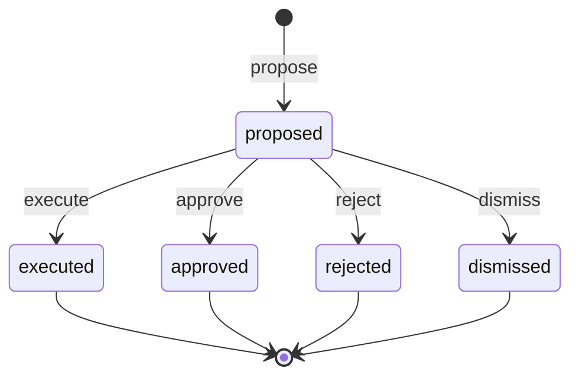

# Agent action state machine

<!-- Generated from packages/domain/src/state-machines by `pnpm --filter @shakti/domain machines:docs`. Do not edit by hand. -->

`agent_actions.state`. What an agent proposed or did with one action type, the command it runs and its input; append-only except the decision, which the inbox commands record once.

Sources: docs/03-roadmap-appendix/phase1.md §7.1; BLUEPRINT §9.3; PRD AI-04; DATABASE §6.9.

Every state and transition comes from the governing documents.

## States

| State | Kind | Notes |
|---|---|---|
| `proposed` | initial | – |
| `executed` | terminal | – |
| `approved` | terminal | – |
| `rejected` | terminal | – |
| `dismissed` | terminal | – |

## Transitions

| Event | From → To | Permitted actor | Guard | Effects |
|---|---|---|---|---|
| `propose` | (new) → `proposed` | the permission of the permission of the command the action runs (`agents.run.record`) | – | – |
| `execute` | `proposed` → `executed` | the permission of the permission of the command the action runs (`agents.run.record`) | – | – |
| `approve` | `proposed` → `approved` | `agents.inbox.act` | – | – |
| `reject` | `proposed` → `rejected` | `agents.inbox.act` | – | – |
| `dismiss` | `proposed` → `dismissed` | `agents.inbox.act` | – | – |

Any other event, or an event from a state not listed for it, answers `conflict` with reason `agent_action_transition_not_allowed`. A guard that refuses answers its own reason; the permission check answers `forbidden`. The command writes the new state to `agent_actions.state` and the time to `agent_actions.decided_at` when the state changes, applies the effects and calls `ctx.audit()`; it emits no event.

## Notes

- `propose`: Filed by the agent itself when its autonomy for the action type is Suggest or Needs approval and no kill switch is off; an inbox item comes with it.
- `execute`: At once, in the same run, when the autonomy is Automatic and no kill switch is off: the command runs as the agent, under the agent’s own permissions. Not in Phase 1: Automatic is refused until Phase 6, and a stored Automatic files a Needs approval suggestion.
- `approve`: Needs approval only: runs the command as the person who approves, under their own permissions, as it was proposed or with the fields its action type lets them change (`agents.inbox.edit`). Refused while a kill switch stops the agent.
- `reject`: Needs approval only: nothing runs.
- `dismiss`: Suggest only: the person has acted on it themselves, or chooses not to; nothing runs.

## Diagram

