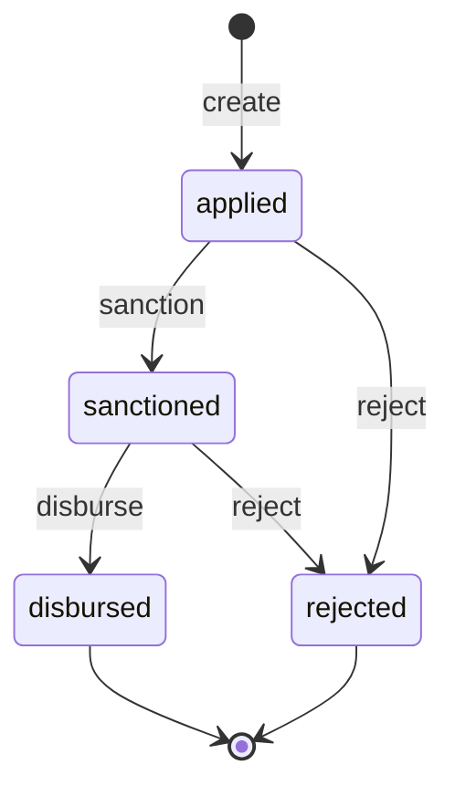

# Customer loan state machine

<!-- Generated from packages/domain/src/state-machines by `pnpm --filter @shakti/domain machines:docs`. Do not edit by hand. -->

`customer_loans.state`. Loan status can gate payment milestones and dispatch (`gates_json`).

Sources: BLUEPRINT §8.1, §19 item 2; PRD CRM-08; DATABASE §6.2 `customer_loans`.

Items marked *proposed* are not named in the governing documents; they were chosen for this specification and need review.

## States

| State | Kind | Notes |
|---|---|---|
| `applied` | initial | – |
| `sanctioned` | – | – |
| `disbursed` | terminal | – |
| `rejected` | terminal | – |

## Transitions

| Event | From → To | Permitted actor | Guard | Effects |
|---|---|---|---|---|
| `create` | (new) → `applied` | `crm.account.write` | – | – |
| `sanction` | `applied` → `sanctioned` | `crm.account.write` | the amount is recorded and above zero | `set_amount`: record the sanctioned amount; `release_gates`: release milestones and dispatches gated on `sanctioned` |
| `disburse` | `sanctioned` → `disbursed` | `crm.account.write` | the amount is recorded and above zero | `release_gates`: release milestones and dispatches gated on `disbursed` (CRM-08) |
| `reject` *(proposed)* | `applied`, `sanctioned` → `rejected` | `crm.account.write` | a reason is given | `notify_owner`: tell the opportunity owner so another route can be offered |

Any other event, or an event from a state not listed for it, answers `conflict` with reason `customer_loan_transition_not_allowed`. A guard that refuses answers its own reason; the permission check answers `forbidden`. The command persists `state` and `state_changed_at`, applies the effects, calls `ctx.audit()` and emits `<aggregate>.<event>`.

## Notes

- `create`: Against the account and, usually, the opportunity.

## Diagram

