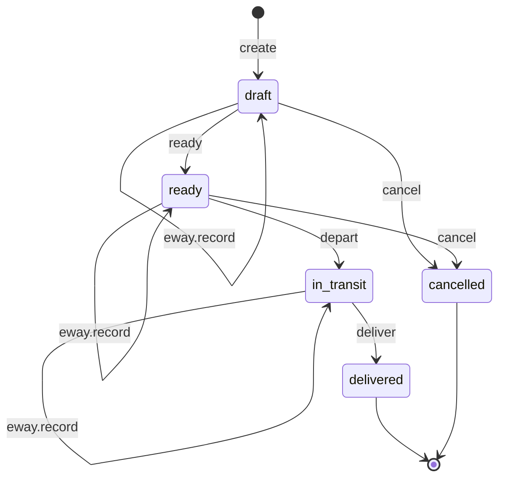

# Dispatch state machine

<!-- Generated from packages/domain/src/state-machines by `pnpm --filter @shakti/domain machines:docs`. Do not edit by hand. -->

`dispatches.state`. One consignment of a sales order from one hub; a split dispatch is several rows.

Sources: BLUEPRINT §8.4, §19 item 2; PRD INV-05, CRM-08, PRJ-02; DATABASE §6.5 `dispatches`.

Items marked *proposed* are not named in the governing documents; they were chosen for this specification and need review.

## States

| State | Kind | Notes |
|---|---|---|
| `draft` | initial | – |
| `ready` | – | – |
| `in_transit` | – | – |
| `delivered` | terminal | – |
| `cancelled` | terminal | – |

## Transitions

| Event | From → To | Permitted actor | Guard | Effects |
|---|---|---|---|---|
| `create` | (new) → `draft` | `inventory.dispatch.write` | – | – |
| `eway.record` *(proposed)* | `draft` → `draft` | `inventory.eway.write` | – | `record_eway`: store the e-way bill number, validity and vehicle on the dispatch |
| `eway.record` *(proposed)* | `ready` → `ready` | `inventory.eway.write` | – | `record_eway`: store the e-way bill number, validity and vehicle on the dispatch |
| `eway.record` *(proposed)* | `in_transit` → `in_transit` | `inventory.eway.write` | – | `record_eway`: store the e-way bill number, validity and vehicle on the dispatch |
| `ready` *(proposed)* | `draft` → `ready` | `inventory.dispatch.write` | – | – |
| `depart` | `ready` → `in_transit` | `inventory.dispatch.write` | e-way bill gate: above ₹50000.00 consignment value, an e-way bill number, a validity not yet passed and the vehicle are recorded; a loan-gated dispatch waits until the loan reaches its configured state (CRM-08); DCR/ALMM serials are validated where the project needs them (PRJ-02) | `issue_stock`: stock movements out of the hub (append-only ledger); `watch_eway_validity`: alert when the e-way bill validity would lapse in transit; `emit`: event for the dispatched WhatsApp message |
| `deliver` | `in_transit` → `delivered` | `inventory.dispatch.write` | the "materials arrived" photo is recorded | `advance_order`: fire `dispatch.partial` or `dispatch.complete` on the sales order |
| `cancel` | `draft`, `ready` → `cancelled` | `inventory.dispatch.write` | a reason is given | `release_pick`: return picked stock to its bins |

Any other event, or an event from a state not listed for it, answers `conflict` with reason `dispatch_transition_not_allowed`. A guard that refuses answers its own reason; the permission check answers `forbidden`. The command persists `state` and `state_changed_at`, applies the effects, calls `ctx.audit()` and emits `<aggregate>.<event>`.

## Notes

- `create`: Against a confirmed or partially dispatched sales order.
- `eway.record`: Accounts generates the e-way bill in Tally or on the portal and enters it here.
- `eway.record`: An extension when the validity would lapse in transit.
- `ready`: Picked and packed; the challan can print.
- `deliver`: Field engineers confirm arrival in the app, but SECURITY §3.2 gives them no dispatch permission: the workshop decides who records arrival.

## Diagram

