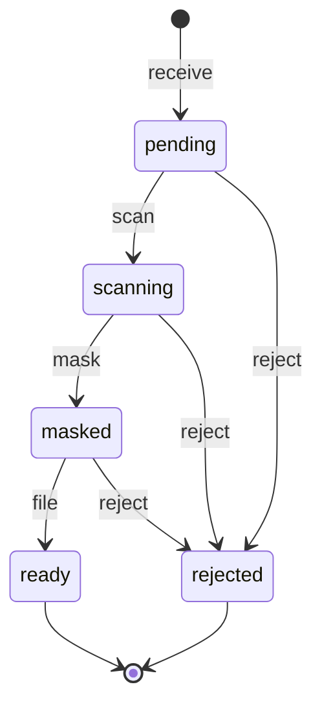

# WhatsApp document filing state machine

<!-- Generated from packages/domain/src/state-machines by `pnpm --filter @shakti/domain machines:docs`. Do not edit by hand. -->

`files.status`. The masking step runs before storage of the kept copy and before any classifier sees the file.

Sources: BLUEPRINT §7.5, §8.6, §19 item 2; PRD WA-02; DATABASE §6.10 `files`.

Items marked *proposed* are not named in the governing documents; they were chosen for this specification and need review.

## States

| State | Kind | Notes |
|---|---|---|
| `pending` | initial | – |
| `scanning` | – | – |
| `masked` | – | Masked copy kept; only the last four Aadhaar digits survive. |
| `ready` | terminal | Classified and filed against a requirement in the vault. |
| `rejected` | terminal | – |

## Transitions

| Event | From → To | Permitted actor | Guard | Effects |
|---|---|---|---|---|
| `receive` | (new) → `pending` | `documents.write` or the platform | – | – |
| `scan` | `pending` → `scanning` | the platform only | – | – |
| `mask` | `scanning` → `masked` | the platform only | the malware scan finished clean | `ocr_mask`: OCR masking: keep the masked copy and the last four digits only |
| `file` | `masked` → `ready` | `documents.write` or the platform | the file is filed against the customer who sent it (WA-02); the platform files only a confident classification; a low-confidence one waits for a person | `attach`: attach to the matching requirement in the vault; `recheck_gates`: re-evaluate the completeness gates |
| `reject` *(proposed)* | `pending`, `scanning`, `masked` → `rejected` | `documents.write` or the platform | a reason is given (infected, unreadable, wrong customer) | – |

Any other event, or an event from a state not listed for it, answers `conflict` with reason `document_filing_transition_not_allowed`. A guard that refuses answers its own reason; the permission check answers `forbidden`. No command drives this machine yet; the commands of its phase follow it (ROADMAP §3 onwards).

## Notes

- `receive`: The WhatsApp webhook worker (platform) or a staff upload.

## Diagram

