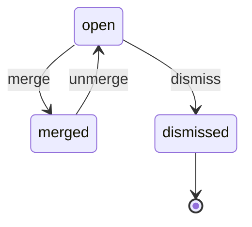

# Duplicate candidate state machine

<!-- Generated from packages/domain/src/state-machines by `pnpm --filter @shakti/domain machines:docs`. Do not edit by hand. -->

`duplicate_candidates.state`. Two customers, or two leads of one company, that look like one, with the reason and how sure the match is. Found open by `crm.lead.create`, the nightly `crm.duplicate.scan` and `crm.duplicate.suggest`; decided by a person holding `crm.lead.merge`.

Sources: docs/03-roadmap-appendix/phase1.md §7.4; PRD CRM-03; DATABASE §6.2 `duplicate_candidates`.

Every state and transition comes from the governing documents.

## States

| State | Kind | Notes |
|---|---|---|
| `open` | initial | – |
| `merged` | – | – |
| `dismissed` | terminal | – |

## Transitions

| Event | From → To | Permitted actor | Guard | Effects |
|---|---|---|---|---|
| `merge` | `open` → `merged` | `crm.lead.merge` | – | – |
| `dismiss` | `open` → `dismissed` | `crm.lead.merge` | – | – |
| `unmerge` | `merged` → `open` | `crm.lead.merge` | – | – |

Any other event, or an event from a state not listed for it, answers `conflict` with reason `duplicate_candidate_transition_not_allowed`. A guard that refuses answers its own reason; the permission check answers `forbidden`. The command writes the new state to `duplicate_candidates.state` when the state changes, applies the effects and calls `ctx.audit()`; it emits no event.

## Notes

- `merge`: By `crm.customer.merge` or `crm.lead.merge`, for people only; the merge records who decided and when.
- `dismiss`: The pair is not the same (`crm.duplicate.dismiss`, people only).
- `unmerge`: Undoing the customer merge made from the card (`crm.customer.unmerge`) opens the card again.

## Diagram

