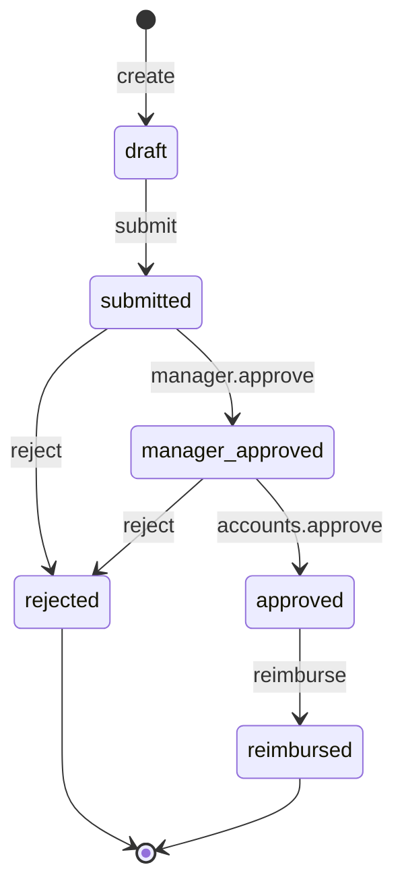

# Expense claim state machine

<!-- Generated from packages/domain/src/state-machines by `pnpm --filter @shakti/domain machines:docs`. Do not edit by hand. -->

`expense_claims.state`. Claims with receipt photos from the app or web, allocated to a project or overhead. Policy limits per category are a workshop input; the approver sees lines over the limit.

Sources: BLUEPRINT §8.7, §8.8, §19 item 2; PRD FIN-07; SECURITY §3.2 `finance.expense.approve`.

Items marked *proposed* are not named in the governing documents; they were chosen for this specification and need review.

## States

| State | Kind | Notes |
|---|---|---|
| `draft` | initial, *proposed* | – |
| `submitted` | *proposed* | – |
| `manager_approved` | *proposed* | – |
| `approved` | *proposed* | – |
| `rejected` | terminal, *proposed* | – |
| `reimbursed` | terminal, *proposed* | – |

## Transitions

| Event | From → To | Permitted actor | Guard | Effects |
|---|---|---|---|---|
| `create` | (new) → `draft` | `finance.expense.submit` | – | – |
| `submit` | `draft` → `submitted` | `finance.expense.submit` | at least one line, each with its receipt photo | – |
| `manager.approve` | `submitted` → `manager_approved` | `finance.expense.approve` at team scope or wider | the approver is not the claimant | `set_manager`: record the manager approver |
| `accounts.approve` | `manager_approved` → `approved` | `finance.expense.verify` at entity scope or wider | the approver is not the claimant; the Accounts step: a person other than the manager who approved | `cost_entry`: job cost entry of type `expense` when allocated to a project (restricted) |
| `reject` *(proposed)* | `submitted`, `manager_approved` → `rejected` | `finance.expense.approve` at team scope or wider | a reason is given; the approver is not the claimant | – |
| `reimburse` | `approved` → `reimbursed` | `finance.payment.write` or the platform | – | `export_line`: included in the monthly reimbursement export (HR-04) |

Any other event, or an event from a state not listed for it, answers `conflict` with reason `expense_claim_transition_not_allowed`. A guard that refuses answers its own reason; the permission check answers `forbidden`. The command persists `state` and `state_changed_at`, applies the effects, calls `ctx.audit()` and emits `<aggregate>.<event>`.

## Notes

- `create`: Every staff role holds `finance.expense.submit` at own scope.
- `accounts.approve`: The GM holds `finance.expense.approve` at entity scope for the manager step; the Accounts step needs `finance.expense.verify`, which only Accounts and the Executive hold.

## Diagram

