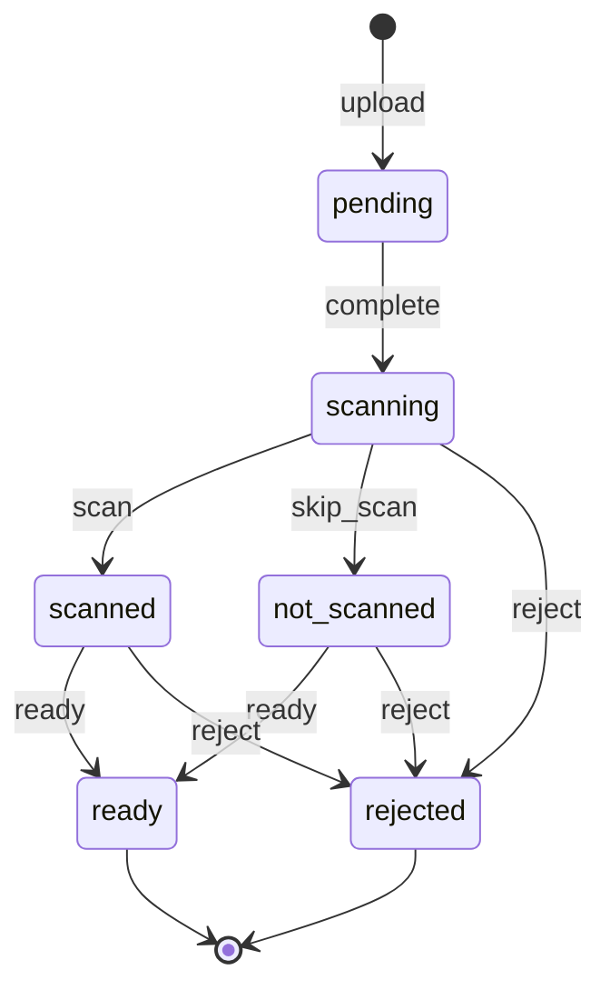

# File upload state machine

<!-- Generated from packages/domain/src/state-machines by `pnpm --filter @shakti/domain machines:docs`. Do not edit by hand. -->

`files.status` for an upload. A file is usable only once `ready`; a WhatsApp document follows `document_filing` instead.

Sources: BLUEPRINT §5; SECURITY §8; ARCHITECTURE §9; DATABASE §6.10 `files`.

Every state and transition comes from the governing documents.

## States

| State | Kind | Notes |
|---|---|---|
| `pending` | initial | Recorded with its pre-signed upload address; the bytes have not landed yet. |
| `scanning` | – | The bytes landed; the malware scan runs. |
| `scanned` | – | No threat found; the image is re-encoded, the PDF checked or the photo masked. |
| `not_scanned` | – | No scanner exists (a developer’s machine); the worker records this only where the environment is not hosted. |
| `ready` | terminal | Usable: the checked copy is the one stored. |
| `rejected` | terminal | – |

## Transitions

| Event | From → To | Permitted actor | Guard | Effects | Emits |
|---|---|---|---|---|---|
| `upload` | (new) → `pending` | the permission of the file's purpose (`packages/domain/src/files/purposes.ts`) or the platform | – | – | – |
| `complete` | `pending` → `scanning` | the permission of the file's purpose (`packages/domain/src/files/purposes.ts`) | the stored object has the size and SHA-256 the upload declared | – | `files.file.uploaded` |
| `scan` | `scanning` → `scanned` | `files.process` at entity scope or wider or the platform | – | – | – |
| `skip_scan` | `scanning` → `not_scanned` | `files.process` at entity scope or wider or the platform | – | – | – |
| `ready` | `scanned`, `not_scanned` → `ready` | `files.process` at entity scope or wider or the platform | – | `replace`: record the checked copy (re-encoded, checked or masked) in place of the upload | – |
| `reject` | `scanning`, `scanned`, `not_scanned` → `rejected` | `files.process` at entity scope or wider or the platform | a reason is given (a threat, an unreadable file, active content) | – | – |

Any other event, or an event from a state not listed for it, answers `conflict` with reason `file_upload_transition_not_allowed`. A guard that refuses answers its own reason; the permission check answers `forbidden`. The command writes the new state to `files.status` when the state changes, applies the effects and calls `ctx.audit()`, and emits the event in the *Emits* column ([event catalogue](../data/EVENTS.md)).

## Notes

- `upload`: `files.upload.begin`. A PDF the render worker makes is not an upload: `files.document.record` records it `ready`.
- `complete`: `files.upload.complete`, by the person who began the upload.
- `scan`: `files.file.mark_scanned`: the GuardDuty tag reads `NO_THREATS_FOUND`.
- `skip_scan`: `files.file.mark_scanned` with no scanner, which the worker records only when not hosted.
- `ready`: `files.file.mark_ready`.
- `reject`: `files.file.reject`; the reason is shown to the uploader.

## Diagram

