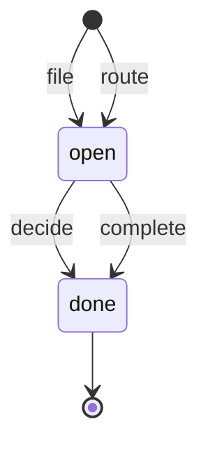

# Inbox item state machine

<!-- Generated from packages/domain/src/state-machines by `pnpm --filter @shakti/domain machines:docs`. Do not edit by hand. -->

`inbox_items.state`. An agent’s suggestion, or work routed to someone, in the Agent Inbox of the person, team or company it is for; scope follows `agents.inbox.act` with the assignee as the owner.

Sources: docs/design/phase1.md §7.1; docs/design/phase1.md §8.1; PRD AI-04; PRD RPT-04; DATABASE §6.9.

Every state and transition comes from the governing documents.

## States

| State | Kind | Notes |
|---|---|---|
| `open` | initial | – |
| `done` | terminal | – |

## Transitions

| Event | From → To | Permitted actor | Guard | Effects |
|---|---|---|---|---|
| `file` | (new) → `open` | the permission of the permission of the command the suggestion runs (`agents.run.record`) | – | – |
| `route` | (new) → `open` | `crm.lead.write` | – | – |
| `decide` | `open` → `done` | `agents.inbox.act` | – | – |
| `complete` | `open` → `done` | `agents.inbox.act` | – | – |

Any other event, or an event from a state not listed for it, answers `conflict` with reason `inbox_item_transition_not_allowed`. A guard that refuses answers its own reason; the permission check answers `forbidden`. The command writes the new state to `inbox_items.state` and the time to `inbox_items.done_at` when the state changes, applies the effects and calls `ctx.audit()`; it emits no event.

## Notes

- `file`: Filed by an agent with the action it proposes; only an agent files a suggestion.
- `route`: An enquiry refused because a colleague looks after the customer, filed by the person who took it as routed work for that colleague (`crm.enquiry.route`).
- `decide`: With the decision on its action: approved, edited, rejected or dismissed.
- `complete`: Routed work its person has dealt with (`agents.inbox.complete`).

## Diagram

