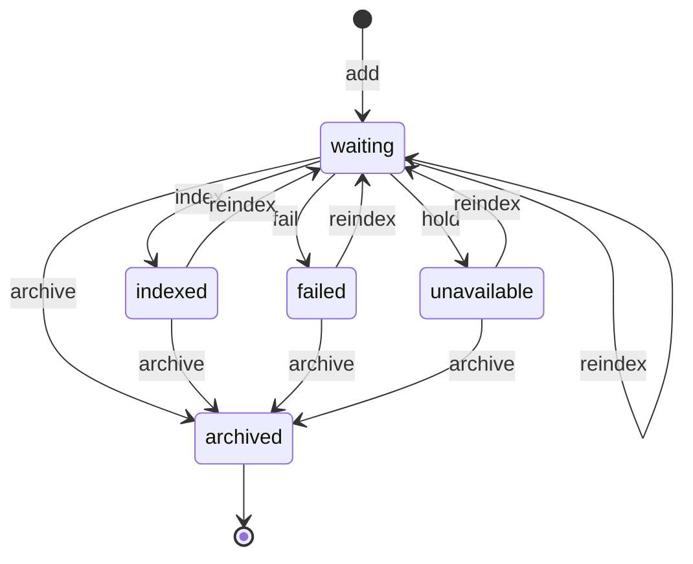

# Knowledge Vault file state machine

<!-- Generated from packages/domain/src/state-machines by `pnpm --filter @shakti/domain machines:docs`. Do not edit by hand. -->

`knowledge_files.state`. A vault upload with its title and sensitivity, for one company or the whole group. Added and archived by a person holding `knowledge.vault.write`; read and indexed by the index job (`system:workers`, `knowledge.index`) through `/api/v1/workers/embeddings/index`.

Sources: docs/design/phase1.md §8.4; PRD AI-01; BLUEPRINT §9.1; DATABASE §6.9 `knowledge_files`.

Every state and transition comes from the governing documents.

## States

| State | Kind | Notes |
|---|---|---|
| `waiting` | initial | Waiting for its upload to pass its checks and for the index job to read it; earlier passages stay in search until new ones replace them. |
| `indexed` | – | Its passages are in search for whoever may read its sensitivity. |
| `failed` | – | The index job could not read it; the reason is kept and an Executive may index it again. |
| `unavailable` | – | No key for the reading or search service is set yet; indexed again once one is. |
| `archived` | terminal | Out of search: its passages are removed. |

## Transitions

| Event | From → To | Permitted actor | Guard | Effects | Emits |
|---|---|---|---|---|---|
| `add` | (new) → `waiting` | `knowledge.vault.write` at all scope or wider | – | – | `knowledge.file.index_requested` |
| `index` | `waiting` → `indexed` | the platform only | – | – | – |
| `fail` | `waiting` → `failed` | the platform only | – | – | – |
| `hold` | `waiting` → `unavailable` | the platform only | – | – | – |
| `reindex` | `waiting`, `indexed`, `failed`, `unavailable` → `waiting` | `knowledge.vault.write` at all scope or wider | – | – | `knowledge.file.index_requested` |
| `archive` | `waiting`, `indexed`, `failed`, `unavailable` → `archived` | `knowledge.vault.write` at all scope or wider | – | `unsearchable`: remove the file’s passages from search | – |

Any other event, or an event from a state not listed for it, answers `conflict` with reason `knowledge_file_transition_not_allowed`. A guard that refuses answers its own reason; the permission check answers `forbidden`. The command writes the new state to `knowledge_files.state` when the state changes, applies the effects and calls `ctx.audit()`, and emits the event in the *Emits* column ([event catalogue](../data/EVENTS.md)).

## Notes

- `add`: `knowledge.file.add`, people only, from the person’s own vault upload; the event is sent at once when the upload has passed its checks, and otherwise by `files.file.mark_ready` when it does.
- `index`: `knowledge.file.record_index`: the passages replace the file’s earlier ones in one transaction.
- `fail`: `knowledge.file.record_index`, or `files.file.reject` when the upload fails its checks.
- `hold`: `knowledge.file.record_index` when `ANTHROPIC_API_KEY` or `VOYAGE_API_KEY` is not set.
- `reindex`: `knowledge.file.reindex`, people only; refused while the upload has not passed its checks, and for a file waiting less than `KNOWLEDGE_WAITING_STALE_SECONDS` (the index job is still within its time).
- `archive`: `knowledge.file.archive`, people only.

## Diagram

