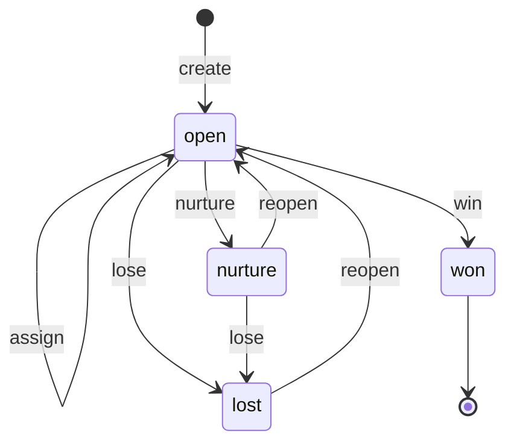

# Opportunity state machine

<!-- Generated from packages/domain/src/state-machines by `pnpm --filter @shakti/domain machines:docs`. Do not edit by hand. -->

`opportunities.state`. One per enquiry per entity; the pipeline stage (`stage_id`) moves only while the opportunity is open.

Sources: docs/design/backend-weeks-3-5.md §7.2; BLUEPRINT §8.1, §8.2; PRD CRM-03, CRM-05, TEL-02.

Items marked *proposed* are not named in the governing documents; they were chosen for this specification and need review.

## States

| State | Kind | Notes |
|---|---|---|
| `open` | initial | Being worked; stage moves and assignment happen here. |
| `nurture` | – | Parked on a nurture cadence with a reason (`crm.opportunity.nurture`); `crm.opportunity.reopen` brings it back to open. |
| `won` | terminal | Closed with an accepted quote or a confirmed order. |
| `lost` | – | Closed without a sale; may be reopened for a limited time. |

## Transitions

| Event | From → To | Permitted actor | Guard | Effects | Emits |
|---|---|---|---|---|---|
| `create` *(proposed)* | (new) → `open` | `crm.lead.write` or the platform | – | – | `crm.lead.created` |
| `stage.move` | `open` → `open` | `crm.lead.write` | the target stage belongs to the opportunity pipeline; the exit rules of the current stage are met (its required fields are filled) | `set_stage`: update `stage_id`; `handover_if_qualified`: when the target stage is `qualified`, run the handover: weighted round-robin over Lead Converters by presence, capacity, language and segment (TEL-02), within 10 s | `crm.opportunity.stage_moved` |
| `assign` | `open` → `open` | `crm.lead.assign` or the platform | the ownership lock has passed, or the caller holds crm.lead.assign at team scope or wider; the platform handover always passes | `set_owner`: set `owner_id` and `team_id`; `lock_owner`: set `locked_until` = now + the pipeline's `lock_hours` (48 h, the workshop default, when the pipeline has none) | `crm.opportunity.assigned` |
| `nurture` | `open` → `nurture` | `crm.lead.write` | a reason is given | `schedule_nurture`: follow-up tasks on the nurture cadence (Phase 1; the cadence is a workshop input); a workflow engine is a later choice | `crm.opportunity.nurtured` |
| `reopen` | `nurture`, `lost` → `open` | `crm.lead.write` | from lost: lost within the last 30 days | `first_open_stage`: stage = the first open stage | `crm.opportunity.reopened` |
| `win` | `open` → `won` | `crm.lead.write` | an accepted quote or a confirmed sales order references the opportunity | – | `crm.opportunity.won` |
| `lose` | `open`, `nurture` → `lost` | `crm.lead.write` | a lost-reason code is given | – | `crm.opportunity.lost` |

Any other event, or an event from a state not listed for it, answers `conflict` with reason `opportunity_transition_not_allowed`. A guard that refuses answers its own reason; the permission check answers `forbidden`. The command writes the new state to `opportunities.state` and the time to `opportunities.state_changed_at` when the state changes, applies the effects and calls `ctx.audit()`, and emits the event in the *Emits* column ([event catalogue](../data/EVENTS.md)).

## Notes

- `create`: Created by `crm.lead.create` (manual entry) or by lead ingestion (the platform).

## Diagram

