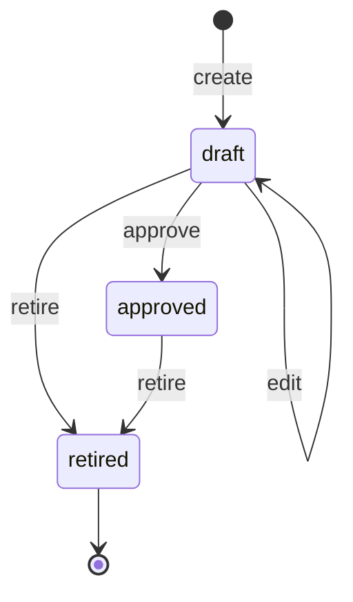

# Playbook directive state machine

<!-- Generated from packages/domain/src/state-machines by `pnpm --filter @shakti/domain machines:docs`. Do not edit by hand. -->

`playbook_directives.state`. Only approved directives steer the agents.

Sources: BLUEPRINT §9.1, §19 item 2; PRD AI-01; DATABASE §6.9 `playbook_directives`.

Items marked *proposed* are not named in the governing documents; they were chosen for this specification and need review.

## States

| State | Kind | Notes |
|---|---|---|
| `draft` | initial | – |
| `approved` | – | – |
| `retired` | terminal | – |

## Transitions

| Event | From → To | Permitted actor | Guard | Effects |
|---|---|---|---|---|
| `create` | (new) → `draft` | `knowledge.playbook.approve` or the platform | – | – |
| `edit` *(proposed)* | `draft` → `draft` | `knowledge.playbook.approve` | – | `recheck_conflicts`: recompute `conflicts_with` |
| `approve` | `draft` → `approved` | `knowledge.playbook.approve` | no unresolved conflict with an approved directive (`conflicts_with` is empty) | `set_approver`: set `approved_by`; `emit`: event so the agents reload their directives |
| `retire` | `draft`, `approved` → `retired` | `knowledge.playbook.approve` | a reason is given | `emit`: event so the agents reload their directives |

Any other event, or an event from a state not listed for it, answers `conflict` with reason `playbook_directive_transition_not_allowed`. A guard that refuses answers its own reason; the permission check answers `forbidden`. No command drives this machine yet; the commands of its phase follow it (ROADMAP §3 onwards).

## Notes

- `create`: Drafted by an Executive, or extracted by the Knowledge Brain from a Teach session or upload (the platform).

## Diagram

