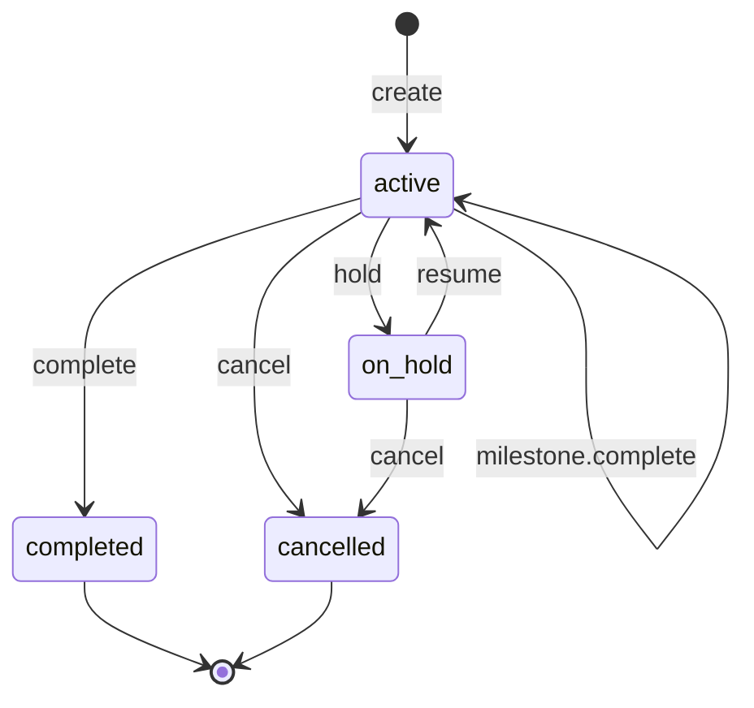

# Project, standard install flow state machine

<!-- Generated from packages/domain/src/state-machines by `pnpm --filter @shakti/domain machines:docs`. Do not edit by hand. -->

`projects.state` for flow templates of the standard kind; `project_milestones.state` holds each step. Default checklist: survey → dispatch → install → commission → handover.

Sources: BLUEPRINT §8.5, §19 item 2; PRD PRJ-01, PRJ-03.

Items marked *proposed* are not named in the governing documents; they were chosen for this specification and need review.

## States

| State | Kind | Notes |
|---|---|---|
| `active` | initial, *proposed* | – |
| `on_hold` | *proposed* | – |
| `completed` | terminal, *proposed* | – |
| `cancelled` | terminal, *proposed* | – |

## Transitions

| Event | From → To | Permitted actor | Guard | Effects |
|---|---|---|---|---|
| `create` | (new) → `active` | `projects.write` or the platform | – | `copy_checklist`: copy the milestones from the flow template |
| `milestone.complete` *(proposed)* | `active` → `active` | `projects.write` | the milestone is the next open one in checklist order; the milestone's required documents are in the vault (PRJ-03) | `mark_milestone`: set the milestone done with `done_at`; `emit`: event for the milestone WhatsApp message |
| `hold` *(proposed)* | `active` → `on_hold` | `projects.write` | a reason is given | – |
| `resume` *(proposed)* | `on_hold` → `active` | `projects.write` | – | – |
| `complete` *(proposed)* | `active` → `completed` | `projects.write` | every milestone is done | `handover_kit`: send the handover kit on WhatsApp; `register_warranty`: register warranty per serial |
| `cancel` *(proposed)* | `active`, `on_hold` → `cancelled` | `projects.write` at entity scope or wider | a reason is given | – |

Any other event, or an event from a state not listed for it, answers `conflict` with reason `project_standard_transition_not_allowed`. A guard that refuses answers its own reason; the permission check answers `forbidden`. No command drives this machine yet; the commands of its phase follow it (ROADMAP §3 onwards).

## Notes

- `create`: The platform creates the project from a confirmed sales order of an install segment.

## Diagram

