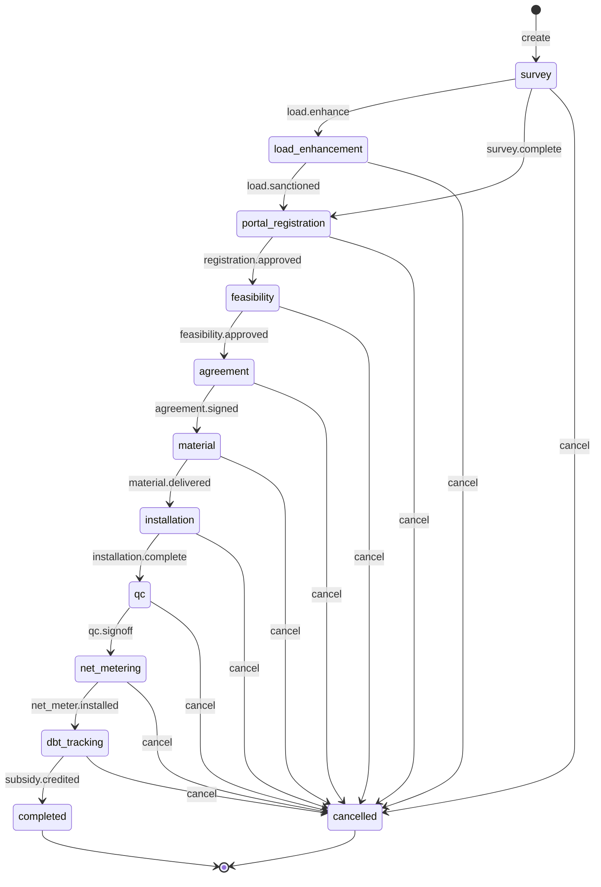

# Project, PM Surya Ghar flow state machine

<!-- Generated from packages/domain/src/state-machines by `pnpm --filter @shakti/domain machines:docs`. Do not edit by hand. -->

`projects.state` for the PM Surya Ghar flow template; the stages are the blueprint sequence survey → load enhancement (when required) → portal registration → feasibility → agreement → material → installation → QC → net-meter/JIR → DBT tracking.

Sources: BLUEPRINT §8.5, §19 item 2; PRD PRJ-02, PRJ-03.

Items marked *proposed* are not named in the governing documents; they were chosen for this specification and need review.

## States

| State | Kind | Notes |
|---|---|---|
| `survey` | initial | – |
| `load_enhancement` | – | Only when the survey finds the sanctioned load too low. |
| `portal_registration` | – | – |
| `feasibility` | – | Approval locks the sanctioned load. |
| `agreement` | – | – |
| `material` | – | Material is dispatched to the site; DCR/ALMM serials are validated first. |
| `installation` | – | – |
| `qc` | – | – |
| `net_metering` | – | Net meter installed and the JIR recorded. |
| `dbt_tracking` | – | – |
| `completed` | terminal, *proposed* | – |
| `cancelled` | terminal, *proposed* | – |

## Transitions

| Event | From → To | Permitted actor | Guard | Effects |
|---|---|---|---|---|
| `create` | (new) → `survey` | `projects.write` or the platform | – | `open_gates`: create the subsidy application and its gates |
| `load.enhance` | `survey` → `load_enhancement` | `projects.write` | the survey found that the load must be enhanced; the stage's required documents are in the vault (PRJ-03) | – |
| `survey.complete` | `survey` → `portal_registration` | `projects.write` | no load enhancement is needed; the stage's required documents are in the vault (PRJ-03) | – |
| `load.sanctioned` | `load_enhancement` → `portal_registration` | `projects.write` | the stage's required documents are in the vault (PRJ-03) | – |
| `registration.approved` | `portal_registration` → `feasibility` | `projects.gate.approve` | the stage's subsidy gate is approved | – |
| `feasibility.approved` | `feasibility` → `agreement` | `projects.gate.approve` | the stage's subsidy gate is approved; the sanctioned load is recorded | `lock_sanctioned_load`: lock `sanctioned_load_kw`; later sizing may not exceed it |
| `agreement.signed` | `agreement` → `material` | `projects.write` | the stage's required documents are in the vault (PRJ-03) | – |
| `material.delivered` | `material` → `installation` | `projects.write` | every DCR/ALMM serial is validated | – |
| `installation.complete` | `installation` → `qc` | `projects.write` | the stage's required documents are in the vault (PRJ-03) | – |
| `qc.signoff` | `qc` → `net_metering` | `projects.qc.signoff` | the stage's required documents are in the vault (PRJ-03) | – |
| `net_meter.installed` | `net_metering` → `dbt_tracking` | `projects.gate.approve` | the stage's subsidy gate is approved | – |
| `subsidy.credited` | `dbt_tracking` → `completed` | `projects.write` | the DBT subsidy credit is recorded | `handover_kit`: send the handover kit on WhatsApp; `cmc_register`: open the CMC register entry (PRJ-07) |
| `cancel` *(proposed)* | `survey`, `load_enhancement`, `portal_registration`, `feasibility`, `agreement`, `material`, `installation`, `qc`, `net_metering`, `dbt_tracking` → `cancelled` | `projects.write` at entity scope or wider | a reason is given | – |

Any other event, or an event from a state not listed for it, answers `conflict` with reason `project_surya_ghar_transition_not_allowed`. A guard that refuses answers its own reason; the permission check answers `forbidden`. The command persists `state` and `state_changed_at`, applies the effects, calls `ctx.audit()` and emits `<aggregate>.<event>`.

## Notes

- `create`: The platform creates the project from a confirmed rooftop subsidy order.
- `material.delivered`: The dispatch machine also refuses to leave `ready` with unvalidated DCR serials.

## Diagram

