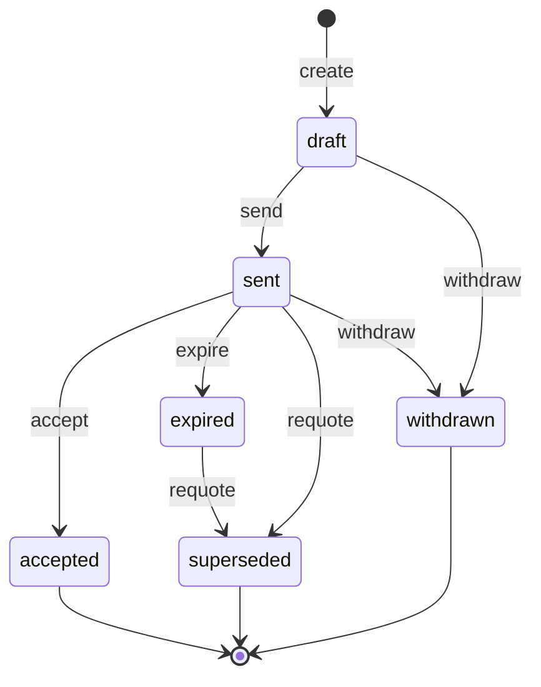

# Quote state machine

<!-- Generated from packages/domain/src/state-machines by `pnpm --filter @shakti/domain machines:docs`. Do not edit by hand. -->

`quotes.state`. Lines snapshot Price Master prices and the tax-rate version at creation.

Sources: docs/design/backend-weeks-3-5.md §7.3; BLUEPRINT §8.3; PRD SAL-03, SAL-04, SAL-05.

Every state and transition comes from the governing documents.

## States

| State | Kind | Notes |
|---|---|---|
| `draft` | initial | – |
| `sent` | – | – |
| `accepted` | terminal | – |
| `expired` | – | Past `valid_until`; only a re-quote at current prices continues the sale. |
| `superseded` | terminal | Replaced by a newer quote; the old one is kept in `quote_versions`. |
| `withdrawn` | terminal | – |

## Transitions

| Event | From → To | Permitted actor | Guard | Effects |
|---|---|---|---|---|
| `create` | (new) → `draft` | `sales.quote.create` | the tier comes from the account type and a current price list exists for the tier and entity; sizing is complete for the pump and rooftop segments; the pump runs inside its curve (pump segment); the sanctioned-load and DCR rules are met where they apply (rooftop subsidy) | `price_lines`: lines priced from the price list (never from input); `compute_tax`: tax computed by the tax engine and snapshotted per line; `set_valid_until`: `valid_until` = created date + 15 calendar days, end of day IST; `number`: `quote_no` from the series |
| `send` | `draft` → `sent` | `sales.quote.send` | the PDF is rendered | `whatsapp_dispatch`: send the PDF on WhatsApp (worker on the event) |
| `accept` | `sent` → `accepted` | `sales.quote.send` or the platform | now ≤ `valid_until` (acceptance after expiry answers `quote_expired` and the app offers a re-quote); `accepted_via` is recorded (WhatsApp reply, WhatsApp OTP or signed upload) | `create_order_draft`: create the sales order draft |
| `expire` | `sent` → `expired` | the platform only | now > `valid_until` | – |
| `requote` | `sent`, `expired` → `superseded` | `sales.quote.create` | – | `new_quote`: a new quote at current prices and current tax rates; `snapshot_version`: `quote_versions` snapshot of the old quote |
| `withdraw` | `draft`, `sent` → `withdrawn` | `sales.quote.send` | a reason is given | – |

Any other event, or an event from a state not listed for it, answers `conflict` with reason `quote_transition_not_allowed`. A guard that refuses answers its own reason; the permission check answers `forbidden`. No command drives this machine yet; the commands of its phase follow it (ROADMAP §3 onwards).

## Notes

- `expire`: A daily job, plus a lazy check when the quote is read.

## Diagram

