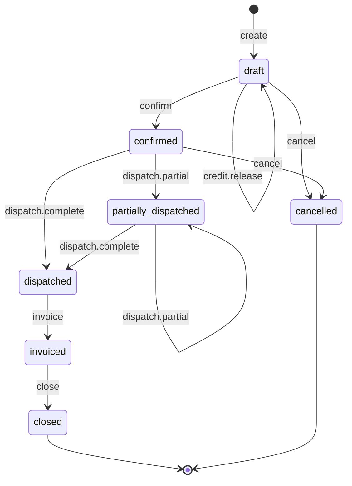

# Sales order state machine

<!-- Generated from packages/domain/src/state-machines by `pnpm --filter @shakti/domain machines:docs`. Do not edit by hand. -->

`sales_orders.state`. The backbone of fulfilment: reservations, dispatches, proforma, payment milestones and projects hang off it.

Sources: docs/design/backend-weeks-3-5.md §7.4; BLUEPRINT §8.3; PRD SAL-06, SAL-07.

Items marked *proposed* are not named in the governing documents; they were chosen for this specification and need review.

## States

| State | Kind | Notes |
|---|---|---|
| `draft` | initial | – |
| `confirmed` | – | – |
| `partially_dispatched` | – | Some lines delivered; backorders stay open. |
| `dispatched` | – | – |
| `invoiced` | – | Linked to the Tally sales voucher (Phase 2 sync). |
| `closed` | terminal | – |
| `cancelled` | terminal | – |

## Transitions

| Event | From → To | Permitted actor | Guard | Effects |
|---|---|---|---|---|
| `create` | (new) → `draft` | `sales.order.create` or the platform | from an accepted quote, or a dealer account ordering without a quote | `copy_lines`: lines copied with their tax snapshot; `number`: `so_no` from the series |
| `credit.release` *(proposed)* | `draft` → `draft` | `sales.credit.release` | a reason is given | `set_credit_release`: set `credit_release_by` to the Executive and keep the reason (audited) |
| `confirm` | `draft` → `confirmed` | `sales.order.confirm` | dealer credit check: block when outstanding + confirmed-unpaid orders + this order > `credit_limit`, or `oldest_overdue_days` > `credit_days`, or no limit is set; the block names the limit or the invoice; passes when an Executive set `credit_release_by` with a reason | `request_reservations`: reservations requested (Phase 3); `emit`: event for the order-confirmed WhatsApp message |
| `dispatch.partial` | `confirmed`, `partially_dispatched` → `partially_dispatched` | the platform only | – | – |
| `dispatch.complete` | `confirmed`, `partially_dispatched` → `dispatched` | the platform only | – | – |
| `invoice` | `dispatched` → `invoiced` | the platform only | a Tally sales voucher is linked | – |
| `close` | `invoiced` → `closed` | `sales.order.confirm` | payments are settled (nothing remains due) | – |
| `cancel` | `draft`, `confirmed` → `cancelled` | `sales.order.cancel` | a reason is given; nothing is dispatched (no dispatch other than a cancelled one) | `release_reservations`: release reservations |

Any other event, or an event from a state not listed for it, answers `conflict` with reason `sales_order_transition_not_allowed`. A guard that refuses answers its own reason; the permission check answers `forbidden`. The command persists `state` and `state_changed_at`, applies the effects, calls `ctx.audit()` and emits `<aggregate>.<event>`.

## Notes

- `create`: The platform creates the draft when a quote is accepted; a dealer order is created by a person.
- `dispatch.partial`: Driven by the dispatch machine (Phase 3) when a dispatch is delivered and lines remain; the e-way bill gate is on the dispatch.
- `dispatch.complete`: Driven by the dispatch machine when the last line is delivered.
- `invoice`: Tally sync (Phase 2) links the voucher by Buyer Order No.

## Diagram

