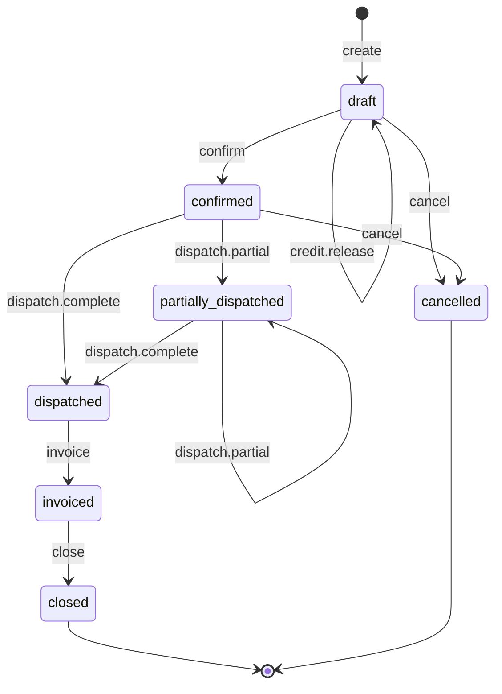

# Sales order state machine

<!-- Generated from packages/domain/src/state-machines by `pnpm --filter @shakti/domain machines:docs`. Do not edit by hand. -->

`sales_orders.state`. The backbone of fulfilment: reservations, dispatches, proforma, payment milestones and projects hang off it.

Sources: docs/design/backend-weeks-3-5.md §7.4; docs/design/phase1.md §8.3; BLUEPRINT §8.3; PRD SAL-06, SAL-07.

Items marked *proposed* are not named in the governing documents; they were chosen for this specification and need review.

## States

| State | Kind | Notes |
|---|---|---|
| `draft` | initial | – |
| `confirmed` | – | – |
| `partially_dispatched` | – | Some lines delivered; backorders stay open. |
| `dispatched` | – | – |
| `invoiced` | – | Linked to the Tally sales voucher (Phase 5 sync). |
| `closed` | terminal | – |
| `cancelled` | terminal | – |

## Transitions

| Event | From → To | Permitted actor | Guard | Effects | Emits |
|---|---|---|---|---|---|
| `create` | (new) → `draft` | `sales.order.create` or the platform | from an accepted quote, or a dealer account ordering without a quote | `copy_lines`: from a quote, its lines copied with their prices and tax snapshot; a dealer's order priced from the live list of the dealer's tier and taxed by the engine; `number`: `so_no` from the series | `sales.order.created` |
| `credit.hold` *(proposed)* | `draft` → `draft` | `sales.order.confirm` | the dealer credit check blocks the confirmation and no release lets it through (the hold keeps the rule and its facts) | `set_credit_hold`: keep `credit_held_at`, the rule and the facts its sentence names (the limit and the exposure, or the overdue invoice); the order stays a draft | `sales.order.credit_held` |
| `credit.release` | `draft` → `draft` | `sales.credit.release` at all scope or wider | a reason is given; the order is held for credit (`credit_held_at` is set) | `set_credit_release`: set `credit_release_by` to the Executive and keep the reason (audited); clear the hold, so the next confirmation passes the check once | `sales.order.credit_released` |
| `confirm` | `draft` → `confirmed` | `sales.order.confirm` | dealer credit check: block when outstanding + confirmed-unpaid orders + this order > `credit_limit`, or `oldest_overdue_days` > `credit_days`, or no limit is set; the block names the limit or the invoice; passes when an Executive set `credit_release_by` with a reason | `win_lead`: an order of a lead wins the lead (`crm.opportunity.win`), and ends its open callbacks and nurture calls; `accrue_commission`: the lead's referral partner earns commission by the partner's rule in force that day (`commission_accruals`); `request_reservations`: reservations requested (Phase 3) | `sales.order.confirmed` |
| `dispatch.partial` | `confirmed`, `partially_dispatched` → `partially_dispatched` | the platform only | – | – | – |
| `dispatch.complete` | `confirmed`, `partially_dispatched` → `dispatched` | the platform only | – | – | – |
| `invoice` | `dispatched` → `invoiced` | the platform only | a Tally sales voucher is linked | – | – |
| `close` | `invoiced` → `closed` | `sales.order.confirm` | payments are settled (nothing remains due) | – | – |
| `cancel` | `draft`, `confirmed` → `cancelled` | `sales.order.cancel` at entity scope or wider | a reason is given; nothing is dispatched (no dispatch other than a cancelled one) | `cancel_commission`: a confirmed order's commission is cancelled; the lead stays won; `release_reservations`: release reservations (Phase 3) | `sales.order.cancelled` |

Any other event, or an event from a state not listed for it, answers `conflict` with reason `sales_order_transition_not_allowed`. A guard that refuses answers its own reason; the permission check answers `forbidden`. The command writes the new state to `sales_orders.state` and the time to `sales_orders.state_changed_at` when the state changes, applies the effects and calls `ctx.audit()`, and emits the event in the *Emits* column ([event catalogue](../data/EVENTS.md)).

## Notes

- `create`: `sales.quote.accept` makes the draft as the person who records the signed copy (the platform will, for a WhatsApp acceptance in Phase 2); `sales.order.create` makes a dealer order without a quote.
- `credit.hold`: Fired by `sales.order.confirm` in place of `confirm` when the credit check blocks: a hold is kept, not refused.
- `dispatch.partial`: Driven by the dispatch machine (Phase 3) when a dispatch is delivered and lines remain; the e-way bill gate is on the dispatch.
- `dispatch.complete`: Driven by the dispatch machine when the last line is delivered.
- `invoice`: Tally sync (Phase 5) links the voucher by Buyer Order No.

## Diagram

