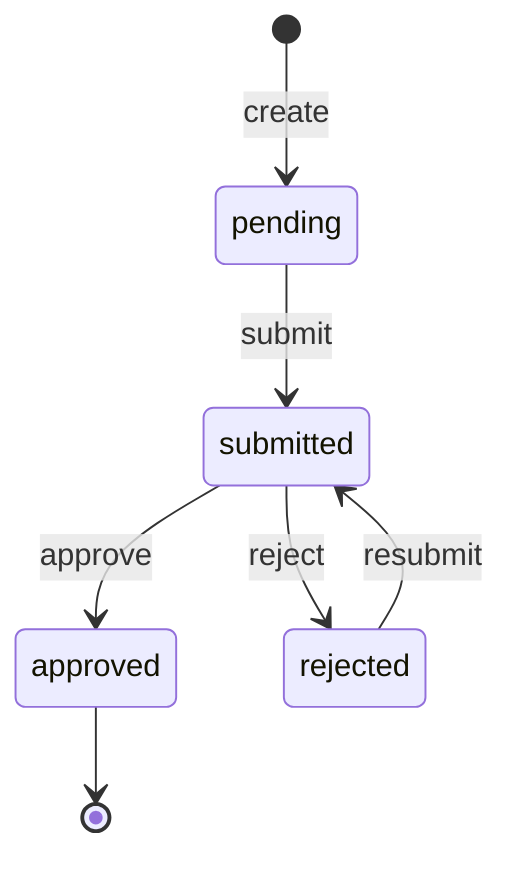

# Subsidy gate state machine

<!-- Generated from packages/domain/src/state-machines by `pnpm --filter @shakti/domain machines:docs`. Do not edit by hand. -->

`subsidy_gates.state`, one row per gate of a `subsidy_applications` row (portal registration, feasibility, net-meter/JIR and the others the workshop lists).

Sources: BLUEPRINT §8.5, §19 item 2; PRD PRJ-02, PRJ-03; DATABASE §6.6 `subsidy_gates`.

Items marked *proposed* are not named in the governing documents; they were chosen for this specification and need review.

## States

| State | Kind | Notes |
|---|---|---|
| `pending` | initial, *proposed* | – |
| `submitted` | *proposed* | – |
| `approved` | terminal, *proposed* | – |
| `rejected` | *proposed* | Returned by the portal or DISCOM with `rejection_reason`; documents are collected again. |

## Transitions

| Event | From → To | Permitted actor | Guard | Effects |
|---|---|---|---|---|
| `create` *(proposed)* | (new) → `pending` | `projects.write` or the platform | – | – |
| `submit` *(proposed)* | `pending` → `submitted` | `projects.write` | every document in `required_docs_json` is in the vault (a gate never closes with one missing) | `build_pack`: generate the DISCOM pack for the gate |
| `approve` *(proposed)* | `submitted` → `approved` | `projects.gate.approve` | – | `advance_project`: lets the project leave the gated stage |
| `reject` *(proposed)* | `submitted` → `rejected` | `projects.gate.approve` | the rejection reason is recorded | `request_documents`: ask the customer for the missing or corrected documents on WhatsApp |
| `resubmit` *(proposed)* | `rejected` → `submitted` | `projects.write` | every document in `required_docs_json` is in the vault (a gate never closes with one missing) | – |

Any other event, or an event from a state not listed for it, answers `conflict` with reason `subsidy_gate_transition_not_allowed`. A guard that refuses answers its own reason; the permission check answers `forbidden`. No command drives this machine yet; the commands of its phase follow it (ROADMAP §3 onwards).

## Notes

- `create`: Created with the subsidy application, one per gate of the template.
- `approve`: Records the portal's or DISCOM's approval.

## Diagram

