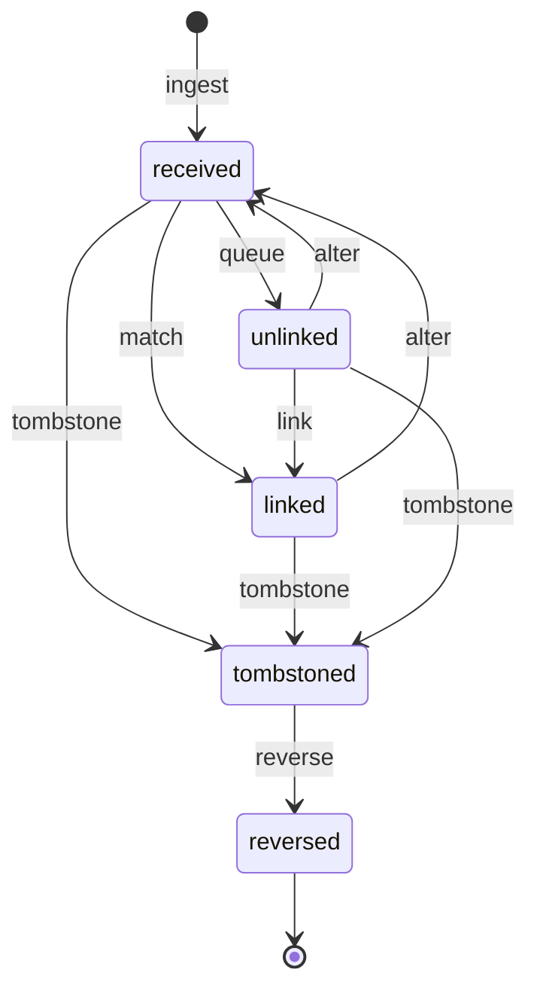

# Tally voucher state machine

<!-- Generated from packages/domain/src/state-machines by `pnpm --filter @shakti/domain machines:docs`. Do not edit by hand. -->

The reconciliation state of a `tally_vouchers` row (a state column is added with the Phase 5 connector); a tombstone is also written to the append-only `tally_voucher_tombstones`.

Sources: BLUEPRINT §8.8, §19 item 2; PRD FIN-02, FIN-03; DATABASE §6.7.

Items marked *proposed* are not named in the governing documents; they were chosen for this specification and need review.

## States

| State | Kind | Notes |
|---|---|---|
| `received` | initial, *proposed* | – |
| `linked` | *proposed* | – |
| `unlinked` | *proposed* | In the review queue (`unlinked_vouchers`). |
| `tombstoned` | *proposed* | Deleted or cancelled in Tally; shown in the review queue. |
| `reversed` | terminal, *proposed* | `reversal_applied_at` set on the tombstone. |

## Transitions

| Event | From → To | Permitted actor | Guard | Effects |
|---|---|---|---|---|
| `ingest` | (new) → `received` | the platform only | – | – |
| `match` | `received` → `linked` | the platform only | reconciliation found the order or proforma | `link`: write `reconciliation_links` with how it matched; `apply`: receipts update milestones, credit notes adjust balances, dealer outstanding is refreshed |
| `queue` | `received` → `unlinked` | the platform only | reconciliation found nothing | `review_queue`: add to the review queue |
| `link` | `unlinked` → `linked` | `finance.recon.write` | the order or proforma to link is chosen | `link`: write `reconciliation_links` as a manual match; `apply`: receipts update milestones, credit notes adjust balances, dealer outstanding is refreshed |
| `alter` *(proposed)* | `linked`, `unlinked` → `received` | the platform only | – | `undo_link`: reverse the previous link and its effects, then match again |
| `tombstone` | `received`, `linked`, `unlinked` → `tombstoned` | the platform only | the GUID is missing from the daily snapshot of its Tally company | `tombstone`: append to `tally_voucher_tombstones` and set `deleted_at`; `review_queue`: show it in the review queue |
| `reverse` | `tombstoned` → `reversed` | the platform only | – | `reverse`: reverse its effect on milestones, outstanding and reconciliation; set `reversal_applied_at` |

Any other event, or an event from a state not listed for it, answers `conflict` with reason `tally_voucher_transition_not_allowed`. A guard that refuses answers its own reason; the permission check answers `forbidden`. The command persists `state` and `state_changed_at`, applies the effects, calls `ctx.audit()` and emits `<aggregate>.<event>`.

## Notes

- `ingest`: The connector push, idempotent by voucher GUID.
- `alter`: A re-read with a higher AlterID changed the voucher.

## Diagram

