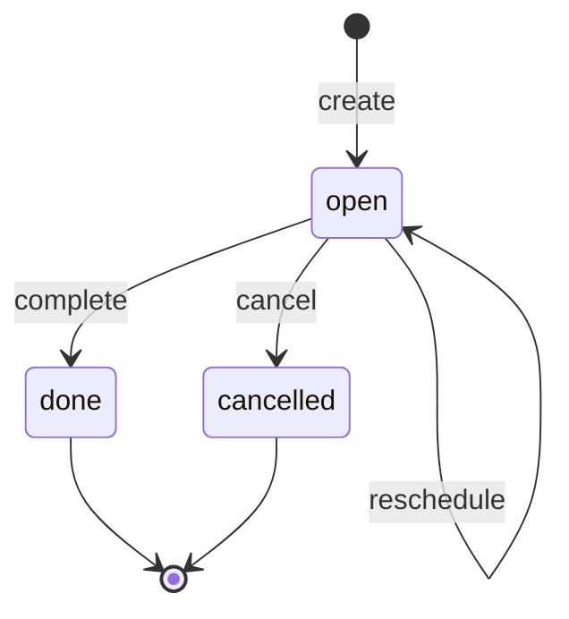

# Task state machine

<!-- Generated from packages/domain/src/state-machines by `pnpm --filter @shakti/domain machines:docs`. Do not edit by hand. -->

`tasks.state`. A callback, follow-up, nurture or review due at a time, on a lead, for one person. Scope follows the person the task is for: own, team or company on `crm.lead.write`.

Sources: docs/design/phase1.md §6.5; PRD CRM-07; DATABASE §6.2 `tasks`.

Every state and transition comes from the governing documents.

## States

| State | Kind | Notes |
|---|---|---|
| `open` | initial | – |
| `done` | terminal | – |
| `cancelled` | terminal | – |

## Transitions

| Event | From → To | Permitted actor | Guard | Effects |
|---|---|---|---|---|
| `create` | (new) → `open` | `crm.lead.write` | the due time is not in the past | – |
| `complete` | `open` → `done` | `crm.lead.write` | – | `set_done_at`: record when the task was done |
| `reschedule` | `open` → `open` | `crm.lead.write` | the due time is not in the past | – |
| `cancel` | `open` → `cancelled` | `crm.lead.write` | – | – |

Any other event, or an event from a state not listed for it, answers `conflict` with reason `task_transition_not_allowed`. A guard that refuses answers its own reason; the permission check answers `forbidden`. The command writes the new state to `tasks.state` when the state changes, applies the effects and calls `ctx.audit()`; it emits no event.

## Notes

- `create`: A task for someone else also needs `crm.lead.assign` at the scope that covers them, and that person must be active in the lead’s company.

## Diagram

