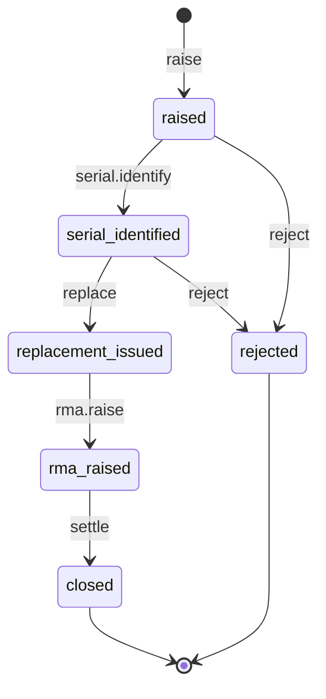

# Warranty claim state machine

<!-- Generated from packages/domain/src/state-machines by `pnpm --filter @shakti/domain machines:docs`. Do not edit by hand. -->

`warranty_claims.state`. Raised on a customer or serial; the replacement comes from stock and the supplier RMA follows; the cost lands in job costing.

Sources: BLUEPRINT §8.4, §19 item 2; PRD INV-08; DATABASE §6.5 `warranty_claims`.

Items marked *proposed* are not named in the governing documents; they were chosen for this specification and need review.

## States

| State | Kind | Notes |
|---|---|---|
| `raised` | initial, *proposed* | Step 1: the claim is raised on a customer or serial. |
| `serial_identified` | *proposed* | Step 2: the failed serial is identified. |
| `replacement_issued` | *proposed* | Step 3: a replacement is issued from stock. |
| `rma_raised` | *proposed* | Step 4: a supplier RMA is raised under the supplier's warranty terms. |
| `closed` | terminal, *proposed* | Step 5: supplier credit or a replacement is received. |
| `rejected` | terminal, *proposed* | Out of warranty or not a fault. |

## Transitions

| Event | From → To | Permitted actor | Guard | Effects |
|---|---|---|---|---|
| `raise` | (new) → `raised` | `inventory.warranty.write` | – | – |
| `serial.identify` | `raised` → `serial_identified` | `inventory.warranty.write` | the failed serial is given; the serial's warranty runs to today or later (IST) | `set_serial`: record the failed serial on the claim |
| `replace` | `serial_identified` → `replacement_issued` | `inventory.stock.move` | the replacement serial is recorded | `issue_stock`: stock movement out for the replacement serial; `cost_entry`: job cost entry of type `warranty` (restricted) |
| `rma.raise` | `replacement_issued` → `rma_raised` | `procurement.po.write` | the supplier's RMA reference is recorded | – |
| `settle` | `rma_raised` → `closed` | `procurement.grn.write` | supplier credit or a supplier replacement is received | `adjust_cost`: offset the warranty cost entry by the supplier credit or replacement |
| `reject` *(proposed)* | `raised`, `serial_identified` → `rejected` | `inventory.warranty.write` | a reason is given | – |

Any other event, or an event from a state not listed for it, answers `conflict` with reason `warranty_claim_transition_not_allowed`. A guard that refuses answers its own reason; the permission check answers `forbidden`. The command persists `state` and `state_changed_at`, applies the effects, calls `ctx.audit()` and emits `<aggregate>.<event>`.

## Diagram

